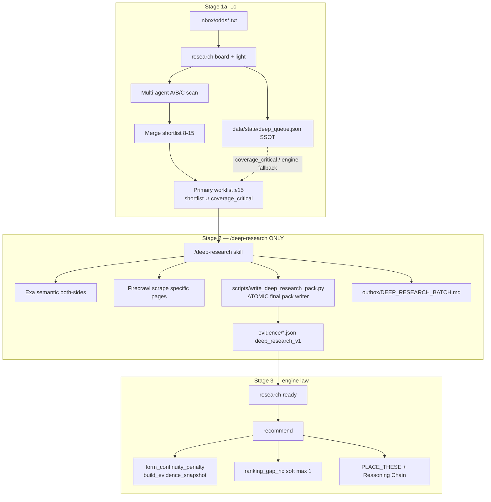
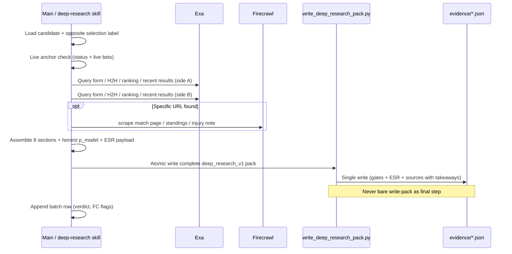

# Design: `/deep-research` Skill — ESR Stage 2 Hardening

| Field | Value |
|-------|--------|
| **PLAN_ID** | `deep-research-skill-esr-2026-07-26` |
| **Author** | _(desk / Grok Build)_ |
| **Date** | 2026-07-26 |
| **Revised** | 2026-07-27 (post design review ISS-01–ISS-12; PR1 review hygiene) |
| **Status** | Accepted (PR1 design landed) |
| **Repository** | repo root (`nt-betting-tracker`) |
| **Skills home** | `~/.grok/skills/` |
| **Related (live)** | `docs/DIVERSITY_AND_EXPLORE.md` · `docs/RESEARCH_GATES.md` · `docs/RESEARCH_WORKFLOW.md` · `~/.grok/skills/daily-run/SKILL.md` · `docs/skills_mirror_daily-run.md` · `nt/form_continuity.py` |
| **Related (PR1 stubs)** | `docs/FORM_CONTINUITY_AND_ANTI_FLIP_HARDENING_2026-07-26.md` (pointer → DIVERSITY + `nt/form_continuity.py`) · `docs/EXA_RESEARCH_USAGE.md` (Exa both-sides on primary worklist only) |
| **Persist copy** | `docs/DEEP_RESEARCH_SKILL_ESR_2026-07-26.md` (this file) |

---

## Overview

Stage 2 of the ESR daily desk today is informal: after multi-agent Stage 1b merges a primary worklist of **8–15** candidates, the main agent runs Exa both-sides research and `python run_nt.py research write-pack` once per line. Quality and structure vary; packs often miss fields that `build_evidence_snapshot` / form-continuity strong-flip scoring and PLACE_THESE reasoning need (`opposite_side_check`, `why_flip`, ranking checklist keys, form continuity block).

**Critical implementation fact (review lock):** today’s `write_research_pack` **fully rebuilds** pack JSON from scaffold + CLI fields. It cannot emit ESR keys, filled source takeaways, `scan_agents`, or S1-friendly `lineup_status`. Any “hand edit after write-pack” is wiped by a second write-pack. Therefore v1 **requires a mandatory, idempotent atomic write/merge helper** — not an optional PR4 afterthought.

This design introduces a focused **`/deep-research`** Grok skill that **standardizes and hardens only that Stage 2 step**. It is never applied to the full odds board (**fail-closed** if the agent is asked to deep the whole dump). It raises research quality and form-continuity / anti-flip evidence quality without slowing Stage 1a/1b, without reviving FEH place law, and without re-arming anti-soft hard gates. Soft underdogs remain not guilty by default; short favourites 1.40–1.80 remain placeable when research supports them; FEH stays shadow-only.

**Delivered by this design:**

1. Skill design (`SKILL.md` structure, triggers, I/O contract) with **required dual-write** (user skill + repo mirror + skill_list/invoke)
2. Normative research-pack structure (JSON schema + human MD view)
3. Field mapping into `form_continuity.build_evidence_snapshot` and strong-flip signals
4. Exact call site from `/daily-run` (primary worklist only)
5. Worked example: Brewers −1.5 win → Rockies +2.5 style flip (gate-safe S1 + no weak-phrase substrings)
6. **Mandatory atomic pack writer** + Stage 2 **batch wall-clock bound** with degrade path

---

## Background & Motivation

### Current state (Stage 0–4)

| Stage | Owner | Depth |
|-------|--------|--------|
| 0 Collect | Operator / collector | Odds dump |
| 1a Engine baseline | CLI | market-scan → board → light → `deep_queue.json` SSOT |
| 1b Multi-agent scan | Subagents A/B/C | Max 5 each; merge → shortlist 8–15; **no Exa packs** |
| 1c Primary worklist | Main agent | shortlist ∪ coverage_critical · **cap 15** |
| **2 Deep** | **Main agent (today ad-hoc)** | Exa both-sides → `evidence/*.json` + honest `p_model` |
| 3 Select | Engine `recommend` | gates + grade + diversify + form_continuity + ranking_gap |
| 3b Expand | Main agent | only if large board & &lt;2 picks |
| 4 Output | Main agent + CLI | PLACE_THESE · place-ack |

**Stage 2 scope law (landed in AGENTS.md PR1 + review hygiene):** when multi-agent Stage 1b ran, deep the **primary worklist** (shortlist ∪ coverage_critical, ≤15) — **not** “work engine `deep_queue` first” as the default primary pass, **not** the full board, **not** inside scan agents A/B/C. On multi-agent all-fail, primary = engine `deep_queue` head (still capped; still once). Root `AGENTS.md` step 5 + hard rules state that this law **supersedes** older deep_queue-first wording when a multi-agent shortlist exists; engine queue language remains Stage 1 construction / composition only.

Stage 2 is the **only** expensive research layer. Scan agents are intentionally shallow. Portfolio soft-reject for form continuity is already live (`config.yaml` → `learning.diversification.form_continuity.enabled: true`, `weak_flip_action: soft_reject`).

### Pain points

1. **Inconsistent pack shape** — `write_research_pack` fills gates + checklist booleans, but ESR fields (`opposite_side_check`, `form_continuity.why_flip`, `signals.ranking_*`, human research sections) are agent-prose only or missing.
2. **Write path fragile** — CLI full-overwrite + empty scaffold takeaways + no ESR args → post-edit packs wiped on rewrite; place quality depends on glue not yet specified as a single command.
3. **Weak anti-flip evidence** — `_count_strong_flip_signals` needs structured snapshot fields. Ad-hoc packs often fail S2/S1 → weak flip soft-reject even when a real flip thesis exists, **or** miss documenting that the flip is weak (good: soft-reject).
4. **Opposite-side gaps** — PLACE_THESE defaults to “not evaluated”; audit flag `missing_opposite_side_check` fires when pack path exists without check (`nt/reasoning_chain.py`). Process miss, not place reject — still degrades chain quality.
5. **Tool sprawl / time** — Exa/Firecrawl uncapped; serial 15 × 4 min can dominate the desk day.
6. **No skill boundary** — Stage 2 lives only inside `/daily-run`; cannot re-invoke cleanly for expansion or a single near-miss.

### What already works (preserve)

- Engine SSOT: `attach_evidence` → `grade_evidence` → `build_portfolio` / form_continuity at **recommend**, not at scan
- Live ledger only for continuity anchors (`filter_live_rows` / `live_ledger_only: true`) — never `history/archives/` or `history/rounds/`
- Narrow soft-reject class: reason prefix **`form_continuity:` only**
- Ranking-gap HC soft max 1 (`is_ranking_gap_hc` + portfolio Pass 2/3)
- Explore boost gated on `base_ev ≥ explore_base_ev_min` (0.005)
- Hard research gates unchanged (`docs/RESEARCH_GATES.md`)
- Grader ignores unknown pack keys safely (additive ESR schema OK)

---

## Goals & Non-Goals

### Goals

| ID | Goal |
|----|------|
| G1 | Dedicated `/deep-research` skill invoked **only** on final shortlist / primary worklist (typically 8–15; hard cap 15); **refuse** full-board paths |
| G2 | Every pack includes the **8 mandatory research sections** (context → form continuity → H2H → ranking → opposite side → natural markets → risks → verdict) |
| G3 | Pack JSON fields **map cleanly** into `build_evidence_snapshot` and strong-flip signals; **mandatory atomic writer** lands ESR keys + real sources every time |
| G4 | Both-sides research always (selection side + opposite) via Exa primary + Firecrawl for specific pages |
| G5 | Budget-bounded **per candidate and per Stage 2 batch** (wall-clock + degrade path) |
| G6 | Feed Reasoning Chain + PLACE_THESE (opposite side always; form continuity; EV split is engine-owned at recommend) |
| G7 | Preserve ESR: soft dogs not guilty; short favs OK; FEH shadow only |
| G8 | **Required dual-write** skill install (user SKILL + repo mirror + DESK_SKILLS + skill_list/invoke) matching daily-run pattern |

### Non-Goals

| ID | Non-goal |
|----|----------|
| NG1 | Deep-research the full odds board or light-fail noise |
| NG2 | Run Exa inside multi-agent scan A/B/C |
| NG3 | Re-introduce FEH place law or anti-soft hard rejects |
| NG4 | Change capital_v2 / phase / secure / unit / 10 NOK test cap |
| NG5 | Rewrite `deep_queue.json` or demote engine queue by family/continuity |
| NG6 | Invent `p_model` or soften min_EV / haircut |
| NG7 | Use archive history as continuity peers |
| NG8 | Make missing opposite-side a hard reject (audit-only remains) |
| NG9 | Rely on bare `write-pack` alone for final packs — CLI may still scaffold gates, but **final pack write is always the atomic deep-research helper** |
| NG10 | Engine assert that every `evidence/*.json` ⊆ primary worklist (process fail-closed + recap check only in v1) |

---

## Proposed Design

### Architecture placement



### Skill identity

| Property | Value |
|----------|--------|
| Slash | `/deep-research` |
| Install path (user) | `~/.grok/skills/deep-research/SKILL.md` |
| Repo mirror | `docs/skills_mirror_deep-research.md` — **required** (same dual-write law as daily-run) |
| Desk pointer | `docs/DESK_SKILLS.md` row — **required** in install PR |
| Helper scripts | `scripts/skill_list.ps1` + `scripts/skill_invoke.ps1` — **must** add `deep-research` to name lists / ValidateSet |
| Invoker | `/daily-run` Stage 2; also standalone for expansion tier or operator re-research of named lines |

**Dual-write law (KD15):** any change to skill body updates **both** `~/.grok/skills/deep-research/SKILL.md` and `docs/skills_mirror_deep-research.md` in the same change. Banner in mirror: “Keep in sync with user skill.”

### Triggers (description frontmatter)

Skill `description` must include:

- Slash: `/deep-research`
- Phrases: “deep research shortlist”, “Stage 2 packs”, “research primary worklist”, “Exa packs for candidates”
- Negative cues: **not** for full board scan; **not** for place-ack; **not** for multi-agent scan-only; **refuse** “deep the whole odds file”

### Inputs

| Input | Required | Source |
|-------|----------|--------|
| Candidate list | Yes | `outbox/MULTI_AGENT_SHORTLIST.md` → `## Primary worklist`, or explicit named lines / JSONL **subset** of that list |
| Odds file | Yes | Same dump used for board (price + selection validation) |
| Sport / market hints | Preferred | Shortlist row fields |
| Scan reason one-liner | Preferred | From A/B/C merge (`scan_agents`, reason) |
| Live continuity context | Preferred | See **Live anchor recipe** below |
| Budget profile | Optional | `standard` (default) \| `tight` \| `expansion` |

#### Hard input filter (fail-closed)

```text
1. Resolve worklist source:
   - Primary: MULTI_AGENT_SHORTLIST ## Primary worklist
   - Fallback (scan all-fail only): engine deep_queue head, cap 15
   - Explicit operator list: only if every line is on odds dump AND
     (on shortlist/primary OR coverage_critical OR Stage 3b expansion keys)
2. Drop any line not on current odds dump
3. Cap at 15; if raw input length > 15 after dedupe → truncate to 15 by shortlist order, log dropped
4. REFUSE and stop Stage 2 if:
   - User/agent requests "full board" / "all odds lines" / entire dump deep
   - Resolved list empty AND no engine fallback path
   - Resolved list clearly is unfiltered board shortlist dump without multi-agent primary
     (e.g. operator pastes 40+ board rows) → stop; ask for primary worklist
5. Never invent candidates from light-fail noise
```

**Recap check (daily-run Stage 2 end):** assert packs written this batch have `(match, selection)` keys ⊆ primary worklist keys; list any extras as process miss.

#### Live anchor recipe (`prior_anchor_note`) — ISS-09

Skill bootstrap **must** check live continuity from working-tree ledger only:

```powershell
# 1) Desk status (era, open risk, recent notes)
python run_nt.py status

# 2) Live bets only — never history/archives or history/rounds
# Prefer latest terminal Wins with handicap selections for team-pair names on worklist
python -c "
from nt.config import load_config
from nt.ledger import load_bets  # or project equivalent path
from nt.form_continuity import filter_live_rows, is_heavy_favourite_hc, default_form_continuity_cfg
# Print last ~30 live rows: bet_id, match, selection, result, created_at
"
```

Practical skill steps (no invent):

1. Read `data/state/status.md` for open tickets context.  
2. From live `data/bets.csv` (or CLI that prints live rows only): find **Win** or open **Pending/ConfirmedPlaced** heavy-fav **minus HC** on same team-pair as any worklist HC dog.  
3. If found within ~48h narrative: set `form_continuity.flip_risk_suspected=true` and `prior_anchor_note` to e.g. `"Live ledger bet_id=… selection=Brewers -1.5 result=Win"`.  
4. If none: `flip_risk_suspected=false`, `prior_anchor_note=""`.  
5. **Engine still owns** window/soft-reject; skill note is research awareness only.  
6. **Forbidden:** `history/archives/`, `history/rounds/`, git stash copies of `data/*`.

### Outputs (per candidate)

| Artifact | Path / form |
|----------|-------------|
| Evidence pack JSON | `evidence/<safe_match_selection>.json` via **atomic helper only** (see Write path) |
| Human research view | `outbox/deep_research/<slug>.md` — **required** for Strong/Acceptable **and** any `flip_risk_suspected`; optional-but-preferred for Weak/Reject |
| Batch index | `outbox/DEEP_RESEARCH_BATCH.md` — table of verdict / p_model / form_continuity_triggered / opposite one-liner / tooling |
| CLI proof | helper stdout JSON (`ok`, `path`, `esr_keys_present: true`) |

### Per-candidate research method



#### Tool budget (normative)

| Budget item | Standard | Tight | Expansion tier |
|-------------|----------|-------|----------------|
| Wall-clock per candidate | ≤ **4 min** | ≤ **2.5 min** | ≤ **3 min** |
| Exa semantic searches | **4–6** | **3–4** | **3–5** |
| Firecrawl scrape | **0–2** pages | **0–1** | **0–2** |
| Firecrawl agent/crawl | **0** (forbidden) | 0 | 0 |
| Candidates per Stage 2 batch | ≤ **15** | ≤ **10** | **5–8** next tier only |

#### Stage 2 batch wall-clock (normative) — ISS-06

| Bound | Value |
|-------|--------|
| **Hard batch budget** | **≤ 45 minutes** wall-clock for Stage 2 primary pass |
| **Soft target** | ≤ 35 min when parallel candidate research available |
| **Parallel default** | **On when host supports parallel subagents** (one subagent per candidate or per 2–3 candidates); each subagent returns packed ESR JSON only — no raw Exa dump to main. Serial fallback if parallel unavailable. |
| **Open Q1 answer** | Parallel preferred for wall-clock; quality contract identical either way |

**Degrade order when budget pressure** (apply as soon as `remaining_candidates × 2.5 min > remaining_batch_budget`):

1. Switch remaining lines to **tight** profile (≤2.5 min, 3–4 Exa, ≤1 scrape).  
2. Prefer lines with multi-agent scan reasons / coverage_critical first; demote pure top-up noise.  
3. For tail lines that cannot fit: write pack with honest research from what is known **or** verdict **Weak** with `deep_research.verdict.rationale` containing `process_timeout:` / `budget_degrade:` — **still** fill opposite_side_check one_liner if any research ran; never invent p_model to force Strong.  
4. Do **not** skip write entirely for a worklist line without a batch row (process miss).  
5. Stage 3b expansion is a **separate** budget (≤ 20 min additional) — does not steal primary 45 min silently.

#### Query template (Exa — both sides)

For match `Home vs Away`, selection `S`:

1. `"{Home} recent form last 10 results {competition} {year}"`
2. `"{Away} recent form last 10 results {competition} {year}"`
3. `"{Home} vs {Away} head to head {competition}"`
4. `"{Home} {Away} rankings standings injury lineup {date window}"`
5. Optional: `"{selection team} {market type} preview {kickoff date}"`
6. Optional natural market: `"{match} total / over under trend"` when candidate is HC/ML

Always answer form and ranking for **both** sides even when selecting only one side.

#### Firecrawl use

- **search** to discover official/stats URLs when Exa snippets are thin  
- **scrape** on 1–2 high-value pages  
- Do **not** crawl entire sites; do **not** run long agent loops on Stage 2 budget  

#### Fallback

If Exa unavailable: HQ web search + sport sites; note `deep_research.tooling.fallback_web: true`. Still both sides. Never invent results.

### Skill body outline (`SKILL.md`)

```markdown
---
name: deep-research
description: >
  ESR Stage 2 deep research on the final primary worklist only (usually 8–15
  candidates). Exa both-sides + optional Firecrawl → structured evidence packs
  with form-continuity / opposite-side / ranking fields via atomic pack writer.
  Use when user runs /deep-research, or when /daily-run reaches Stage 2.
  Never on full odds board (refuse). Never revives FEH or anti-soft hard gates.
---

# /deep-research — Primary-worklist packs only

## 0) Bootstrap
- Load AGENTS.md ESR Stage 0–4 + form continuity section
- CWD = nt-betting-tracker root
- Confirm input list ≤15 from MULTI_AGENT_SHORTLIST primary (or engine fallback)
- REFUSE full-board / dump-wide deep
- Live anchor recipe (status + live bets.csv only)
- FORBIDDEN: history/archives, history/rounds

## 1) Resolve worklist (fail-closed)
- Parse primary worklist; validate against odds dump
- coverage_critical never silently dropped
- Cap 15; empty without fallback → stop

## 2) Budget clock
- Start Stage 2 wall clock; hard stop degrade at 45 min primary

## 3) For each candidate (budget-capped)
- Research both sides (Exa → Firecrawl as needed)
- Fill 8 sections; honest p_model
- Weak-phrase ban on why_flip / one_liner / summary (even in negation)
- S1 via gate-canonical availability_status + notes / lineup_status
- Atomic: python scripts/write_deep_research_pack.py …  (ONLY final write)
- Optional human MD view

## 4) Batch summary + recap
- outbox/DEEP_RESEARCH_BATCH.md
- packs written ⊆ primary worklist keys
- Hand back to daily-run Stage 3

## Hard rules
- Soft dogs not guilty; short 1.40–1.80 OK with support
- FEH shadow only
- form_continuity: engine soft-reject only; do not hand-override weak flips
- Never bare write-pack as final pack step
- Live ledger only for continuity narrative anchors
```

---

## Research pack structure

### Design principle

Keep **engine-required** fields compatible with today’s gates / grader, and add **ESR research block** fields that are:

- Additive JSON keys (grader ignores unknowns safely)
- Explicitly consumed by `build_evidence_snapshot`
- Written **only** via the atomic helper so they survive re-runs

### JSON schema (normative, revised)

```json
{
  "$schema": "https://json-schema.org/draft/2020-12/schema",
  "$id": "nt-betting-tracker/deep-research-pack-v1",
  "title": "DeepResearchPack",
  "type": "object",
  "required": [
    "match", "selection", "p_model", "summary", "failure_modes", "sources",
    "opposite_side_check", "deep_research"
  ],
  "properties": {
    "match": { "type": "string" },
    "selection": { "type": "string" },
    "sport": { "type": "string" },
    "league": { "type": "string" },
    "decimal_odds_ref": { "type": "number" },
    "p_model": { "type": "number", "minimum": 0.01, "maximum": 0.99 },
    "summary": { "type": "string", "minLength": 40 },
    "failure_modes": { "type": "string", "minLength": 10 },
    "confidence": { "type": "number" },
    "model_name": { "type": "string", "const": "agent_deep_research" },
    "context_risk": { "enum": ["low", "medium", "high", "unknown"] },

    "availability_status": {
      "enum": ["confirmed", "predicted", "stable_guess", "missing"],
      "description": "Gate-canonical RESEARCH_GATES / write-pack CLI enum only. Do NOT use changed|out|doubtful here."
    },
    "availability_notes": { "type": "string" },
    "lineup_status": {
      "enum": ["confirmed", "predicted", "stable_guess", "missing", "changed", "uncertain"],
      "description": "May use changed|uncertain for S1 injury_or_lineup_break without fighting gate availability enum"
    },
    "lineup_notes": { "type": "string" },

    "script_lean": { "type": "string" },
    "selection_vs_script": { "enum": ["agree", "conflict", "neutral", "unknown"] },
    "base_rate_conflict": { "type": "boolean" },
    "research_gates": { "type": "object" },
    "checklist": { "type": "object" },
    "market_family": { "type": "string" },
    "scan_agents": {
      "type": "array",
      "items": { "type": "string" }
    },

    "sources": {
      "type": "array",
      "minItems": 4,
      "items": {
        "type": "object",
        "required": ["url", "takeaway"],
        "properties": {
          "url": { "type": "string" },
          "takeaway": { "type": "string", "minLength": 8 },
          "kind": {
            "enum": ["stats", "injury", "lineup", "news", "odds", "official", "h2h", "ranking", "form"]
          },
          "side": { "enum": ["home", "away", "both", "n_a"] },
          "accessed_at": { "type": "string" }
        }
      }
    },

    "opposite_side_check": {
      "type": "object",
      "required": ["one_liner", "evaluated", "opposite_selection"],
      "properties": {
        "evaluated": { "type": "boolean" },
        "opposite_selection": { "type": "string" },
        "one_liner": { "type": "string", "minLength": 20 },
        "opposite_p_sketch": { "type": "number" },
        "why_not_opposite": { "type": "string" }
      }
    },

    "form_continuity": {
      "type": "object",
      "properties": {
        "checked": { "type": "boolean" },
        "flip_risk_suspected": { "type": "boolean" },
        "prior_anchor_note": { "type": "string" },
        "why_flip": { "type": "string" },
        "strong_signals_claimed": {
          "type": "array",
          "items": {
            "enum": ["S1_injury_lineup", "S2_why_flip", "S3_base_ev_grade", "S4_structural"]
          }
        },
        "form_continuity_triggered": { "type": "boolean" },
        "recent_form_home": { "type": "string" },
        "recent_form_away": { "type": "string" },
        "conclusion": { "type": "string" }
      }
    },

    "signals": {
      "type": "object",
      "properties": {
        "ranking_seed": {
          "type": "object",
          "properties": {
            "filled": { "type": "boolean" },
            "strength": {
              "enum": ["none", "weak", "medium", "positive", "strong", "high"]
            },
            "note": { "type": "string" }
          }
        },
        "ranking_strength": { "type": "object" }
      }
    },

    "feh_checklist": {
      "type": "object",
      "description": "Shadow FEH fields only — never place law. Ranking keys for build_evidence_snapshot.",
      "properties": {
        "higher_ranked_side": {
          "enum": [
            "favourite", "favorite", "home", "player_a",
            "underdog", "away", "player_b", "even", "unknown", "n_a"
          ]
        },
        "ranking_confidence": { "type": "number", "minimum": 0, "maximum": 1 },
        "why_this_side_not_opposite": { "type": "string" }
      }
    },

    "deep_research": {
      "type": "object",
      "required": [
        "match_context", "recent_form", "h2h", "ranking_strength_gap",
        "natural_markets", "key_risks", "verdict"
      ],
      "properties": {
        "schema_version": { "type": "string", "const": "deep_research_v1" },
        "tooling": {
          "type": "object",
          "properties": {
            "exa_queries": { "type": "integer" },
            "firecrawl_pages": { "type": "integer" },
            "fallback_web": { "type": "boolean" },
            "seconds_estimate": { "type": "number" },
            "budget_profile": { "enum": ["standard", "tight", "expansion", "degrade"] }
          }
        },
        "match_context": { "type": "object" },
        "recent_form": { "type": "object" },
        "h2h": { "type": "string" },
        "ranking_strength_gap": { "type": "object" },
        "natural_markets": { "type": "string" },
        "key_risks": { "type": "array", "items": { "type": "string" } },
        "verdict": {
          "type": "object",
          "required": ["label", "base_ev_estimate", "form_continuity_triggered"],
          "properties": {
            "label": { "enum": ["Strong", "Acceptable", "Weak", "Reject"] },
            "base_ev_estimate": { "type": "number" },
            "form_continuity_triggered": { "type": "boolean" },
            "rationale": { "type": "string" }
          }
        }
      }
    },

    "notes": { "type": "string" }
  }
}
```

### Minimum pack bar (skill contract)

| Bar | Requirement |
|-----|-------------|
| Engine placeable (not F) | `p_model`, `summary`, `failure_modes`, research gates honest; sources present |
| **Process bar (skill strict)** | ≥4 sources with **non-empty takeaways** (min ~8 chars each); empty takeaways are **soft quality** in engine (`source_quality_notes` / critique) — **not** a hard place reject, but skill **must not** ship empty takeaways |
| ESR deep | `opposite_side_check.evaluated=true` + `one_liner` ≥20 chars |
| Form | `deep_research.recent_form` + `form_continuity.checked=true` |
| Ranking | `feh_checklist.higher_ranked_side` + `ranking_confidence` OR explicit `unknown` with note |
| Verdict | Strong / Acceptable / Weak / Reject + `base_ev_estimate` |
| Honesty | Never set `selection_vs_script=conflict` unless true; never invent p_model |

**Engine hard rejects only** (per `docs/RESEARCH_GATES.md` / `grade_evidence`): script conflict; base_rate conflict; missing availability with no research on sensitive markets; missing `p_model`; other configured gate F paths. Empty takeaways and thin sources are **soft quality** — skill process bar stays stricter than engine hard law.

### Human MD view

Same 8-section structure as before (Match Context → … → Final Research Verdict + Sources). Required when verdict ∈ {Strong, Acceptable} or `flip_risk_suspected`.

---

## Write path — **mandatory atomic helper** (ISS-01, ISS-02, ISS-12)

### Problem (normative facts)

| Fact | Implication |
|------|-------------|
| `write_research_pack` rebuilds entire JSON | Second write-pack **wipes** any post-merge ESR fields |
| CLI has no source takeaway args | Scaffold sources ship with **empty** takeaways |
| CLI availability choices | only `confirmed\|predicted\|stable_guess\|missing` |
| CLI has no ESR / scan_agents / market_family / model_name flags | Those keys **only** exist if helper writes them |
| Grader safe for unknown keys | Atomic helper may add ESR freely |

### Only allowed final write path (v1)

**Do not** end a candidate with bare:

```powershell
python run_nt.py research write-pack ...
```

**Do** end every candidate with the atomic helper (single write to `evidence/*.json`):

```powershell
# Payload = complete deep_research_v1 object (all required keys + sources with takeaways)
python scripts/write_deep_research_pack.py `
  --payload outbox/deep_research/<slug>.payload.json `
  --odds-ref 1.85
# stdout: {"ok": true, "path": "evidence/....json", "esr_keys_present": true, ...}
```

### Helper contract — `scripts/write_deep_research_pack.py`

| Property | Spec |
|----------|------|
| **Idempotent** | Same payload → same path overwrite; re-run safe; never partial merge that leaves stale opposite without new payload keys |
| **Atomic** | Write to temp file in `evidence/` then `replace`/`rename` onto final path (no half-written pack on crash) |
| **Complete pack** | Builds full dict: gate fields + `p_model` + **sources with takeaways** + `opposite_side_check` + `form_continuity` + `deep_research` + `signals` + `feh_checklist` + `scan_agents` + `market_family` + `model_name=agent_deep_research` |
| **Preserve honesty** | Does not invent `p_model`; requires payload `p_model` |
| **S1-safe fields** | Sets gate-canonical `availability_status`; allows `lineup_status` ∈ {changed, uncertain, …}; copies notes containing injury/lineup language |
| **Validation** | Fail if `<4` sources with non-empty takeaway; fail if `opposite_side_check.evaluated` false; fail if `deep_research.schema_version` missing; warn (non-fail) if weak-phrase substrings detected in summary/why_flip/one_liner |
| **Optional internal use of write_research_pack** | Helper **may** call `write_research_pack` in-memory for gate defaults **then immediately** overlay ESR + sources and write once — skill never sees intermediate wipeable file as “done” |
| **Re-research** | Always re-run helper with full payload (not write-pack then merge). **Forbidden:** write-pack after helper without re-running helper |

### Payload file shape

```json
{
  "match": "…",
  "selection": "…",
  "p_model": 0.58,
  "sport": "baseball",
  "league": "MLB",
  "decimal_odds_ref": 1.85,
  "summary": "…",
  "failure_modes": "…",
  "availability_status": "predicted",
  "availability_notes": "…",
  "lineup_status": "changed",
  "lineup_notes": "…",
  "context_risk": "medium",
  "script_lean": "competitive",
  "selection_vs_script": "agree",
  "base_rate_conflict": false,
  "market_family": "handicap_baseball",
  "scan_agents": ["C"],
  "sources": [ {"url": "…", "takeaway": "…", "kind": "lineup", "side": "home"} ],
  "opposite_side_check": { "evaluated": true, "opposite_selection": "…", "one_liner": "…" },
  "form_continuity": { "checked": true, "why_flip": "…", "…" },
  "signals": { "ranking_seed": { "filled": true, "strength": "positive", "note": "…" } },
  "feh_checklist": { "higher_ranked_side": "favourite", "ranking_confidence": 0.8 },
  "deep_research": { "schema_version": "deep_research_v1", "…" },
  "notes": "deep_research_v1"
}
```

### Skill command sequence (canonical)

```text
1. Research (Exa/Firecrawl) → assemble payload JSON on disk
2. python scripts/write_deep_research_pack.py --payload <payload> 
3. Optional: python run_nt.py research critique evidence/<file>.json --odds …
4. Append DEEP_RESEARCH_BATCH.md row
5. If summary fix needed later: edit payload → re-run helper (never bare write-pack)
```

### Later optional (not blocking R2)

Extend CLI `research write-pack --esr-json path` as thin wrapper around the same helper API — **does not replace** helper as SSOT for skill.

---

## Integration with form-continuity and anti-flip

### Ownership split

| Concern | Owner |
|---------|--------|
| Detect heavy-fav HC anchor on **live** ledger | Engine `form_continuity_penalty` |
| Series window hours **AND** games fail-closed | Engine (`max_hours: 48`, `max_games: 2`) |
| Count strong flip signals ≥2 | Engine `_count_strong_flip_signals` |
| Soft-reject prefix `form_continuity:` | Engine |
| Supply evidence so strong flip can **escape** soft-reject | **Skill / pack (atomic helper)** |
| Document weak flip honestly | **Skill / pack** |
| Hand-override soft-reject without structural why_flip | **Forbidden** |

### Strong-flip signal map (revised S1 — ISS-03)

| Signal | Engine rule | Pack field actions (**gate-safe**) |
|--------|-------------|-------------------------------------|
| **S1** injury/lineup | `injury_or_lineup_break` true if: `availability_status` ∈ {doubtful,out,changed} **OR** `lineup_status` ∈ {changed, uncertain} **OR** `"injury"` in availability_notes/lineup_notes; **plus** notes tokens on portfolio rec.notes | **Preferred:** keep `availability_status` ∈ {`predicted`,`confirmed`,`stable_guess`,`missing`} (gate/CLI enum). Set `lineup_status` to `changed` or `uncertain` when material. Put explicit language in notes: `"injury"`, `"lineup change"`, `"scratched"`, `"out for"`. Also put those tokens in pack `notes` so portfolio notes path can hit S1. **Do not** set availability_status to `changed`/`out`/`doubtful` in v1. |
| **S2** why_flip | `why_flip` ≥40 chars and **not** weak-phrase-only | `form_continuity.why_flip` structural prose only |
| **S3** base_ev + grade | engine at recommend | Honest p_model; grade from pack quality |
| **S4** structural | tokens in notes+summary+why | Use exact idioms: pitcher change, starting pitcher, rotation change, confirmed lineup, rest advantage, travel, back-to-back, b2b — **not** S1 injury tokens double-count |

### Weak-phrase ban (ISS-04) — **even in negation**

**Rule:** Never place any `_DEFAULT_WEAK_PHRASES` substring (EN or NO) in:

- `form_continuity.why_flip`
- `opposite_side_check.one_liner`
- `opposite_side_check.why_not_opposite`
- `summary`
- `feh_checklist.why_this_side_not_opposite`

…**even when negating** (“not because X is easier”). Reason: if `why_flip` is missing, snapshot falls back to `one_liner`; `_blob_has_weak_phrase` still trips and **S2 fails**.

**Weak list includes (non-exhaustive):** easier line, +2.5 is easier, softer number, public on favourite/favorite/fav, public chalk, sharp lean, sharp other way, steam other side, fade the favourite/favorite, bounce back, enklere linje, mykere linje, publikum på favoritt, fade favoritt, tilbakefall.

**Rewrite pattern:** say what **is** true (“SP downgrade is material; rest advantage favors dog RL”) — do not name the weak idiom.

Helper **warns** if weak substrings detected; skill **must** fix before shipping Strong/Acceptable on a flip.

### `build_evidence_snapshot` field mapping

```text
pack.summary                          → snap.summary[:400]
pack.form_continuity.why_flip         → snap.why_flip[:300]   # primary
pack.opposite_side_check.one_liner    → snap.why_flip fallback  # must be weak-phrase clean
pack.feh_checklist.why_this_side…     → snap.why_flip fallback
pack.availability_status / notes      → snap.injury_or_lineup_break
pack.lineup_status / lineup_notes     → same (preferred S1 path: lineup_status changed + injury in notes)
pack.feh_checklist.higher_ranked_side → snap.higher_ranked_side
pack.feh_checklist.ranking_confidence → snap.ranking_confidence
pack.signals.ranking_seed             → snap.signals_rank_primary
pack.opposite_side_check              → snap.opposite_side_check
engine grade                          → snap.grade
```

### Ranking-gap HC soft max tagging

Unchanged: tag when selection is rank-aligned HC with confidence/signals; portfolio soft-caps ≤1; skill does not fight Pass 3 force-accept.

### Reasoning Chain + PLACE_THESE

Unchanged ownership: opposite from pack; form continuity reason + EV split from engine; scan_agents from pack provenance.

### ESR preservation checklist

- Soft dog HC allowed when matchup + EV support  
- Short 1.40–1.80 with form/rank support  
- FEH checklist shadow-only — no `FEH_*` reject codes  
- Reject verdict OK; do not force seats  
- Continuity anchors from live status/bets only  

---

## How `/daily-run` should call `/deep-research`

### Call site

```text
After MULTI_AGENT_SHORTLIST.md + Primary worklist ready
  (or engine deep_queue fallback on all-fail scan):

1. Invoke /deep-research with worklist + odds + budget=standard
2. Skill enforces ≤45 min batch + degrade
3. Atomic packs only
4. Recap: packs ⊆ primary worklist
5. research ready → recommend → …
6. Stage 3b: re-invoke /deep-research expansion budget (≤20 min, 5–8 lines)
```

### daily-run SKILL delta

```markdown
## 3) Stage 2 — Deep research on PRIMARY WORKLIST

**Invoke `/deep-research`** once on the primary worklist.

Do **not** free-form Exa without the 8-section pack contract.
Do **not** bare write-pack as final pack write (helper only).
Do **not** deep outside primary worklist except Stage 3b expansion.
Do **not** deep the full odds board (refuse).

Deliverables:
- evidence/*.json (deep_research_v1 via write_deep_research_pack.py)
- outbox/DEEP_RESEARCH_BATCH.md
- outbox/deep_research/*.md (required for Strong/Acceptable / flip_risk)
```

### Failure modes

| Case | Behaviour |
|------|-----------|
| Exa down | Fallback web; flag tooling; continue |
| Single candidate timeout | Weak/Reject + process note; still helper-write if partial research |
| Batch 45 min hit | Degrade order; tail Weak with budget_degrade |
| Helper validation fail | Fix payload; re-run helper; do not leave empty-takeaway scaffold |
| All packs F / no +EV | Stage 3 empty slip OK after expansion rule |

---

## Example: good research pack (side-flip style) — **revised**

**Scenario:** Live ledger won **Brewers −1.5**. Today: **Rockies +2.5**. Engine form_continuity will fire if window matches.

### Strong-flip example (gate-safe S1, no weak idioms)

```json
{
  "match": "Milwaukee Brewers vs Colorado Rockies",
  "selection": "Handikap 2-veis 2.5 (inkludert ekstra innings): Colorado Rockies +2.5",
  "sport": "baseball",
  "league": "MLB",
  "decimal_odds_ref": 1.85,
  "p_model": 0.58,
  "summary": "Series game 2 after Brewers covered -1.5 behind ace. Today pitcher change: Brewers go to opener or bullpen game after short rest; Rockies start their number-two with rest advantage. Ranking still favors Brewers, but run-line +2.5 is a structural matchup change driven by SP delta, not a public-side narrative.",
  "failure_modes": "Brewers stack early anyway; Rockies bullpen collapses; weather delay resets SP.",
  "availability_status": "predicted",
  "availability_notes": "Probables listed: Brewers opener/bullpen game after ace scratched (injury / lineup change vs game 1); Rockies SP confirmed.",
  "lineup_status": "changed",
  "lineup_notes": "Pitcher change on favourite side; confirmed lineup delta vs game 1; ace out for this start.",
  "context_risk": "medium",
  "script_lean": "competitive",
  "selection_vs_script": "agree",
  "base_rate_conflict": false,
  "market_family": "handicap_baseball",
  "scan_agents": ["C"],
  "model_name": "agent_deep_research",
  "sources": [
    {"url": "https://www.mlb.com/example-probables", "takeaway": "Brewers opener listed; ace pushed — lineup change", "kind": "lineup", "side": "home"},
    {"url": "https://www.espn.com/example-preview", "takeaway": "Rockies SP number-two confirmed, five days rest", "kind": "lineup", "side": "away"},
    {"url": "https://www.baseball-reference.com/example-h2h", "takeaway": "H2H last season mixed; no automatic dog edge", "kind": "h2h", "side": "both"},
    {"url": "https://www.mlb.com/standings", "takeaway": "Brewers clearly higher standings; ranking gap large", "kind": "ranking", "side": "both"}
  ],
  "opposite_side_check": {
    "evaluated": true,
    "opposite_selection": "Milwaukee Brewers heavy fav HC (minus run line)",
    "one_liner": "Fav HC is the ranking-default side, but today's pitcher change and rest advantage remove the game-1 script — dog RL is selected because the SP delta is material.",
    "why_not_opposite": "Brewers minus HC still prices residual ranking edge without fully pricing the SP downgrade on this board."
  },
  "form_continuity": {
    "checked": true,
    "flip_risk_suspected": true,
    "prior_anchor_note": "Live ledger: Brewers -1.5 Win prior game same pair (from status/bets live rows — not archives)",
    "why_flip": "Starting pitcher change on the Brewers after game-1 ace cover; Rockies hold rest advantage and confirmed lineup vs a bullpen or opener game — structural matchup flip with material SP delta.",
    "strong_signals_claimed": ["S1_injury_lineup", "S2_why_flip", "S4_structural"],
    "form_continuity_triggered": true,
    "recent_form_home": "Brewers W-W-L-W-W; covered -1.5 game 1",
    "recent_form_away": "Rockies L-W-L-L-W; outscored in series game 1",
    "conclusion": "Continuity risk real; escape only via SP/lineup structural signals (documented)."
  },
  "signals": {
    "ranking_seed": {
      "filled": true,
      "strength": "positive",
      "note": "Brewers higher standings — selection is dog RL so ranking_gap_hc for THIS selection should be false"
    }
  },
  "feh_checklist": {
    "higher_ranked_side": "favourite",
    "ranking_confidence": 0.8,
    "why_this_side_not_opposite": "Dog RL selected despite ranking gap because SP and rest structural flip."
  },
  "deep_research": {
    "schema_version": "deep_research_v1",
    "tooling": {
      "exa_queries": 5,
      "firecrawl_pages": 1,
      "fallback_web": false,
      "budget_profile": "standard"
    },
    "match_context": {
      "competition": "MLB",
      "format": "9 innings + extras in HC",
      "importance": "Regular season series game 2",
      "series_context": "Brewers won game 1 and covered heavy fav HC"
    },
    "recent_form": {
      "home_last_n": "Brewers 4-1 last 5; covered -1.5 game 1",
      "away_last_n": "Rockies 2-3 last 5; failed to cover game 1",
      "side_flip_after_heavy_fav_check": "YES — opposite of successful Brewers -1.5",
      "form_continuity_rules_applied": "Expect engine soft-reject unless ≥2 strong signals; pack supplies S1 via lineup_status+notes, S2 why_flip, S4 tokens",
      "conclusion": "Flip is structural SP-driven"
    },
    "h2h": "Recent H2H mixed; no automatic dog edge from H2H alone.",
    "ranking_strength_gap": {
      "gap_summary": "Brewers clearly stronger roster/standings",
      "ranking_gap_hc_considered": true,
      "gap_strength": "large",
      "higher_ranked_side": "favourite"
    },
    "natural_markets": "Totals depend on SP; avoid stacking same-match ML+HC.",
    "key_risks": [
      "Brewers offense still covers without ace",
      "Opener report wrong / ace reinstated",
      "form_continuity demotion even if not soft-rejected"
    ],
    "verdict": {
      "label": "Acceptable",
      "base_ev_estimate": 0.07,
      "form_continuity_triggered": true,
      "rationale": "Clear SP structural flip; ranking against selection so not ranking-gap HC seat; EV only if p_model holds."
    }
  },
  "notes": "deep_research_v1; ESR both-sides; lineup change and injury language for S1; no FEH place language"
}
```

### Weak-flip anti-pattern (do **not** write)

```text
why_flip / one_liner / summary containing:
  "Rockies +2.5 is an easier line after Brewers already won; fade the favourite; bounce back"
```

→ weak phrases; S2 fails; soft-reject expected. Skill verdict **Reject** or **Weak**.

---

## API / Interface Changes

### Skill surface (required)

| Interface | Change |
|-----------|--------|
| `~/.grok/skills/deep-research/SKILL.md` | **New** (user) |
| `docs/skills_mirror_deep-research.md` | **Required** dual-write mirror |
| `docs/DESK_SKILLS.md` | Add `/deep-research` row |
| `scripts/skill_list.ps1` | Add `"deep-research"` to `$names` |
| `scripts/skill_invoke.ps1` | Add ValidateSet / cases for deep-research |
| `docs/skills_mirror_daily-run.md` + user daily-run | Stage 2 invoke deep-research |
| `docs/DEEP_RESEARCH_SKILL_ESR_2026-07-26.md` | Persisted design |
| `AGENTS.md` | Stage 2 primary-worklist sentence (PR1) |

### Engine / scripts (R2 ship-blocker)

| Interface | Change | Priority |
|-----------|--------|----------|
| `scripts/write_deep_research_pack.py` | **Mandatory** atomic complete-pack writer | **P0 — PR2** |
| Optional: `nt/research.py` function `write_deep_research_pack(...)` | Shared by script | P0 with script |
| CLI `research write-pack --esr-json` | Optional thin wrapper later | P3 |
| `build_evidence_snapshot` | No change | — |
| `form_continuity_penalty` | No change | — |
| Grader | No hard F for ESR keys; empty takeaways remain soft | — |

---

## Data Model Changes

### Evidence pack (additive)

New keys: `deep_research`, richer `opposite_side_check`, `form_continuity`, `signals`, shadow `feh_checklist`, `scan_agents`, `market_family`, `model_name=agent_deep_research`. Gate `availability_status` stays four-valued; `lineup_status` may use `changed`/`uncertain`.

**Migration:** none. Old packs still grade; missing ESR → weaker flip escape (fail-closed) + opposite audit flag.

### Outbox

| Path | Role |
|------|------|
| `outbox/deep_research/*.payload.json` | Pre-write payload (optional retain) |
| `outbox/deep_research/*.md` | Human section view |
| `outbox/DEEP_RESEARCH_BATCH.md` | Batch index + recap |

### Ledger / state

No schema changes. Continuity peers live ledger only.

---

## Alternatives Considered

### A1 — Keep Stage 2 inline in `/daily-run` only

Reject as primary; daily-run **delegates** to skill.

### A2 — Full Exa multi-agent fan-out per candidate

Reject for Stage 2 default (too slow). Bounded Exa only.

### A3 — Engine-enforced deep pack schema (hard F if missing ESR)

Defer; soft audit for opposite is enough for v1.

### A4 — Subagent-per-candidate parallel

**Accept as default when host supports** (answers Open Q1); serial fallback OK; same pack contract.

### A5 — Extend write-pack CLI first (no separate helper)

| Pros | Cons |
|------|------|
| One CLI | Still easy to forget ESR flags; overwrite semantics remain |
| | Skill + ops must pass many new args |

**Partial accept:** helper is SSOT; optional later `--esr-json` wraps helper. Pure CLI-flag sprawl without atomic complete write is **rejected** for R2.

---

## Security & Privacy Considerations

Unchanged in spirit: plugin OAuth, no PII, no ledger stake writes, scrapes untrusted, archive isolation, no secrets in packs.

---

## Observability

| Signal | Where |
|--------|--------|
| Pack written | helper stdout + `evidence/*.json` |
| `esr_keys_present` | helper JSON |
| Batch coverage | `DEEP_RESEARCH_BATCH.md` |
| Batch time | batch MD header `stage2_seconds` / degrade count |
| Opposite process | `reasoning_chains.jsonl` missing flag |
| Form continuity | REJECTS `form_continuity:` |
| Ranking-gap | `ranking_gap_hc:` notes |
| Recap ⊆ worklist | daily-run Stage 2 end checklist |
| Critique | optional after helper |

---

## Rollout Plan

| Phase | Action | Gate |
|-------|--------|------|
| R0 | Design in `docs/` | Done when PR1 lands |
| R1 | PR1 docs + AGENTS Stage 2 sentence + FORM stub or unlink | Docs only |
| R2 | **PR2 skill + dual-write + skill_list/invoke + atomic helper** | **Ship-blocker for first live day** — no live Stage 2 without helper |
| R3 | PR3 daily-run Stage 2 wire | Depends on PR2 |
| R4 | PR5 fixtures (can start with hand packs; prefer helper) | |
| R5 | Optional CLI `--esr-json` / critique warn | Polish |

**Rollback:** revert daily-run Stage 2 text; remove skill; keep helper unused; engine unchanged.

**Risks (updated)**

| Risk | Severity | Mitigation |
|------|----------|------------|
| write-pack wipe of ESR fields | **High** | Atomic helper only final path; forbid bare write-pack after helper |
| Stage 2 too slow (15×4m serial) | **High** | 45 min batch hard budget; parallel default; degrade order |
| S1 status enum vs gates | Medium | Gate-canonical availability; S1 via lineup_status + notes |
| Weak-phrase in negation | Medium | Ban even in negation; fix example; helper warn |
| Missing dual-write / skill_list | Medium | Required in PR2 |
| Fake strong-flip prose | High | Weak-phrase blocklist; S3 needs real EV+grade |
| Accidental full-board deep | Medium | Fail-closed refuse + recap ⊆ worklist |
| FEH via checklist language | Medium | Shadow-only hard rules in SKILL |

---

## Open Questions

| # | Question | Resolution (post-review) |
|---|----------|---------------------------|
| 1 | Parallel deep subagents default? | **Yes when host supports**; serial fallback |
| 2 | MD human view always? | **Required** for Strong/Acceptable and flip_risk; preferred otherwise |
| 3 | Engine write-pack extension vs helper? | **Helper SSOT in PR2**; CLI wrapper later optional |
| 4 | critique warn missing opposite? | Optional PR6 |
| 5 | Expansion auto-invoke? | **Yes** inside daily-run 3b |
| 6 | Batch JSONL? | Optional later; MD required v1 |

---

## References

| Doc / code | Role |
|------------|------|
| `~/.grok/skills/daily-run/SKILL.md` | Full day ESR |
| `docs/skills_mirror_daily-run.md` | Repo mirror pattern (**required dual-write model**) |
| `AGENTS.md` | Desk law (PR1 Stage 2 sentence) |
| `docs/DIVERSITY_AND_EXPLORE.md` | form_continuity + ranking_gap (live FORM design content proxy) |
| `docs/RESEARCH_WORKFLOW.md` / `docs/RESEARCH_GATES.md` | Pack + gates |
| `docs/DESK_SKILLS.md` | Skill index |
| `nt/form_continuity.py` | snapshot, S1–S4, ranking_gap |
| `nt/research.py` | write_research_pack overwrite behavior |
| `nt/__main__.py` | write-pack CLI availability choices |
| `scripts/skill_list.ps1` / `skill_invoke.ps1` | hardcoded skill names — extend |
| `config.yaml` form_continuity | Live defaults |
| Exa / Firecrawl plugins | Bounded use |

**PR1 stubs landed:** `docs/FORM_CONTINUITY_AND_ANTI_FLIP_HARDENING_2026-07-26.md` (pointer), `docs/EXA_RESEARCH_USAGE.md` (thin Exa scope). Full form-continuity narrative remains in DIVERSITY + `nt/form_continuity.py`.

---

## Key Decisions

| ID | Decision |
|----|----------|
| KD1 | `/deep-research` is a **separate user skill** that `/daily-run` invokes at Stage 2. |
| KD2 | Scope is **primary worklist only** (≤15). **Refuse** full-board deep. Recap: packs ⊆ worklist. |
| KD3 | Every pack implements **8 mandatory sections** + JSON mapped to snapshot / opposite / ranking. |
| KD4 | Tools: **Exa primary** (4–6 standard), **Firecrawl** 0–2 scrapes; no crawl/agent loops. |
| KD5 | **Engine remains law** for form_continuity soft-reject, ranking_gap, EV, grade, capital. |
| KD6 | Strong flip uses S1–S4; no weak-phrase-only thesis. |
| KD7 | **No FEH / anti-soft place-law revival.** Soft dogs not guilty; short favs OK. |
| KD8 | Continuity anchors: **live ledger only**. |
| KD9 | **Final pack write is always** `scripts/write_deep_research_pack.py` (atomic, idempotent, complete ESR + sources). Bare `write-pack` is never the final step. Re-research = re-run helper with full payload. |
| KD10 | Missing opposite-side remains **audit-only** for engine; skill treats opposite as process-mandatory. |
| KD11 | Verdict labels are research guidance; place is `recommend`. |
| KD12 | Stage 3b reuses skill with expansion budget (≤20 min, 5–8 lines). |
| KD13 | Per-candidate budgets **plus** Stage 2 batch hard cap **≤45 min** with degrade order; parallel preferred when available. |
| KD14 | Persist design to `docs/DEEP_RESEARCH_SKILL_ESR_2026-07-26.md`. |
| KD15 | **Required dual-write:** user SKILL + `docs/skills_mirror_deep-research.md` + DESK_SKILLS + skill_list + skill_invoke in install PR. |
| KD16 | **S1 gate-safe path:** `availability_status` four-valued only; material breaks via `lineup_status` changed/uncertain + injury/lineup language in notes. |
| KD17 | **Weak-phrase ban even in negation** on why_flip / one_liner / summary / why_this_side fields. |
| KD18 | Empty takeaways = skill process fail + soft engine quality — **not** claimed as engine hard reject. |

---

## PR Plan

Ordered PRs. **PR2 is the first-live-day ship blocker** (helper + skill dual-write).

### PR1 — Design doc + AGENTS Stage 2 + link hygiene

| | |
|--|--|
| **Description** | Persist design; fix missing FORM/EXA references (land minimal stubs **or** stop linking as live); AGENTS.md explicit Stage 2 sentence (primary worklist ≤15, not full board / not scan agents / not deep_queue-first when multi-agent shortlist exists); DESK_SKILLS planned row. |
| **Files** | `docs/DEEP_RESEARCH_SKILL_ESR_2026-07-26.md` · `AGENTS.md` · `docs/DESK_SKILLS.md` · optional stubs `docs/FORM_CONTINUITY_AND_ANTI_FLIP_HARDENING_2026-07-26.md` (pointer to DIVERSITY + form_continuity.py) and/or `docs/EXA_RESEARCH_USAGE.md` (thin: Exa both-sides on primary worklist only) |
| **Deps** | None |
| **Tests** | None |

### PR2 — Atomic helper + `/deep-research` skill + dual-write + skill scripts (**R2 blocker**)

| | |
|--|--|
| **Description** | Implement `scripts/write_deep_research_pack.py` (+ optional `nt/research.write_deep_research_pack`) with atomic write, validation (≥4 takeaways, opposite evaluated, deep_research block), weak-phrase **warn**. Install skill with full contract (budgets, 45 min batch, degrade, fail-closed full-board, live anchor recipe, weak-phrase ban, S1 gate-safe, Brewers example). **Required dual-write** mirror. Extend `skill_list.ps1` / `skill_invoke.ps1`. DESK_SKILLS installed row. |
| **Files** | `scripts/write_deep_research_pack.py` · `nt/research.py` (optional fn) · `~/.grok/skills/deep-research/SKILL.md` · `docs/skills_mirror_deep-research.md` · `docs/DESK_SKILLS.md` · `scripts/skill_list.ps1` · `scripts/skill_invoke.ps1` · minimal unit test for helper validation |
| **Deps** | PR1 preferred |
| **Tests** | Helper rejects empty takeaways / missing opposite; writes esr_keys; idempotent overwrite; weak-phrase warn |
| **Note** | Absorbs former “optional PR4 merge” — **not optional** for first live day |

### PR3 — Wire `/daily-run` Stage 2 → `/deep-research`

| | |
|--|--|
| **Description** | Stage 2 invokes `/deep-research` only; expansion 3b same; deliverables include batch MD + recap ⊆ worklist; dual-write both daily-run skill copies. |
| **Files** | `~/.grok/skills/daily-run/SKILL.md` · `docs/skills_mirror_daily-run.md` |
| **Deps** | **PR2** (helper + skill must exist) |
| **Tests** | Ops dry desk checklist |

### PR4 — Fixture tests (strong/weak flip mapping)

| | |
|--|--|
| **Description** | Golden strong-flip fixture (gate-safe S1, no weak idioms) and weak-phrase fixture; assert `build_evidence_snapshot` + `_count_strong_flip_signals` ≥2 on strong; weak fails S2. Prefer packs produced by helper. |
| **Files** | `tests/test_deep_research_pack_mapping.py` · `tests/fixtures/deep_research_*.json` |
| **Deps** | PR2 preferred (can use hand fixtures earlier) |
| **Tests** | pytest |

### PR5 — Observability polish (optional)

| | |
|--|--|
| **Description** | critique soft-warn missing opposite_side_check; skill_smoke includes deep-research; optional `write-pack --esr-json` wrapper. |
| **Files** | `nt/research.py` critique · `nt/__main__.py` · `scripts/skill_smoke.ps1` |
| **Deps** | PR2–PR3 |
| **Tests** | smoke / unit |

---

### Former PR plan mapping

| Old | New |
|-----|-----|
| PR1 docs | PR1 (expanded link hygiene + AGENTS) |
| PR2 skill only | **PR2 skill + dual-write + scripts + atomic helper** |
| PR3 daily-run | PR3 |
| PR4 merge optional | **Absorbed into PR2 (mandatory)** |
| PR5 fixtures | PR4 |
| PR6 polish | PR5 |

---

*End of design document — PLAN_ID `deep-research-skill-esr-2026-07-26` (review-revised 2026-07-27).*
