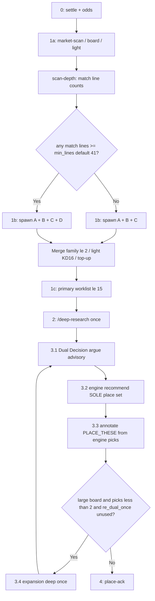
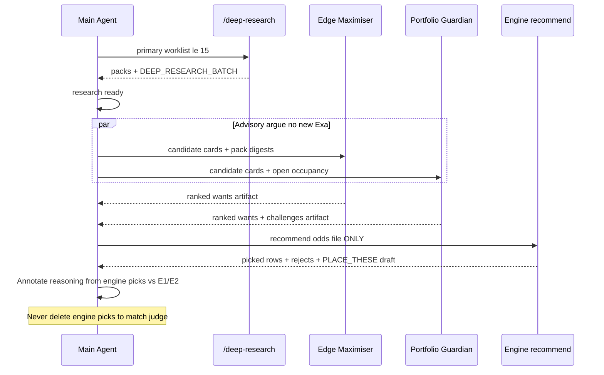

# Adaptive Multi-Agent Scan + Dual Decision Agents (ESR)

| Field | Value |
|-------|--------|
| **PLAN_ID** | `adaptive-scan-and-dual-decision-2026-07-27` |
| **Author** | desk / Grok Build |
| **Date** | 2026-07-27 |
| **Revised** | 2026-07-27 (post design review ISS-01–ISS-14) |
| **Status** | **Accepted** · **Implemented-in-progress** (PR1 docs persist; skill/code land in PR0–PR5) |
| **Repository** | `nt-betting-tracker` |
| **Related (live)** | `docs/skills_mirror_daily-run.md` · `~/.grok/skills/daily-run/SKILL.md` · `docs/DEEP_RESEARCH_SKILL_ESR_2026-07-26.md` · `docs/skills_mirror_deep-research.md` · `docs/DIVERSITY_AND_EXPLORE.md` · `docs/MARKET_COVERAGE.md` · `docs/FORM_CONTINUITY_AND_ANTI_FLIP_HARDENING_2026-07-26.md` · `AGENTS.md` (Stage 1b / Dual Decision sections land in **PR2/PR4** — not yet claimed here) |
| **Related (code)** | `nt/market_coverage.py` (`DEFAULT_HIGH_VOLUME_THRESHOLD = 40`) · `nt/odds_parse.py` · `nt/board.py` · `nt/recommend.py` · `nt/portfolio.py` · `nt/light_research.py` · `scripts/write_deep_research_pack.py` · pycache: `scan_merge` · `market_family` · `live_ledger` · `form_continuity` (sources may be missing until PR0 / PR-H) |
| **Doc family** | This file (normative design) · stub [`ESR_MULTI_AGENT_SCAN_2026-07-25.md`](./ESR_MULTI_AGENT_SCAN_2026-07-25.md) · philosophy [`RESEARCH_RESET_SIMPLE_EFFECTIVE_2026-07-25.md`](./RESEARCH_RESET_SIMPLE_EFFECTIVE_2026-07-25.md) |

---

## Overview

Edge-Seeking Research (ESR) Stage 1b already runs three shallow scan agents (A favourites / B totals+props / C HC+matchup) that merge into an 8–15 primary worklist for Stage 2 `/deep-research`. Live desk days still under-produce **football HUB/1X2** edges, under-explore **long-tail props** on high-volume boards, and finalize the slip from a **single main-agent perspective** after packs exist.

This design strengthens Stage 1b into an **adaptive** multi-agent scan (A/B/C always + **conditional Agent D** when any match has **>40** parseable odds lines) and inserts a **fast Dual Decision** layer after deep research as **non-binding advisory ranking + PLACE_THESE annotation**. Engine `recommend` / `build_portfolio` remains the **sole** source of the place set and stakes. Form-continuity, anti-flip, capital_v2, phase, secure, unit, and ControlSignals math are **not changed by this plan** (a separate hygiene restore may re-land missing modules without changing their documented math). Full-board deep remains **refused**.

**Delivered by this design:**

1. Updated Agent A/B/C role cards (HUB/1X2 mandate + short_chalk interaction; strengthened props; HC matchup discipline)
2. Conditional Agent D spawn logic with a concrete **odds-line count** definition (`parse_odds_file` Candidate count; never reuse market-scan `high_volume` bool for spawn)
3. Dual Decision stage (2 argument agents + main annotator) with **KD-DD-wire: advisory-only**
4. Wiring into `/daily-run` (skill + repo mirrors + helpers + docs) with ordered PRs that restore deps before skill mandates code
5. Worked examples: thin multi-sport board (A+B+C only) and large football board (A+B+C+D + dual decision)

---

## Background & Motivation

### Current ESR flow (live skill law)

From `docs/skills_mirror_daily-run.md` / `~/.grok/skills/daily-run/SKILL.md`:

| Stage | Action | Owner |
|-------|--------|--------|
| 0 Collect | Odds dump in `inbox/` | Operator / collector |
| 1a Engine baseline | `market-scan` → `board` → `light` → `data/state/deep_queue.json` SSOT | CLI |
| 1b Multi-agent scan | A/B/C max **5** each → merge/dedupe/family ≤2 → shortlist **8–15** | Subagents + main |
| 1c Primary worklist | shortlist ∪ `coverage_critical` · cap **15** | Main |
| 2 Deep | `/deep-research` **once** on primary worklist only; atomic `scripts/write_deep_research_pack.py` | Skill |
| 3 Select | `research ready` → `recommend` (gates + grade + diversify) | Engine |
| 3b Expand | Large board & &lt;2 picks → `/deep-research` expansion 5–8 | Skill |
| 4 Output | `PLACE_THESE.md` → place-ack | Main + CLI |

Merge algorithm and failure modes (partial merge, engine top-up, all-fail → engine `deep_queue`, never silent-skip Stage 2) are already specified in the daily-run skill. Artifact shapes are live: `outbox/scan_agent_{a,b,c}_YYYY-MM-DD.jsonl`, `outbox/MULTI_AGENT_SHORTLIST.md`, provenance `scan_agent:` on PLACE_THESE.

### Evidence from a recent desk day (2026-07-27)

| Artifact | Observation |
|----------|-------------|
| `inbox/odds_2026-07-27.txt` | 14 matches, **144** candidates; **max 26 lines/match** → no high-volume match |
| Agent A JSONL | 5 picks: esports ML + football/baseball short ML (1.41–1.52) — **no mid-band football HUB 1X2** |
| Agent B JSONL | Maps totals, team totals, game totals, football O2.5 — props thin |
| Agent C JSONL | HC dogs with matchup reasons + `force_scan:` — good role fit |
| Merge | Shortlist 12; several A short-chalk MLs **dropped** at light stage1 / KD16 |
| Slip | 2 picks: esports ML (A) + baseball HC (C) — **zero football HUB/1X2** |

Contrast high-volume dump `inbox/odds_available_now.txt`: **Frankrike vs Spania ≈ 886 lines** (≫40). On boards like that, Stage 1b today still only has A/B/C capacity (15 scan seats before merge caps) and Agent B is forced to compete between main totals and deep specials.

### Pain points

1. **Too few football HUB/1X2 bets**  
   Agent A’s live card says “ML / clear fav side” in **1.40–1.90**, but practice biases to short ML chalk that light prefilter marks `short_chalk` (`short_chalk_odds: 1.70`), or to non-football ML. Football **HUB** mid-band favourites are not mandated. When clear 1X2 edges exist, agents still divert to handicaps. Even after A “searches HUB,” short 1.40–1.55 HUB will often **fail light / KD16** unless `force_scan:` or mid-band preference is explicit.

2. **Deep prop markets under-explored**  
   `docs/MARKET_COVERAGE.md` already catalogs T2/T3/T4 on high-volume matches (`DEFAULT_HIGH_VOLUME_THRESHOLD = 40` in `nt/market_coverage.py`). Stage 1b does **not** spawn a dedicated long-tail scanner, so interesting props/cards/corners/shots from market-scan rarely reach the primary worklist within the 15-cap.

3. **Final selection single-agent risk**  
   After packs exist, one main agent narrates “best +EV.” Portfolio hard caps are engine-enforced **when present in code**. Dual Decision must **not** invent a parallel place list — it improves challenge quality and PLACE_THESE explanation against whatever `recommend` actually picks.

### What already works (preserve)

- Engine SSOT: `deep_queue.json` unrewritten by multi-agent merge
- Diversity triad (skill): (1) no family demote of engine queue · (2) shortlist soft family ≤2 · (3) portfolio hard max 2 at recommend **when engine implements it**
- Stage 2 fail-closed: primary worklist ≤15; refuse full-board deep; atomic pack writer
- Scan agents: scan-only (no Exa packs, no place, no ledger)
- Scan-merge semantics (from pycache / skill): odds-dump validation, light-eligibility KD16, `force_scan:`, coverage_critical union, engine fallback ISS-2
- High-volume catalog: market-scan tiers T1–T4
- Live diversify keys in this worktree’s `nt/portfolio.py`: `max_per_market`, max sport, **max_per_match**, correlation — **not** currently `form_continuity` / `ranking_gap_hc` (see Branch hygiene)

### Branch hygiene (this worktree — design must not paper over)

| Module / path | Status on this worktree |
|---------------|-------------------------|
| `nt/scan_merge.py` | **Source missing**; pycache present (A/B/C only API) |
| `nt/market_family.py` | **Source missing**; pycache present (`market_family()`) — **hard** scan_merge import |
| `nt/live_ledger.py` | **Source missing**; pycache present (`filter_live_rows`, `assert_not_archive_path`) — **hard** scan_merge import |
| `nt/form_continuity.py` | **Source missing**; pycache present |
| Live `nt/portfolio.py` | **No** `form_continuity` / `ranking_gap` wiring (~1404 lines) |
| `nt/portfolio.sync-conflict-*-CK225WL.py` | **Has** form_continuity + ranking-gap soft cap — Syncthing conflict left thinner portfolio |
| `docs/ESR_MULTI_AGENT_SCAN_2026-07-25.md` | **Missing** (linked from daily-run) |
| `docs/RESEARCH_RESET_SIMPLE_EFFECTIVE_2026-07-25.md` | **Missing** |
| Root `AGENTS.md` | No multi-agent Stage 1b section; still deep_queue-first wording |
| `nt/__main__.py` | **No** `scan-merge` / `scan-depth` subcommands |
| `tests/test_scan_merge.py` | Missing (pycache only) |
| Windows `nt` builtin | Shadows package; always use `run_nt` / `nt_bootstrap.ensure_local_nt()` |

**Implication:** Dual Decision Guardian challenges against form_continuity / ranking-gap **engine soft-rejects are not reliable on this worktree** until a hygiene restore. This plan does **not** change continuity math; it either (PR-H) restores documented modules/wiring without math change, or Guardian uses **live** diversify keys only until then.

### Engine recommend API (wire-in fact)

`nt/recommend.py` `run_recommend(cfg, odds_path, …)`:

1. `parse_odds_file(odds_path)`
2. `attach_evidence(candidates, …)`
3. `build_portfolio(cfg, candidates, …)` — **no** preferred-slate / pin / priority / shortlist argument

Therefore Dual Decision **cannot** select the place set without a new engine hook (deferred optional later PR). **v1 law = advisory-only** (KD-DD-wire).

---

## Goals & Non-Goals

### Goals

| ID | Goal |
|----|------|
| G1 | Strengthen Agent **A** so football **HUB/1X2 Match Result** in **1.40–1.90** is actively sought and **survives to Stage 2** when research supports (mid-band / `force_scan:` / light interaction documented) |
| G2 | Strengthen Agent **B** for team totals, player props, cards, corners, specials (still max 5; self-limit ≤2 same family; when D armed → main totals bias) |
| G3 | Keep Agent **C** as HC + matchup specialist |
| G4 | Spawn conditional Agent **D** only when ≥1 match has **lines ≥ adaptive_scan_agent_d_min_lines (default 41)**; D = long-tail only; max 5 |
| G5 | Merge A+B+C(+D) with existing rules (family ≤2, shortlist 8–15); soft D role-drift annotation only |
| G6 | After Stage 2 packs: **Dual Decision** argues; main runs **engine recommend first**; annotates PLACE_THESE (advisory-only) |
| G7 | Wire into `/daily-run` + mirrors + DESK_SKILLS + AGENTS without skill/code drift |
| G8 | Dual Decision remains **fast** (no new Exa; ≤8 min) |
| G9 | Provenance: `scan_agent` may include `D`; dual-decision tags written **after** engine pick set is known |

### Non-Goals

| ID | Non-goal |
|----|----------|
| NG1 | Change form-continuity, anti-flip, capital_v2, phase ladder, secure, unit sizing, 10 NOK test cap, ControlSignals **math** |
| NG2 | Full-board deep research or deep inside any scan agent |
| NG3 | Raise max beyond **5** per scan agent or primary worklist cap **15** |
| NG4 | FEH / anti-soft place-law revival |
| NG5 | Rewrite `data/state/deep_queue.json` from multi-agent merge |
| NG6 | Dual Decision invents `p_model` or softens min_EV |
| NG7 | Permanent hard-reject list growth from dual-decision arguments |
| NG8 | Replace engine `recommend` / `build_portfolio` with LLM slip construction, or hand-remove engine picks |
| NG9 | v1 engine hook `--prefer-keys` / sort boost (optional later only) |

---

## Proposed Design

### End-to-end flow (normative stage IDs)

Use **substeps under Stage 3 Select** so “Stage 3” is unambiguous:

| ID | Name | Action |
|----|------|--------|
| 0 | Collect | settle + odds |
| 1a | Engine baseline | market-scan / board / light |
| 1b | Adaptive scan | A∥B∥C(∥D) → merge 8–15 |
| 1c | Primary worklist | shortlist ∪ coverage_critical ≤15 |
| 2 | Deep | `/deep-research` once |
| **3.1** | Dual Decision argue | Edge Maximiser ∥ Portfolio Guardian (advisory artifacts only) |
| **3.2** | Engine recommend | `research ready` → `recommend` — **sole place-set law** |
| **3.3** | Annotate + PLACE_THESE | Main writes blend narrative **from engine picks** + dual-decision cards |
| **3.4** | Expansion (optional, **once**) | If large board & &lt;2 picks → `/deep-research` expansion → re-run 3.1–3.3 **once** (`re_dual_once` consumed) |
| 4 | Place | place-ack |



**Order law:**

```text
settle → odds → adaptive Stage 1b scan → merge 8–15 → /deep-research
  → dual decision ARGUE (advisory) → engine recommend → annotate PLACE_THESE
  → (optional once) expansion → re-argue → re-recommend → re-annotate
```

---

## PART 1 — Adaptive multi-agent scan (Stage 1b)

### 1.1 Spawn matrix

| Agent | Role | Focus markets | Odds band | Max | Spawn |
|-------|------|---------------|-----------|-----|--------|
| **A** | Favourites & HUB | **HUB / 1X2 Match Result** (esp. football), clear fav ML/side | **1.40–1.90** incl. | **5** | Always |
| **B** | Totals & Props | Team totals, player props, cards, corners, specials, natural O/U | Open | **5** | Always |
| **C** | Handicaps & Matchup | HC + matchup dogs with real reason | Open | **5** | Always |
| **D** | Deep Props & Specials | Long-tail only (T2–T4 style) | Prefer non-main | **5** | **Conditional** |

**Hard bans (all scan agents):** no Exa pack · no `write_deep_research_pack` · no recommend · no ledger write · no invent `p_model` · no `history/archives/` or `history/rounds/`.

**Parallelism:** Prefer parallel A∥B∥C(∥D). Sequential fallback: **A → B → C → (D if armed)**. Wait budget: **≤12 minutes** for the **entire** scan layer including D.

**Sequential D budget (KD-scan-seq):** If sequential and wall-clock after A+B+C is **≥10 minutes**, **skip D** even if spawn predicate true; note `scan_agent_missing: D (budget)`. Do not extend the 12 min law.

### 1.2 Agent A — Favourites & HUB (strengthened)

**Purpose:** Surface short-to-mid favourite edges, with **mandatory active search** of football (and other 3-way) **HUB/1X2 Match Result**, in a way that can **reach Stage 2**.

**Must:**

1. Scan every football (and other HUB) match for **1X2 / HUB** selections in **[1.40, 1.90]**.
2. Prefer **main Match Result** over diverting a clear 1X2 edge into handicap solely because HC is “more interesting.”
3. If a clear favourite 1X2 edge exists (form/rank/H2H one-liner supports fav or draw), include it among the ≤5 — **do not ignore 1X2 for HC**.
4. Still allow non-football short ML/Vinner in band when stronger than football HUB.
5. **Light / short_chalk interaction (normative for G1):**
   - Live light: `short_chalk_odds: 1.70`, heavy `short_chalk_penalty`, short-main demotion (`nt/light_research.py` / `config.yaml`).
   - Merge KD16: multi-agent-only **hard light-fail → DROP** unless reason contains `force_scan:` and main keeps with note.
   - **Prefer odds ≥ 1.70** when structural support is thin (default A seats).
   - Allow **1.40–1.69** only with an **explicit structural one-liner** (form/rank/H2H/table) **and** prefix reason with `force_scan:` when the edge is real enough to justify Stage 2 cost despite light fail risk.
   - Prefer mid-band **1.70–1.90** football HUB over 1.40–1.55 chalk that will be process-theater (scanned then KD16-dropped).
6. Soft `form_continuity_risk:` when live ledger shows recent heavy-fav Win on opposite side (scan note only).

**Must not:**

- Fill all five seats with 1.40–1.55 chalk ML that light will drop without `force_scan:`.
- Treat “longshot ML” as A territory.
- Skip HUB entirely on a football-heavy board to fill seats with non-football chalk.

**Acceptance heuristic (agent self-check):**

| Check | Pass |
|-------|------|
| Odds ∈ [1.40, 1.90] | Required |
| ≥1 football HUB/1X2 among A’s picks **when football HUB lines in band exist** | Required |
| Clear 1X2 not replaced by HC for same match without one-line justification | Required |
| If odds &lt; 1.70: structural why + `force_scan:` when intending Stage 2 survival | Required |
| Prefer ≥1 seat at odds ≥ 1.70 when such HUB lines exist | Strong preference |
| Non-empty reason | Required |

**Output schema (JSONL row):**

```json
{
  "match": "Barcelona SC vs LDU Quito",
  "selection": "HUB: Barcelona SC",
  "odds": 1.75,
  "sport": "football",
  "market_family": "ml",
  "market_type": "HUB",
  "reason": "Home fav mid-band HUB; table/form lean home; not HC.",
  "scan_agent": "A",
  "form_continuity_risk": ""
}
```

### 1.3 Agent B — Totals & Props (strengthened)

**Must actively consider (when present on dump):** match totals / maps / runs; **team totals**; **player props**; **cards**; **corners**; other specials with a one-sentence natural story.

**Self-limit:** ≤**2** same coarse `market_family` in B’s own five.

**Coordination with D (when `spawn_agent_d=true` — pass flag from scan-depth into B’s prompt):**

| Rule | Detail |
|------|--------|
| B hard self-bias | Prefer **main natural totals + team totals**; at most **1** pure long-tail prop/card/corner seat |
| D owns | Deep props, cards, corners, shots, specials on high-volume matches |
| Merge (when D-armed) | If B and D collide on the **same long-tail family key**, **prefer D’s row** over B’s for that family seat (soft priority in merge sort, still subject to family ≤2). Note `b_yielded_longtail_to_d` in dropped/notes |

When D is **not** spawned, B must cover props itself (full strengthened mandate).

### 1.4 Agent C — Handicaps & Matchup

Unchanged core: HC + matchup dogs with real reasons; `force_scan:` only for real matchup vs light-fail risk; soft `form_continuity_risk:`; not “long odds = value.” Do not steal clear HUB 1X2 edges that belong in A without a distinct HC thesis.

### 1.5 Agent D — Deep Props & Specials (conditional)

#### Spawn predicate (normative)

```text
lines_count(M) = |{ Candidate rows from parse_odds_file with match == M }|
SPAWN_D := exists M such that lines_count(M) >= adaptive_scan_agent_d_min_lines
default adaptive_scan_agent_d_min_lines = 41   # strict product >40
```

- Implement as **`n >= cfg`** only — **never** call market-scan’s `high_volume = (n >= 40)` bool for spawn_d.
- Unit tests required: **n=40 → false**, **n=41 → true**.
- Log in shortlist header: `agent_d: spawned | skipped (max_lines_per_match=N, min_lines=41)`.

**Shared helper (code):**

```python
def match_line_counts(odds_path) -> dict: ...
def should_spawn_agent_d(counts: dict, min_lines: int = 41) -> bool:
    return any(n >= min_lines for n in counts["per_match"].values())
# Do NOT reuse market_coverage high_volume flag.
```

Optional shared primitive for market-scan vs D (if both touch the same util later):

```python
def is_high_volume(n: int, threshold: int = 40, mode: str = "ge") -> bool:
    # market-scan: mode="ge", threshold=40
    # agent D: prefer should_spawn_agent_d / min_lines=41 instead of this helper
    ...
```

**What counts as a line:** each priced **selection** `Candidate` after parser de-dupe (`match|selection|decimal_odds`). Not raw text lines, not metadata headers.

#### Agent D role card

| Rule | Detail |
|------|--------|
| Focus | Long-tail **only**: player props, cards, corners, shots, specials, exotic team stats |
| Avoid | Pure HUB/1X2, main ML, main HC, primary O2.5 |
| Prefer | Matches in `matches_over_threshold` (agent bias ≥3 of 5 — **not** merge-hard-enforced in v1) |
| Max | **5** |
| Depth | Same shallow scan contract as A/B/C |
| Hints | `outbox/market_scans/*` interesting/review when present |
| Self-limit | ≤2 same `market_family` |

#### Long-tail classification (merge-implementable, v1)

Reuse patterns from `nt/market_coverage.py` tiers where possible:

```text
is_long_tail(selection, market_type) :=
  tier in {T2_props, T3_alt, T4_specials}
  OR family in {goalscorer, player_stat, corners, cards, special}
  OR prop/cards/corners/shots/specials regex (same spirit as market_coverage._TIER_RULES)

is_main_board(selection, market_type) :=
  HUB / Vinner ML / main HC / primary O2.5 (ou_25) / bare draw — T1_main style
```

**v1 merge rule for D role-drift (soft only — KD-D-soft):**

- **Never hard-drop** D rows for role drift in v1.
- If ≥3 of D’s kept rows are `is_main_board`, annotate shortlist: `process_miss: agent_d_role_drift` and list the main rows.
- Family ≤2 remains the **only hard** seat competition with B (plus B→D long-tail prefer when D-armed).

### 1.6 Merge algorithm (A+B+C; +D after PR3)

**PR0 restore target = A/B/C parity with pycache** (`_AGENT_ORDER = A,B,C,ENGINE`). Agent D deltas are **PR3 only**.

```text
Constants (pycache / skill):
  AGENT_MAX = 5
  AGENT_A_ODDS_LO/HI = 1.40 / 1.90
  MAX_FAMILY_AFTER_MERGE = 2
  MAX_PER_SPORT_SOFT = 3
  SHORTLIST_MIN/MAX = 8 / 15
  PRIMARY_CAP = 15
  FORCE_SCAN_TOKEN = "force_scan:"
  COVERAGE_TAGS = coverage_floor:top_promo_scaffold | coverage_floor:sport_rotation

PR0 agent order: A, B, C, ENGINE
PR3 agent order: A, B, C, D, ENGINE
  discover_agent_files: a,b,c  →  a,b,c,d
  _normalize_agent_id: \b([ABC])\b  →  \b([ABCD])\b
  run_scan_merge: + agent_d path
  render_shortlist_markdown: include D counts / skipped

1. Preflight: match_line_counts → spawn_d flag (PR3; until then main may hand-count)
2. Load agent JSONL/JSON
3. Truncate each agent to 5
4. Normalize: evidence_pair_key; attach scan_agents, odds, reason, sport, market_family
5. Drop invalid: off odds dump; empty reason; Agent A odds outside [1.40, 1.90]
6. (PR3) Soft annotate D role-drift if ≥3/5 main_board — do not hard-drop
7. Dedupe by key; union scan_agents → e.g. A+C, B+D
8. Family rule: each market_family ≤2
   - When D-armed: on long-tail family collision B vs D, prefer D (stable sort key)
9. Open occupancy soft (live Pending+ConfirmedPlaced via live_ledger.filter_live_rows)
10. Soft sport: prefer ≤3 per sport on multi-sport boards
11. Light-eligibility (KD16): multi-agent-only hard light-fail DROP unless force_scan:
12. Size clamp 8–15; engine top-up if <8
13. form_continuity_risk notes from agents — annotation only; no new hard-drop class
14. primary_worklist = shortlist ∪ coverage_critical (cap 15)
15. Write MULTI_AGENT_SHORTLIST.md + optional JSON
```

**Do not change** form-continuity / anti-flip **engine** behavior in this plan.

### 1.7 Failure / timeout

| Case | Behaviour |
|------|-----------|
| D not spawned | A/B/C path only |
| D armed but fails/timeout/budget skip | Merge A+B/C; `scan_agent_missing: D`; still Stage 2 |
| Partial A/B/C | KD17 partial merge + engine top-up |
| All fail | `fallback: engine_deep_queue`; still Stage 2 |
| Wait budget | Single **12 min** for entire scan layer |

### 1.8 CLI (after PR0 / PR3)

```powershell
# PR0
python run_nt.py research scan-merge --odds <odds_file> `
  --agent-a outbox/scan_agent_a_YYYY-MM-DD.jsonl `
  --agent-b outbox/scan_agent_b_YYYY-MM-DD.jsonl `
  --agent-c outbox/scan_agent_c_YYYY-MM-DD.jsonl
# or: --agents-dir outbox

# PR3
python run_nt.py research scan-depth --odds <odds_file>
python run_nt.py research scan-merge ... --agent-d outbox/scan_agent_d_YYYY-MM-DD.jsonl
```

Until PR3 lands, skill text for adaptive D must say: **manual line-count** (group Candidates / or count selections per match from dump) is acceptable; do not claim `scan-depth` is mandatory.

---

## PART 2 — Dual Decision Agents (advisory only)

### 2.1 KD-DD-wire (normative — implements Issue 1) — **law, not optional**

> **Dual Decision artifacts are non-binding advisory ranking only.**  
> **PLACE_THESE content and the stake/place set come exclusively from engine `recommend` / `build_portfolio` output.**  
> The judge **never** publishes a preferred 2–6 list as a place list.  
> There is **no** pre-recommend “build preferred set that recommend must honor” in v1.  
> **Hand-removing an engine pick because Guardian challenged it is forbidden.**

| Conflict | Rule |
|----------|------|
| Engine **drops** a dual-decision want | Near-miss with **engine reject reason**; do not hand-force place |
| Engine **includes** a dual-decision **drop** | **Still place** the engine pick; annotate `decision: engine_only` or `guardian_would_drop` — **do not hand-remove** |
| Dual agents agree on X, engine picks Y | Place **Y**; narrative explains disagreement |
| No dual artifacts (skip path) | PLACE_THESE as today; omit dual tags |

**Optional later (not v1):** engine hook `recommend --prefer-keys` / sort boost — requires code + tests; changes selection presentation order only if designed carefully; **out of scope** for this plan’s non-goals.

### 2.2 Placement (Stage 3.1 → 3.2 → 3.3)



**Speed law:** Dual Decision argue ≤ **8 minutes** wall-clock (prefer E1∥E2). Inputs = packs + shortlist reasons + open occupancy + Settlement Lessons soft notes. **No** new Exa, **no** new packs.

### 2.3 Inputs (shared card set)

Same as before: match/selection/odds, sport, market_family, scan_agents, p_model/grade, opposite_side, open family/sport/match seats, lessons soft tags. Optional continuity/RG fields **when present** on packs or engine notes.

### 2.4 Decision Agent 1 — Edge Maximiser

Mission, template, max rank 3–6: unchanged intent. Output: `outbox/decision_agent_edge_YYYY-MM-DD.md`. **Does not place.**

### 2.5 Decision Agent 2 — Portfolio Guardian

Mission: balanced argument + challenges. Output: `outbox/decision_agent_guardian_YYYY-MM-DD.md`. **Does not place.**

**Challenge keys — branch-aware (Issue 3):**

| Priority | Challenge using | When |
|----------|-----------------|------|
| **P0 live always** | `max_per_market` / market_family concentration, **max_per_match**, sport caps, correlation / same-match stacks | Always on this worktree |
| **P1 when present** | `form_continuity:` soft-reject notes, ranking-gap HC soft cap signals | Only if engine/portfolio emits them (after hygiene PR-H) or pack notes flag them |
| Soft | lessons_soft pile-ons; explore-boost-only thin base_ev | When notes available |

**Do not claim** “engine will soft-reject ranking-gap pile” on this worktree until portfolio wiring is restored. Guardian still **should** challenge RG pile narratively (desk risk), but operators must not expect an engine soft-skip that does not exist yet.

### 2.6 Main Agent protocol (advisory annotator — replaces old “Final Judge builds preferred set”)

```text
STAGE 3.1 — ARGUE (before recommend)
1. Spawn Edge Maximiser + Portfolio Guardian on deep-ready cards.
2. Write decision_agent_edge_*.md + decision_agent_guardian_*.md + draft DUAL_DECISION_*.md
   (wants/challenges only — NOT a place list).

STAGE 3.2 — ENGINE LAW
3. python run_nt.py research ready --odds <odds_file>
4. python run_nt.py recommend --odds <odds_file>
   (live default; dry-run only if user asked)
5. Engine output = sole picked set + stakes + rejects.

STAGE 3.3 — ANNOTATE (after recommend)
6. For each engine-picked row:
   - If on both E1 and E2 top lists → decision: both
   - If only E1 → decision: edge_only (or edge_over_guardian if E2 challenged)
   - If only E2 → decision: guardian_only
   - If on neither → decision: engine_only
7. For each E1/E2 want not picked → near-miss with engine reject reason (not dual veto).
8. Never hand-remove an engine pick because Guardian challenged it.
9. Finalize PLACE_THESE reasoning + outbox/DUAL_DECISION_YYYY-MM-DD.md reconciliation section.
10. Stage 3.4: if large board & picks < 2 and re_dual_once unused → expansion deep →
    re-run 3.1–3.3 exactly once; set re_dual_once=consumed.
```

#### PLACE_THESE provenance (post-engine only)

```markdown
### N. {Selection} @ {odds} · …
- **Why:** …
- **Support:** …
- **Main risk:** …
- **Opposite side:** …
- **Form continuity:** …
- **EV split:** …
- **Diversity:** …
- **scan_agent:** A+D
- **decision:** both | edge_only | guardian_only | edge_over_guardian | engine_only
- **dual_decision:** maximiser_rank=#k · guardian_rank=#j · note: …
```

**Integrity rule (KD-prov):** Write `decision:` tags **only after** recommend. Any claim of `both` requires the pick to appear on **both** agent want lists **and** in engine picks.

### 2.7 Skip rules (KD-dd-skip)

| Session type | Dual Decision |
|--------------|---------------|
| Full `/daily-run` | Run 3.1–3.3 |
| Recommend-only / already-researched packs only | **Skip** 3.1 (same as Stage 1b skip) |
| Empty deep-ready set | Skip argue; still recommend path may empty |
| `dual_decision` skill kill-switch | Skip (see Feature flags — skill-only) |

### 2.8 What Dual Decision must not do

- Invent or edit `p_model`  
- Soften min_EV / haircut  
- Publish a place list separate from engine picks  
- Hand-remove or hand-add bets vs engine output  
- Re-open full odds board  
- Replace `build_portfolio`  
- Run &gt; ~8 minutes or nest deep-research  

---

## API / Interface Changes

### Skill: `/daily-run`

| Stage | Action |
|-------|--------|
| **1b** | Adaptive A/B/C + **conditional D** (max 5); D only after line-count (≥41 or manual until scan-depth) |
| **2** | `/deep-research` once (unchanged) |
| **3.1** | Dual Decision **argue** (advisory) |
| **3.2** | engine `recommend` (**sole place set**) |
| **3.3** | Annotate PLACE_THESE from engine picks |
| **3.4** | Expansion once → re-3.1–3.3 once |

### CLI

| Command | PR | Role |
|---------|-----|------|
| `research scan-merge` | PR0 | A/B/C merge + shortlist |
| `research scan-depth` | PR3 | per-match counts + spawn_agent_d |
| `research scan-merge --agent-d` | PR3 | D merge support |
| `recommend` | — | **No v1 math/API change** |

### scan_merge restore surface (PR0 hard deps)

| Module | Why |
|--------|-----|
| `nt/market_family.py` | `from nt.market_family import market_family` — hard |
| `nt/live_ledger.py` | `filter_live_rows` for open occupancy — hard |
| `nt/scan_merge.py` | merge core — A/B/C only in PR0 |
| `tests/test_scan_merge.py` | restore |
| `nt/__main__.py` | `scan-merge` subcommand |

**Not in PR0:** Agent D (normalize/discover/render/run_scan_merge signature), `scan-depth`.

**Windows note:** `import nt` hits the **builtin** unless `nt_bootstrap.ensure_local_nt()` / `run_nt` ran first. Document in restore notes.

### Agent artifacts

| Agent | Path |
|-------|------|
| A/B/C/D | `outbox/scan_agent_{a,b,c,d}_YYYY-MM-DD.jsonl` |
| Edge / Guardian | `outbox/decision_agent_{edge,guardian}_YYYY-MM-DD.md` |
| Reconciliation | `outbox/DUAL_DECISION_YYYY-MM-DD.md` (wants **and** post-engine match table) |
| Shortlist | `outbox/MULTI_AGENT_SHORTLIST.md` |

---

## Data Model Changes

### No ledger / bets.csv schema changes

### Config (code-read keys only)

```yaml
research:
  high_volume_market_threshold: 40          # market-scan only (>=)
  adaptive_scan_agent_d_min_lines: 41       # Agent D spawn: lines >= 41
  # NO research.dual_decision.enabled in v1 — skills do not load YAML;
  # Dual Decision kill-switch is skill text / skill comment only.
```

### form-continuity / capital / phase

**This plan does not change math.** Hygiene PR-H may restore missing **sources/wiring** to match skill-documented behavior without redesigning thresholds.

---

## Alternatives Considered

### Alt 1 — Always spawn four scan agents (A–D)

Rejected: wastes thin boards; D cannibalizes B; 12 min tighter.

### Alt 2 — No Dual Decision; only strengthen A/B/C + D

Rejected as sole solution (product requires dual argue); valid **ship Part 1 first** path.

### Alt 3 — Dual Decision replaces engine `recommend`

Rejected: breaks capital/diversify law; invents stakes.

### Alt 4 — Lower D threshold to ≥20 / ≥26

Rejected for v1: little true long-tail; role drift.

### Alt 5 — Dual Decision only on Stage 3.4 expansion

Rejected: misses concentration narrative on first recommend.

### Alt 6 — Engine `--prefer-keys` soft boost in v1

Rejected for v1: requires recommend/portfolio API + tests; defer optional later PR. Advisory-only is implementable without engine changes.

### Alt 7 — Pre-recommend judge preferred set, then “align” narrative to engine

Rejected (review Issue 1): creates place-list theater or silent portfolio bypass. **KD-DD-wire** forbids this.

---

## Security & Privacy Considerations

| Topic | Handling |
|-------|----------|
| Ledger integrity | Scan + dual decision read-only on bets; only recommend/place-ack write risk |
| Archive isolation | FORBIDDEN archives/rounds/git stash data |
| Prompt injection | Odds dump untrusted text; no shell from selections |
| Stake safety | Dual Decision cannot raise/lower stakes; capital_v2 / unit / 10 NOK unchanged |

---

## Observability

| Signal | Where |
|--------|--------|
| spawn_agent_d + max lines | shortlist header + scan_depth JSON |
| Agent missing / budget skip D | `scan_agent_missing:` |
| D role drift | `process_miss: agent_d_role_drift` |
| B yielded long-tail to D | merge notes |
| Dual agreement vs engine | `DUAL_DECISION_*.md` post-engine table (`both` / `engine_only` / rejected wants) |
| Process miss | Dual Decision skipped silently on full daily-run |

### Metrics

| Metric | Target |
|--------|--------|
| Football HUB on shortlist when football present | ≥1 seat process metric when band lines exist |
| HUB seats that survive to primary (not KD16-dropped) | Track; prefer ≥1 mid-band or force_scan HUB |
| D spawn | n=40 false / n=41 true |
| Dual wall-clock | ≤8 min |
| PLACE_THESE decision tags | 100% post-engine; no pre-recommend tags |

---

## Rollout Plan

### Feature flags

| Concern | Kill-switch |
|---------|-------------|
| Agent D min lines | `research.adaptive_scan_agent_d_min_lines` (code) |
| Dual Decision | **Skill-only** for v1: comment out Stage 3.1 in `/daily-run` skill + mirror; **no** YAML flag (skills do not load config) |
| scan-merge | Stop invoking CLI; fall back to manual merge |

### Hygiene prerequisite (PR-H — recommended parallel, not dual-decision math)

Restore **documented** form_continuity + portfolio wiring from pycache + sync-conflict portfolio **without changing** continuity thresholds/math. Until then Dual Decision Guardian uses **P0 live diversify keys** only for “engine will enforce” claims.

### Rollback

| Layer | Action |
|-------|--------|
| Skill | Revert adaptive D / Stage 3.1 sections |
| Code | scan-merge without D; ignore scan_agent_d files |
| Dual Decision | Skill skip; no recommend code to revert |

### Risks

| Risk | Severity | Mitigation |
|------|----------|------------|
| Dual Decision becomes place theater | Critical | KD-DD-wire; tags post-engine only |
| PR0 incomplete deps | Critical | Restore market_family + live_ledger + scan_merge together |
| A HUB still KD16-dropped | Med | ≥1.70 prefer + force_scan for 1.40–1.69 |
| Guardian claims absent soft-rejects | Med | Branch-aware challenge keys; PR-H |
| B/D family collision | Med | D prefer long-tail when D-armed; B self-bias |
| Sequential 12 min false with D | Med | Skip D if ≥10 min after A/B/C |
| Doc link 404s | Low | PR1 stubs |

---

## Worked examples

### Example 1 — Small multi-sport board (A+B+C only)

**Odds:** `inbox/odds_2026-07-27.txt` — max **26** lines/match → spawn_d false.

```text
1a → scan-depth (or manual): max=26 → D skipped
1b A∥B∥C
   A: football HUB in ≥1.70 band when possible; force_scan only if short structural
   B: full props mandate (no D)
   C: HC matchup
merge → primary ≤15
2 deep
3.1 Edge ∥ Guardian argue
3.2 recommend (engine place set)
3.3 annotate decision: both|engine_only|…
4 place-ack
```

### Example 2 — Large football board (A+B+C+D + dual decision)

**Odds:** FRA–ESP **886** lines → spawn_d true.

```text
scan-depth: max=886 ≥41 → D armed
A: HUB 1X2 mid-band; B: main totals; C: HC; D: T2–T4 long-tail on FRA-ESP
merge: family ≤2; long-tail collision prefers D over B
2 deep primary only (NOT 886-line board)
3.1 argue → 3.2 recommend → 3.3 annotate
```

---

## Wire-into `/daily-run` checklist

| Surface | Update |
|---------|--------|
| `~/.grok/skills/daily-run/SKILL.md` | Adaptive 1b + Stage 3.1–3.3 advisory dual decision; **no** pre-recommend preferred place set |
| `docs/skills_mirror_daily-run.md` | Byte-sync |
| `docs/DESK_SKILLS.md` | Pointer |
| Missing doc stubs | ESR_MULTI_AGENT + RESEARCH_RESET (PR1) |
| Root `AGENTS.md` | **Single landing PR** for ESR Stage 0–4 skeleton when skill law first changes (see PR plan) |
| `nt/scan_merge.py` + deps | PR0 |
| scan-depth + D | PR3 |
| Tests / skill_smoke | PR0 merge; PR4 dual-decision template fixture |

---

## Open Questions

| ID | Question | Resolution in this revision |
|----|----------|------------------------------|
| OQ1 | `>40` vs `>=40` | **KD3:** `min_lines=41`; tests 40/41; never reuse market-scan bool |
| OQ2 | Hard force D to HV matches only? | Soft agent bias ≥3/5; not merge-hard in v1 |
| OQ3 | Dual on recommend-only? | **KD-dd-skip:** no |
| OQ4 | Engine dual_decision fields? | Defer optional later; v1 agent MD post-engine |
| OQ5 | Sequential D budget? | **KD-scan-seq:** skip D if ≥10 min after A/B/C |
| OQ6 | form_continuity missing? | **PR-H** restore without math change; Guardian P0 live keys until then |

---

## References

- `docs/skills_mirror_daily-run.md` · `~/.grok/skills/daily-run/SKILL.md`
- `docs/DEEP_RESEARCH_SKILL_ESR_2026-07-26.md` · `docs/skills_mirror_deep-research.md`
- `docs/MARKET_COVERAGE.md` · `nt/market_coverage.py`
- `docs/DIVERSITY_AND_EXPLORE.md` · `docs/FORM_CONTINUITY_AND_ANTI_FLIP_HARDENING_2026-07-26.md`
- `nt/odds_parse.py` · `nt/recommend.py` · `nt/portfolio.py` (live diversify keys)
- pycache contracts: `scan_merge`, `market_family`, `live_ledger`, `form_continuity`
- Live artifacts: `outbox/MULTI_AGENT_SHORTLIST.md`, `outbox/scan_agent_*_2026-07-27.jsonl`

---

## Key Decisions

| ID | Decision |
|----|----------|
| KD1 | Stage 1b **adaptive**: always A/B/C; D only if any match `lines_count >= adaptive_scan_agent_d_min_lines` (default **41**) |
| KD2 | `lines_count` = `parse_odds_file` **Candidate** rows per `match` (post de-dupe) |
| KD3 | Implement spawn as `n >= min_lines` (default 41); **never** reuse market-scan `high_volume` bool; unit tests n=40 false, n=41 true |
| KD4 | Agent A **must** search football HUB/1X2; prefer **≥ short_chalk_odds (1.70)**; 1.40–1.69 only with structural why + `force_scan:` when Stage 2 intended |
| KD5 | Agent B strengthened props; when D-armed, bias main totals (≤1 long-tail); merge prefers D on long-tail family collision |
| KD6 | Agent C = HC/matchup |
| KD7 | Agent D long-tail only; max 5; soft role-drift annotation if ≥3/5 main_board — **no hard-drop** v1 |
| KD8 | Merge family ≤2, shortlist 8–15, coverage_critical, engine fallback; D order/discover/normalize in **PR3 only** |
| KD9 | This plan does **not** change form-continuity/anti-flip/capital/phase math; PR-H may restore missing wiring |
| **KD-DD-wire** | Dual Decision is **non-binding advisory only**; place set + stakes **only** from engine `recommend`; never hand-remove engine picks; never publish judge preferred set as place list |
| KD10 | Dual Decision = Stage **3.1 argue** → **3.2 recommend** → **3.3 annotate** |
| KD11 | Dual Decision ≤8 min; no new Exa |
| KD12 | Target slip 2–6 when engine finds +EV; empty OK after expansion + no +EV |
| KD13 | No full-board deep; primary cap **15** |
| KD14 | PR0 restores **market_family + live_ledger + scan_merge (A/B/C) + CLI + tests** before adaptive skill automation |
| KD15 | PLACE_THESE `decision:` tags **after** recommend only; non-slate picks → `engine_only` |
| KD16 | Expansion re-runs dual argue + recommend + annotate **once** (`re_dual_once`) |
| KD17 | Coordinated skill + mirror + DESK_SKILLS + **one** AGENTS landing when Stage 1b/3.x law changes |
| **KD-dd-skip** | Skip Dual Decision on recommend-only sessions |
| **KD-scan-seq** | Sequential host: skip D if A/B/C already used ≥10 min of the 12 min scan budget |
| **KD-D-soft** | D role-drift is annotate-only in v1 |
| **KD-prov** | `decision: both` only if pick ∈ E1 wants ∩ E2 wants ∩ engine picks |

---

## PR Plan

Ordered. **Do not** ship skill mandates that require code before that code lands.

### PR-H — Hygiene restore: form_continuity + portfolio wiring (recommended parallel)

| | |
|--|--|
| **Title** | Restore `form_continuity` + portfolio continuity/RG wiring from pycache/sync-conflict (no math redesign) |
| **Depends on** | — |
| **Files** | `nt/form_continuity.py` · `nt/live_ledger.py` (if not already via PR0) · `nt/portfolio.py` (merge sync-conflict continuity paths carefully) · tests if present in pycache |
| **Description** | Re-land skill-documented soft-reject / ranking-gap soft cap **without changing thresholds**. Unblocks Guardian “engine will enforce” claims. Can ship independent of adaptive scan. |
| **Note** | If deferred, Dual Decision skill must use P0 live diversify keys only for enforcement claims. |

### PR0 — Restore A/B/C scan-merge foundation (complete dep chain)

| | |
|--|--|
| **Title** | Restore market_family + live_ledger + scan_merge (A/B/C) + CLI + tests |
| **Depends on** | — |
| **Files** | `nt/market_family.py` · `nt/live_ledger.py` · `nt/scan_merge.py` · `tests/test_scan_merge.py` · `nt/__main__.py` (`research scan-merge`) · restore notes (Windows `nt` builtin / `nt_bootstrap`) |
| **Description** | Independently shippable A/B/C merge matching **current pycache** contract (`_AGENT_ORDER=A,B,C,ENGINE`; discover a/b/c; normalize ABC). Smoke: one missing agent → shortlist + `scan_agent_missing` + engine top-up path. **No Agent D.** |
| **Tests** | Partial agent; all-fail engine fallback; family cap; Agent A odds band; open occupancy via live_ledger |

### PR1 — Design docs + link stubs

| | |
|--|--|
| **Title** | Persist adaptive/dual design; stub every daily-run 404 |
| **Depends on** | — (parallel PR0) |
| **Files** | `docs/ESR_ADAPTIVE_SCAN_AND_DUAL_DECISION_2026-07-27.md` · **stub** `docs/ESR_MULTI_AGENT_SCAN_2026-07-25.md` (pointer → adaptive design + live skill) · **stub** `docs/RESEARCH_RESET_SIMPLE_EFFECTIVE_2026-07-25.md` (ESR philosophy pointer) · `docs/DESK_SKILLS.md` · `docs/RESIDUAL_RISKS.md` (R-S2-11 dual advisory, R-S2-12 agent D, R-S2-13 branch hygiene) |
| **Description** | Stop skill 404s; do not claim AGENTS already has Stage 1b until PR2/PR4 AGENTS section lands. |

### PR2 — Skill + AGENTS: adaptive A/B/C + conditional D (manual depth OK)

| | |
|--|--|
| **Title** | `/daily-run` adaptive scan role cards; AGENTS Stage 1b skeleton |
| **Depends on** | PR1; **PR0 recommended** for merge CLI (manual merge still allowed) |
| **Files** | `~/.grok/skills/daily-run/SKILL.md` · `docs/skills_mirror_daily-run.md` · `docs/DESK_SKILLS.md` · **`AGENTS.md`** (ESR Stage 0–4 + multi-agent 1b + primary-worklist supersede deep_queue-first when shortlist exists) |
| **Description** | A/B/C strengthened cards; D conditional with **manual line-count until PR3** (“must run scan-depth **when available**; else count Candidates per match”). Sequential D budget rule. **No Dual Decision yet** (still 3 = ready+recommend). |
| **AGENTS rule** | This is the **only** PR that introduces Stage 1b into AGENTS; PR4 amends Stage 3 only. |

### PR3 — Code: scan-depth + Agent D merge support

| | |
|--|--|
| **Title** | `scan-depth` + scan-merge agent D + config min_lines |
| **Depends on** | PR0 |
| **Files** | `nt/scan_merge.py` (D: order, discover, normalize regex ABCD, `agent_d`, render, role-drift soft, B/D long-tail prefer) · `nt/__main__.py` (`scan-depth`) · `config.yaml` · `tests/test_scan_merge.py` · `tests/test_scan_depth.py` |
| **Description** | `should_spawn_agent_d` with min_lines=41; tests n=40/41. Skill may be patched in a tiny follow-up line in same PR or PR2.1 to say scan-depth is now mandatory when CLI present. |
| **Tests** | spawn false/true; D role-drift annotate; B/D long-tail prefer when D-armed |

### PR4 — Skill + AGENTS: Dual Decision Stage 3.1–3.3 (advisory-only)

| | |
|--|--|
| **Title** | Dual Decision argue → recommend → annotate (KD-DD-wire) |
| **Depends on** | PR2 (and PR-H recommended for Guardian engine claims) |
| **Files** | daily-run skill + mirror · `AGENTS.md` Stage 3.1–3.4 only · DESK_SKILLS · golden template `docs/templates/DUAL_DECISION_TEMPLATE.md` or `outbox/_fixtures/DUAL_DECISION_example.md` · `scripts/skill_smoke.ps1` row: dual-decision template present / checklist |
| **Description** | Explicit advisory-only law; post-engine `decision:` tags; skip on recommend-only; expansion once. **No recommend.py changes.** |
| **Verify** | Ops: edge+guardian artifacts; DUAL_DECISION reconciliation table matches engine picks; no hand-removed picks |

### PR5 — Ops smoke + residual cleanup (no second AGENTS rewrite)

| | |
|--|--|
| **Title** | skill_smoke scan-merge/scan-depth rows; residual risks; README one-liner |
| **Depends on** | PR0–PR4 |
| **Files** | `scripts/skill_smoke.ps1` · `docs/RESIDUAL_RISKS.md` · `README.md` flow line · **not** a third AGENTS structural rewrite (only fix leftovers if PR2/PR4 missed a sentence) |
| **Description** | Automated smoke: scan-merge one-agent-missing; scan-depth 40/41 fixture; dual-decision template exists. |

### PR6 — (Optional later) engine prefer-keys / reasoning_chain fields

| | |
|--|--|
| **Title** | Optional structured dual_decision or soft prefer-keys |
| **Depends on** | PR4 + explicit product ask |
| **Files** | `nt/recommend.py` / `nt/portfolio.py` / `nt/reasoning_chain.py` + tests |
| **Description** | Only if advisory annotation proves insufficient. Requires “math/sort change” review — not silent. |

---

## Implementation notes for agents (copy-paste role cards)

### Scan Agent A

```text
You are ESR Scan Agent A — Favourites & HUB (max 5).
Odds band 1.40–1.90. Prefer ≥1.70 (short_chalk_odds) so seats survive light/KD16.
MUST search football HUB/1X2. MUST NOT ignore clear 1X2 for HC.
If 1.40–1.69: structural one-liner + force_scan: when Stage 2 intended.
No p_model, packs, Exa, place. Output: outbox/scan_agent_a_YYYY-MM-DD.jsonl
```

### Scan Agent B

```text
You are ESR Scan Agent B — Totals & Props (max 5).
Team totals, player props, cards, corners, specials, natural totals.
Self-limit ≤2 same market_family.
If spawn_agent_d=true: bias main totals; at most 1 long-tail seat (D owns deep props).
No p_model, packs, Exa, place. Output: outbox/scan_agent_b_YYYY-MM-DD.jsonl
```

### Scan Agent C

```text
You are ESR Scan Agent C — Handicaps & Matchup (max 5).
Real matchup reasons only. force_scan: only when justified.
No p_model, packs, Exa, place. Output: outbox/scan_agent_c_YYYY-MM-DD.jsonl
```

### Scan Agent D

```text
You are ESR Scan Agent D — Deep Props & Specials (max 5).
Spawned only because a match has ≥41 parseable lines. Long-tail ONLY (props/cards/corners/shots/specials).
Bias to high-volume matches. Avoid pure HUB/main HC/main O2.5.
No p_model, packs, Exa, place. Output: outbox/scan_agent_d_YYYY-MM-DD.jsonl
```

### Decision Agent 1 — Edge Maximiser

```text
Advisory only. Packs exist. No new research. Rank 3–6 wants by honest +EV.
You do NOT place bets. Output: outbox/decision_agent_edge_YYYY-MM-DD.md
```

### Decision Agent 2 — Portfolio Guardian

```text
Advisory only. Challenge family concentration, max_per_match stacks, sport pile-ups;
also ranking-gap HC / form_continuity when engine notes present — do not invent engine soft-rejects.
You do NOT place bets. Output: outbox/decision_agent_guardian_YYYY-MM-DD.md
```

### Main agent annotation (not a second place list)

```text
After dual-decision artifacts: run engine recommend. PLACE_THESE picks = engine only.
Tag each pick decision: both|edge_only|guardian_only|engine_only using post-engine reconciliation.
Never delete an engine pick to satisfy Guardian.
```

---

*End of design — PLAN_ID `adaptive-scan-and-dual-decision-2026-07-27` · revision ISS-01–ISS-14*
