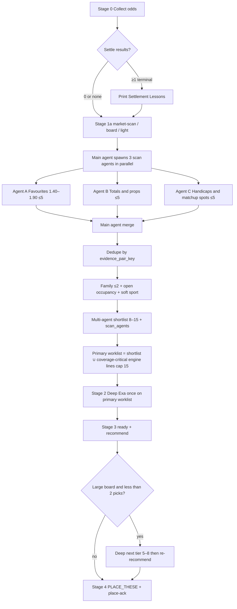

# Multi-Agent Stage-1 Scan (ESR Broad Scan Only)

| Field | Value |
|-------|--------|
| **Document title** | Controlled Multi-Agent First Pass for ESR Stage 1 |
| **PLAN_ID** | `esr-multi-agent-scan-2026-07-25` |
| **Author** | systems architect |
| **Date** | 2026-07-25 |
| **Rev** | 2 — review issues 1–14 closed |
| **Status** | Design (ready for implement) |
| **Repo** | `C:\Users\Sander\Documents\GitHub\nt-betting-tracker` |
| **Philosophy parent** | [`docs/RESEARCH_RESET_SIMPLE_EFFECTIVE_2026-07-25.md`](docs/RESEARCH_RESET_SIMPLE_EFFECTIVE_2026-07-25.md) |
| **Related** | [`docs/ESR_DIVERSITY_LEARNING_HARDENING_2026-07-25.md`](docs/ESR_DIVERSITY_LEARNING_HARDENING_2026-07-25.md) · [`docs/DIVERSITY_AND_EXPLORE.md`](docs/DIVERSITY_AND_EXPLORE.md) · [`docs/skills_mirror_daily-run.md`](docs/skills_mirror_daily-run.md) |
| **Does not supersede** | `capital_v2`, phase ladder, secure bucket, unit formula, 10 NOK `TEST_CAP:esr_v1`, FEH-off place path, ControlSignals contracts |
| **Live desk SSOT** | Clean era **2026-07-25 / 500 NOK** — never load `history/archives/` or `history/rounds/`; never git-overwrite `data/bets.csv` |
| **Authoritative PR order** | **PR Plan** section below (not the old conflicting Rollout table) |

---

## Overview

Add a **controlled multi-agent first pass** on top of Edge-Seeking Research (ESR), **only** for Stage 1 broad scan → shortlist.

Three parallel **scan agents** (A favourites, B totals/props, C handicaps/matchup dogs) each return ≤5 short candidates. The **main agent** merges, dedupes, applies shortlist family/sport soft diversity (including open-book occupancy), produces a final **8–15** shortlist with agent provenance, then runs **normal ESR deep research once** on a frozen **primary worklist** (merged shortlist ∪ coverage-critical engine lines). Final recommend / place / capital math stay with the main agent and existing engines.

**Hard product constraint:** this does **not** change core ESR philosophy, does **not** re-introduce FEH or Anti-Soft-Underdog hard gates, and does **not** touch capital_v2 / phase / secure / unit ladder / 10 NOK test cap.

**Integration preference:** skill + agent-orchestration (`AGENTS.md`, `/daily-run`) first. Optional **thin** merge helper only if dedupe + family counting is error-prone by hand. Portfolio hard max-2 `market_family` and `max_per_sport: 2` at recommend stay engine law (`nt/portfolio.py` + `nt/market_family.py` + `config.yaml`).

---

## Background & Motivation

### Current Stage 1 (what exists today)

| Piece | Code / skill | Behaviour |
|-------|----------------|-----------|
| Market coverage | `python run_nt.py research market-scan` | Flag interesting lines across T1–T4 |
| Board shortlist | `nt/board.py` `shortlist_board` / `research board` | **Filtered** multi-sport shortlist + macro mix; football share cap — **not** the full odds dump |
| Light assess | `nt/light_research.py` | pass/fail + notes; **no** auto-promote |
| Engine deep queue | `build_deep_queue` + `data/state/deep_queue.json` | Edge-seeking `promotion_score`; dynamic target **8–15**; composition quotas **off** under ESR; tags `coverage_floor:top_promo_scaffold` / `coverage_floor:sport_rotation` |
| Deep (Stage 2) | Agent Exa + `evidence/*.json` | Honest `p_model`; once per shortlisted line |
| Diversify (Stage 3) | `nt/portfolio.py` + `nt/market_family.py` | Hard max **2** per coarse `market_family` **and** `max_per_sport: 2` open+slip |
| Identity keys | `nt/odds_common.py` | `normalize_match_key` · `normalize_selection_key` · `evidence_pair_key` |
| `/daily-run` | `docs/skills_mirror_daily-run.md` · `~/.grok/skills/daily-run/SKILL.md` | Full Stage 0–4 orchestration; today Stage 2 says “work engine deep_queue first” |

Stage 1 today is **single-agent + engine scoring**. The main agent (or light heuristics) can under-sample favourites, over-sample tennis totals, or miss natural props while still filling `deep_queue` by promo score alone.

### Pain this plan addresses

1. **Single-pass blind spots** — one agent scanning the whole board tends to over-index on familiar shapes (e.g. tennis O/U) and under-scan clear short favourites or prop spots.
2. **Shallow diversity at research time** — portfolio hard-caps same-family **after** packs exist; wasted deep research on 3+ clones of one family (or seats already full open-book) is expensive (Exa + packs). Soft family/sport spread at **shortlist merge** reduces that waste **without** demoting the engine `deep_queue` SSOT by permanent hard rules.
3. **Provenance** — operator cannot see *who* surfaced a line (favourite desk vs totals desk vs matchup desk). Multi-agent tags fix that for reasoning.

### What stays deliberately unchanged

- ESR maxims (curious, honest EV, short 1.40–1.80 OK, soft dogs not guilty).
- FEH demoted / shadow only.
- Engine `promotion_score` / coverage floor / `temp_ev_relax` contracts (coverage-critical lines still reach primary deep — see KD15).
- Stage 2–4 place path: grade + research_gates + EV + soft bands.
- Settlement Lessons + similar-recent + archive isolation.
- capital_v2 / phase / secure / unit / 10 NOK.
- **Engine `deep_queue` is never family-demoted** — diversify hard caps bind at recommend / portfolio (existing law).

---

## Goals & Non-Goals

### Goals

| # | Goal | Success signal |
|---|------|----------------|
| G1 | Parallel scan agents A/B/C after collect + settle | `/daily-run` Stage 1 spawns three agents; each ≤5 candidates |
| G2 | Role-scoped scanning (odds band / market type / matchup) | Agent outputs match role filters; no full deep research in scan |
| G3 | Main-agent merge → final shortlist **8–15** with provenance | Artifact shows `scan_agents` list; MD renders `scan_agent: A+C`; deduped via `evidence_pair_key` |
| G4 | Shortlist diversity: after merge each `market_family` **≤2**; respect open-book family/sport occupancy | Merge algorithm + drops table; tennis totals cannot monopolize; open-full families deprioritized |
| G5 | Deep research **once** on frozen **primary worklist** | Stage 2 Exa only on primary set; no deep in A/B/C |
| G6 | Reasoning shows which agent suggested each shortlisted / placed line | `PLACE_THESE` carries `scan_agent: A` or `A+C` |
| G7 | Live ledger only | No archive/history paths; no capital math changes |
| G8 | Stage 2 skill law rewritten without dual contradiction | Dual-write replaces “work engine deep_queue first” with primary worklist rule (KD15) |

### Non-Goals

- Parallel **deep** research agents (Exa both-sides, packs) — main agent only.
- Multi-agent recommend / place / stake decisions.
- Re-arm FEH place ownership or anti-soft hard reject.
- **Engine hard demote of `deep_queue` by family** (queue SSOT unchanged; portfolio already hard-caps at recommend).
- Change `capital_v2`, phase, secure, unit ladder, 10 NOK test cap.
- New permanent hard-reject lists from scan roles.
- Heavy multi-agent “research engine” product; prefer skill dual-write + optional thin merge CLI.
- Reading `history/archives/` or `history/rounds/` for scan memory.
- Rewriting `data/state/deep_queue.json` from multi-agent merge (v1).

---

## Diversity triad (law — dual-write mandatory)

PR1 **must** insert this triad into `AGENTS.md`, `docs/skills_mirror_daily-run.md`, and `docs/RESEARCH_WORKFLOW.md` so agents neither hand-prune engine queue by family nor refuse shortlist soft caps:

| # | Layer | Rule |
|---|-------|------|
| **(1)** | **Engine `deep_queue` SSOT** | Unchanged. **No** family demote of engine queue at Stage 1. Coverage floor tags and promo ranking remain engine law. Cross-link: [`docs/DIVERSITY_AND_EXPLORE.md`](docs/DIVERSITY_AND_EXPLORE.md) · ESR diversity hardening. |
| **(2)** | **Multi-agent shortlist overlay** | Soft family cap on **Stage 2 agent work order only**: after merge each `market_family` count **must be ≤2** (drop when ≥3); second seat allowed; prefer spread to 1 when priority equal. Does **not** rewrite `deep_queue.json`. |
| **(3)** | **Portfolio place law** | Hard max **2** `market_family` **and** `max_per_sport: 2` on open+slip at recommend — **unchanged** engine enforcement in `nt/portfolio.py`. |

**Forbidden misreads:** (a) “family demote is illegal everywhere” → wrong, shortlist soft cap is legal; (b) “hand-prune engine queue by family before deep” → wrong, engine queue stays intact.

---

## Proposed Design

### Stage mapping (ESR Stage 0–4)

```text
0 Collect + settle + Settlement Lessons (unchanged)
1a Engine board baseline: market-scan → board → light (unchanged engines)
1b MULTI-AGENT SCAN (NEW) → merge/dedupe/diversity → multi-agent shortlist 8–15
1c PRIMARY WORKLIST = shortlist ∪ coverage-critical engine lines (cap 15)
2 Deep Exa + packs ONCE on primary worklist only
3 Ready + recommend (+ expand if large board & <2 picks)
4 PLACE_THESE + place-ack
```

**This plan owns Stage 1b–1c only.** Stages 0, 1a engines, 2–4 stay as law in root `AGENTS.md` and `docs/RESEARCH_RESET_SIMPLE_EFFECTIVE_2026-07-25.md` (with Stage 2 work-order text updated by PR1).



### Relationship to engine `deep_queue` and Stage 2 primary worklist (KD15)

| Layer | Role after this plan |
|-------|----------------------|
| **Engine** `build_deep_queue` | Still runs in Stage 1a (coverage floor, promo score, Lumina SSOT `data/state/deep_queue.json`). **Never rewritten** by multi-agent merge. **Never family-demoted.** |
| **Multi-agent shortlist** | `outbox/MULTI_AGENT_SHORTLIST.md` — agent-chosen overlay with provenance (8–15). |
| **Primary worklist** | Frozen set the main agent deeps on Stage 2 primary pass (formula below). Written into shortlist MD `## Primary worklist` section. |
| **Portfolio** | Unchanged hard max 2 `market_family` + `max_per_sport: 2` at recommend. |

#### Frozen primary-pass set (normative — PR1 skill text)

```text
coverage_critical =
  engine deep_queue lines whose notes/tags contain either:
    "coverage_floor:top_promo_scaffold"  (from light_research annotate)
    OR "coverage_floor:sport_rotation"
  (if tags missing on export: treat top ~20% by promotion_score as scaffold-equivalent
   only when coverage_floor enabled — same intent as config top_promo_scaffold_pct)

primary_worklist =
  unique_by evidence_pair_key(
    multi_agent_shortlist
    ∪ coverage_critical
  )
  hard-capped at 15:
    keep order: multi_agent_shortlist first (already family-capped),
    then coverage_critical not already present (by promo desc),
    drop overflow with note "primary_cap_drop: …"

remaining engine-only lines (not in primary_worklist) → Stage 3b expansion only
  (next_tier_keys / next light-pass by promo) — NOT ignored forever
```

**Intent:** Multi-agent shortlist **replaces default engine ordering** for primary deep, **but does not silently kill Mechanism A**: coverage scaffold + sport-rotation lines always enter primary worklist when not already present, until the hard cap of 15.

**Dual-write Stage 2 law (replaces current skill “work engine deep_queue first”):**

```text
Stage 2 primary: deep EVERY line on PRIMARY WORKLIST (from MULTI_AGENT_SHORTLIST.md).
Do not deep random odds lines outside primary worklist + Stage 3b expansion.
Do not hand-prune engine deep_queue.json.
If multi-agent layer failed entirely → primary_worklist = engine deep_queue (pre-plan path).
```

#### Precedence summary

1. Build multi-agent shortlist (merge algorithm).
2. Build primary worklist = shortlist ∪ coverage_critical (cap 15).
3. Stage 2 deep **only** primary worklist on primary pass.
4. Multi-agent-only lines: eligible only if light-eligibility rule (KD16) passes.
5. Stage 3b expansion = remaining engine next tier — **not** a second multi-agent pass (KD13).

Do **not** delete or bypass `deep_queue.json`; multi-agent output is an **overlay worklist** with provenance.

---

## 1. How multi-agent scan is triggered inside `/daily-run`

### Insert point

After section **1) Results first** (settle + Settlement Lessons) and after **Stage 1a** CLI baseline:

```powershell
python run_nt.py research market-scan --odds <odds_file>
python run_nt.py research board --odds <odds_file>
python run_nt.py research light --odds <odds_file>   # if board did not auto-light
```

**Then** (new Stage 1b), **before** Stage 2 Exa deep:

1. Main agent confirms Settlement Lessons already printed if applicable.
2. Main agent loads **hints + universe** (read-only):
   - **Legal candidate universe:** current **odds dump** (`inbox/odds_*.txt`) — full file, not merely board shortlist
   - Hints: `outbox/research_board*.md`, `outbox/light_research/`, `data/state/deep_queue.json`
   - Open risk occupancy (family + sport counts) from live `python run_nt.py status` / Pending+ConfirmedPlaced only — **never** archives
3. Main agent spawns **three parallel** scan subagents with role prompts (below); if parallel spawn unavailable → sequential A→B→C (KD17).
4. Wait with timeout policy (below).
5. Merge → write `outbox/MULTI_AGENT_SHORTLIST.md` including **Primary worklist** section.
6. Proceed to Stage 2 on **primary worklist**.

### Skill dual-write (mandatory)

| File | Change |
|------|--------|
| `docs/skills_mirror_daily-run.md` | Insert Stage 1b multi-agent scan between current §2 board/light and §3 deep; **rewrite §3** Stage 2 to primary worklist; add **diversity triad**; add deliverable `MULTI_AGENT_SHORTLIST.md` (+ optional per-agent scan files) in PR1 |
| `~/.grok/skills/daily-run/SKILL.md` | Same content (keep dual-write in sync) |
| Root `AGENTS.md` | Stage 1b law + triad + primary worklist + no FEH/anti-soft + capital untouched |
| `docs/DESK_SKILLS.md` | One-line daily-run description update |
| `docs/RESEARCH_WORKFLOW.md` | Stage 1 diagram + shortlist provenance + triad |
| `docs/DIVERSITY_AND_EXPLORE.md` | One paragraph: shortlist soft cap ≠ engine queue demote |

### Trigger conditions

| Condition | Multi-agent scan? |
|-----------|-------------------|
| Full `/daily-run` with odds file | **Yes** (default) |
| User drops new odds + “research / recommend” | **Yes** (same as Stage 0–4 mandate) |
| `recommend` only on already-researched packs | **No** |
| Dry-run / preview only | Optional; still may run scan for shortlist preview |
| Odds parse fail / empty dump | **Skip** with warning; do not spawn |

### Parallelism mechanism

Prefer the host agent’s **parallel subagent / task** spawn (Grok multi-agent or equivalent). There is **no** committed `.grok/workflows` multi-agent Rhai in-repo today — do **not** require a new workflow product.

Each subagent receives:

- **Odds path** (full dump — legal universe)
- Optional board MD / light / deep_queue **hints** (not exclusive universe)
- Open family/sport occupancy one-liner if available (awareness)
- **Role card** (A/B/C) with hard limits
- Settlement Lessons soft notes summary (one screen) if present — awareness only
- Explicit ban: no Exa deep packs, no `write-pack`, no `recommend`, no ledger writes

Main agent is the only writer of merge artifacts, packs, recommend, place-ack.

### Failure / timeout (numeric defaults — KD17)

| Case | Behaviour |
|------|-----------|
| **Parallel wait** | Wait up to **12 minutes** wall-clock for all three (host-dependent; skill default) |
| **After timeout with ≥1 complete** | Merge completed agents; note `scan_agent_missing: X[,Y]`; top up primary worklist from engine queue / coverage_critical |
| **Proceed after 2/3** | Allowed once timeout fires or one agent returns hard-fail; do not wait forever for the third |
| **Parallel spawn unavailable** | Run **sequential A → B → C** (same role cards); still apply full merge |
| **All three fail / empty** | Fall back to engine `deep_queue` only (pre-plan behaviour); `primary_worklist = deep_queue`; warn process miss on multi-agent layer |
| **Agent returns &gt;5** | Main agent truncates to 5 (keep first 5 by agent order or odds clarity) |
| **Agent invents lines not on odds dump** | Drop at merge (must match odds dump via `evidence_pair_key` + odds tolerance) |

---

## 2. Exact roles and limits for Agents A, B, C

### Shared scan contract (all three)

| Rule | Value |
|------|--------|
| Purpose | **Fast scanning only** — surface promising lines for deep later |
| Max candidates | **5** each |
| Total raw pool | **≤15** (5+5+5) before merge |
| Legal universe | **Full current odds dump** — board/light/deep_queue are hints only |
| Format | Short clean list (MD template **or** JSONL preferred when PR2 helper present) |
| Depth | Light form/rank/matchup **one sentence** — **no** Exa both-sides, no pack, no `p_model` |
| Forbidden | FEH language as place law; anti-soft guilt; hard reject ideology; inventing odds; archive history |
| Allowed inputs | Current odds, board report, light notes, Settlement Lessons soft notes, live open risk awareness |
| Forbidden inputs | `history/archives/`, `history/rounds/`, git stash ledger copies |
| Output file (recommended) | `outbox/scan_agent_{a,b,c}_YYYY-MM-DD.jsonl` (preferred) **or** `.md` |

### Candidate line template (MD)

```markdown
1. **Match:** {Home vs Away or NT name}
   - **Selection + odds:** {selection} @ {decimal}
   - **Why promising:** {one sentence}
   - **scan_agent:** A
   - **market_family:** {optional; main fills via nt.market_family}
```

### Candidate line template (JSONL — preferred for machine merge)

```json
{"match":"Humphries vs Price","selection":"Humphries to Win","decimal_odds":1.55,"scan_agents":["A"],"scan_reason":"Clear ranking + form gap; Price cold last 3.","sport":"darts"}
```

### Provenance field naming (canonical — KD18)

| Store | Form |
|-------|------|
| JSON / helper | **`scan_agents`**: list of strings, e.g. `["A"]`, `["A","C"]` — sorted A then B then C |
| Markdown / PLACE_THESE | **`scan_agent:`** joined with `+`, e.g. `A`, `A+C` |
| Forbidden | Free-form `also:` footnotes; singular-only storage that cannot union |

### Agent A — Favourites & lower odds

| Field | Spec |
|-------|------|
| **Focus** | Clear favourites with solid form / ranking edges |
| **Odds band** | **1.40 – 1.90** (inclusive). Prefer core **1.40–1.80** when signal is strong; allow up to **1.90** for near-favourite / short DNB-style |
| **Markets** | Primarily ML / match winner / clear favourite HC if still “favourite side”; not a totals-first agent |
| **Signal bar** | Form gap, ranking gap, H2H lean, rest/motivation — **not** “short price is good” alone |
| **ESR alignment** | Short favourites are welcome when research supports (Stage 2 will prove) |
| **Avoid** | Chalk noise with no form/rank story; dumping entire 1.40 board without edge thesis |
| **Merge hard drop** | Odds outside **[1.40, 1.90]** dropped |

### Agent B — Totals & player props

| Field | Spec |
|-------|------|
| **Focus** | Over/Under and player props that fit team/player profiles |
| **Odds band** | Any reasonable board odds; prefer lines with a **natural** totals/prop story (not price identity) |
| **Markets** | Sport totals (games/goals/points), period totals when natural, player props (goals, 180s, checkout, points) |
| **Signal bar** | Pace/style, recent scoring environment, minutes/availability **hint** (deep confirms), prop role fit |
| **Diversity self-limit** | **≤2** from the same coarse `market_family` (aligned with merge target — do not burn a 3rd slot on `tennis_totals`) |
| **Avoid** | Blind O22.5 spam; props with no availability story even at scan level |

### Agent C — Handicaps & matchup spots

| Field | Spec |
|-------|------|
| **Focus** | Handicaps and **stronger matchup-based** underdogs / spots |
| **Odds band** | Open; underdogs and HC lines welcome when there is a **real reason** |
| **Markets** | Asian/HC, +games/+sets, soft dogs with matchup edge; alt lines when matchup justifies |
| **Signal bar** | Style matchup, ranking upset case, motivation, travel/rest, tactical mismatch — **must have a real reason, not just price** |
| **ESR alignment** | Soft underdogs **not guilty by default**; scan for edges, do not pre-convict |
| **Avoid** | “Long odds = value”; bare HC with zero matchup note |
| **Optional merge heuristic (v1.1 if desk noise)** | C candidates with odds **&gt; 3.5** require at least one matchup token in reason (`form` / `rank` / `H2H` / `style` / `injury` / `veto` / `rest` / `motivation` or equivalent) else drop — **not required for v1** |

### Role non-overlap guidance (soft)

| Boundary | Guidance |
|----------|----------|
| A vs C | A owns short **favourite** sides; C owns dogs/HC spots. Same match may appear on both sides only if different selections. |
| B vs A/C | B owns totals/props; if A/C see a natural total, they may list it but B is primary — merge keeps best one-sentence reason. |
| Cross-role same selection | Dedupe keeps **one** row; union `scan_agents` → render `scan_agent: A+B`. |

---

## 3. How main agent merges and filters

### Inputs

- `scan_A` ≤5, `scan_B` ≤5, `scan_C` ≤5 (JSONL preferred, MD accepted)
- **Odds-dump validity (normative):** candidate must exist on the **current full odds file**, not merely on `research_board` shortlist
- Identity: `from nt.odds_common import evidence_pair_key` → `key = evidence_pair_key(match, selection)`
- Odds tolerance: prefer **exact line match** on dump; else accept if `abs(o_scan - o_dump) / o_dump ≤ 0.02` (2% relative) for same `evidence_pair_key`
- Engine `deep_queue` for coverage_critical union + top-up
- Live open risk occupancy: family counts + sport counts from Pending/ConfirmedPlaced only (`filter_live_rows` / status — **not** archives)

### Algorithm (deterministic, agent-enforceable)

```text
1. Normalize each candidate:
     key = evidence_pair_key(match, selection)   # nt.odds_common
     attach scan_agents (list), odds, scan_reason, role, sport
     market_family = market_family(sport, selection, …)  # nt.market_family

2. Drop invalid:
     - key not present on CURRENT ODDS DUMP (full file)
     - empty scan_reason
     - Agent A odds outside [1.40, 1.90]
     - (optional v1.1) Agent C odds > 3.5 without matchup tokens

3. Dedupe by evidence_pair_key:
     - Keep single entry
     - Union scan_agents lists; render MD as sorted join with +
     - Prefer longer/clearer scan_reason; may append "; also: …" only as reason text, not as second provenance field

4. Soft diversity on market_family (normative family rule — KD4):
     After merge, each market_family count MUST be ≤2
     (enforce by dropping when count would be ≥3; second seat allowed;
      prefer spreading to 1 when priority equal among candidates).
     Priority (high→low keep):
       a) Appears in engine deep_queue / higher promotion_score if known
       b) Multi-agent agreement (len(scan_agents) ≥ 2)
       c) Role specificity (A for ML fav, B for totals, C for HC)
       d) Not open-book full (see 4b)
       e) Earlier agent order A→B→C as weak tiebreak

4b. Open-book occupancy soft filter (KD19) — live ledger only:
     Load open Pending+ConfirmedPlaced family_counts and sport_counts
     (same caps as config: max_per_market_family default 2, max_per_sport default 2).
     For each candidate:
       - If open_family_count[family] >= max_per_market_family:
           deprioritize; prefer drop before researching (reason: open_family_full)
       - If open_sport_count[sport] >= max_per_sport:
           deprioritize; prefer drop (reason: open_sport_full)
     Soft only: if dropping would leave shortlist < 8 on a large board and no
     alternative candidates exist, may keep 1 research seat with note
     "research_despite_open_full: …" (operator still cannot place past portfolio hard cap).

4c. Soft sport spread (KD20) — multi-sport boards only:
     Prefer ≤3 candidates per sport on final multi-agent shortlist when ≥3 sports
     appear on the odds dump. Enforce only while shortlist would stay ≥8 after drops
     (or board-limited). Weaker than family rule; secondary to 4/4b.

5. Light-eligibility for multi-agent-only lines (KD16):
     If candidate not in engine deep_queue:
       - If light verdict == pass OR never lighted (missing light) → eligible
       - If light verdict == fail (hard light-fail) → DROP unless scan_reason
         starts with or contains "force_scan:" AND main agent keeps with note
         (default: DROP hard fails — no expensive Exa on light-fail noise)

6. Size clamp on multi-agent shortlist:
     - If >15: drop weakest by same priority until 15
     - If <8 and engine queue has unused light-pass not open-full: top up by promo
     - Final multi-agent shortlist band: 8–15 (may be <8 on tiny boards)

7. Build primary_worklist = shortlist ∪ coverage_critical (cap 15) — see KD15

8. Write artifacts (Data Model) including drops + primary worklist section

9. Stage 2 deep = primary_worklist only (primary pass)
```

### Diversity note vs portfolio hard cap

| Layer | Cap | Enforcement |
|-------|-----|-------------|
| **Shortlist merge (this plan)** | Each `market_family` **must be ≤2** after merge (drop at ≥3); second seat allowed; prefer 1 when priority equal | Main agent (+ optional thin helper) |
| **Open occupancy (soft)** | Deprioritize family/sport already at open max | Main agent from live status |
| **Soft sport spread** | Prefer ≤3 per sport on multi-sport boards | Main agent |
| **Recommend / portfolio** | Hard max **2** open+slip family **and** sport | `nt/portfolio.py` — **unchanged** |

Rationale: avoid researching three tennis totals when only two can place, and avoid researching families/sports whose open seats are already full — without changing place law or demoting engine queue.

### Reuse of `market_family` and identity keys

```python
from nt.odds_common import evidence_pair_key
from nt.market_family import market_family

key = evidence_pair_key(match, selection)
family = market_family(sport=..., selection=..., market_type=...)
```

Same coarse family keys as portfolio (`tennis_totals`, `football_1x2`, `player_props`, …). Line numbers are **not** in the family key (O21.5 and O22.5 share `tennis_totals`).

### Optional thin engine helper (PR2)

```text
python run_nt.py research scan-merge \
  --a outbox/scan_agent_a_….jsonl \
  --b outbox/scan_agent_b_….jsonl \
  --c outbox/scan_agent_c_….jsonl \
  --odds inbox/odds_….txt \
  --out outbox/MULTI_AGENT_SHORTLIST.md
```

**Parse contract (PR2):**

| Input | Support |
|-------|---------|
| **JSONL / JSON primary** | Required path; schema = candidate fields above |
| **MD best-effort** | Secondary parser for skill MD template; tests focus on JSONL |
| Validation | Against **full odds dump**; keys via `evidence_pair_key` |
| Family | `market_family()` after sport/selection known (infer sport from odds parse if needed) |
| Open occupancy | Optional: read live open rows if `--live-open` / status export present |

Implementation: `nt/scan_merge.py` — **No** place, **no** p_model, **no** capital. Default path remains pure agent merge if helper not built first. Skill: emit JSONL when helper present.

---

## 4. Example multi-agent intermediate output

### Agent A — Favourites & lower odds (≤5)

```markdown
# Scan Agent A — Favourites 1.40–1.90
# odds: inbox/odds_2026-07-25.txt
# max: 5 · deep: forbidden · universe: full odds dump

1. **Match:** Humphries vs Price
   - **Selection + odds:** Humphries to Win @ 1.55
   - **Why promising:** Clear ranking + form gap; Price cold last 3; format favours Humphries.
   - **scan_agent:** A

2. **Match:** Sinner vs Rune
   - **Selection + odds:** Sinner to Win @ 1.42
   - **Why promising:** Ranking gulf and recent hard-court dominance; Rune uneven YTD.
   - **scan_agent:** A

3. **Match:** Bodø/Glimt vs Tromsø
   - **Selection + odds:** Bodø/Glimt to Win @ 1.48
   - **Why promising:** Home form + table gap; Tromsø missing CB (board note).
   - **scan_agent:** A

4. **Match:** G2 vs Vitality
   - **Selection + odds:** G2 to Win @ 1.72
   - **Why promising:** Map pool and recent LAN form lean G2; Vitality roster flux.
   - **scan_agent:** A
```

### Agent B — Totals & player props (≤5)

```markdown
# Scan Agent B — Totals & props
# max: 5 · deep: forbidden · family self-limit ≤2

1. **Match:** Van Assche vs Passaro
   - **Selection + odds:** Over 22.5 games @ 1.88
   - **Why promising:** Both hold serve well; recent H2H went distance; natural total for level.
   - **scan_agent:** B

2. **Match:** City vs United
   - **Selection + odds:** Over 2.5 goals @ 1.75
   - **Why promising:** Both sides open midfield; recent xG environment supports multi-goal script.
   - **scan_agent:** B

3. **Match:** Humphries vs Price
   - **Selection + odds:** Humphries 180s Over 1.5 @ 1.95
   - **Why promising:** Humphries volume 180 rate vs Price pace; prop fits scorer profile.
   - **scan_agent:** B

4. **Match:** Lakers vs Suns
   - **Selection + odds:** Player X points Over 24.5 @ 1.90
   - **Why promising:** Usage stable; opponent allows pace at position; minutes not flagged rest.
   - **scan_agent:** B
```

### Agent C — Handicaps & matchup spots (≤5)

```markdown
# Scan Agent C — HC & matchup dogs
# max: 5 · deep: forbidden

1. **Match:** Alcaraz vs Zverev
   - **Selection + odds:** Zverev +3.5 games @ 1.92
   - **Why promising:** Zverev serve holds; surface slows Alcaraz free points; real cover path not pure price.
   - **scan_agent:** C

2. **Match:** Brann vs Molde
   - **Selection + odds:** Molde +0.5 (DNB/HC) @ 2.05
   - **Why promising:** Molde away organization vs Brann injury list; matchup edge not “dog for dog”.
   - **scan_agent:** C

3. **Match:** FaZe vs NaVi
   - **Selection + odds:** NaVi +1.5 maps @ 1.85
   - **Why promising:** Map veto favour NaVi comfort; FaZe BO3 variance high on second map.
   - **scan_agent:** C
```

### Main agent merge → final shortlist + primary worklist (example)

```markdown
# MULTI_AGENT_SHORTLIST — 2026-07-25
# Source: A(4)+B(4)+C(3) → merge → 11 candidates
# Family rule: each market_family ≤2 after merge (drop at ≥3)
# Open occupancy: none full this run
# Soft sport: OK
# Deep research primary: ## Primary worklist below (cap 15)

| # | Match | Selection @ odds | Family | scan_agent | Why (scan) |
|---|-------|------------------|--------|------------|------------|
| 1 | Humphries vs Price | Humphries ML @ 1.55 | darts_ml | A | Ranking + form gap |
| 2 | Sinner vs Rune | Sinner ML @ 1.42 | tennis_ml | A | Ranking gulf hard court |
| 3 | Bodø/Glimt vs Tromsø | Bodø ML @ 1.48 | football_1x2 | A | Home form + CB absence |
| 4 | G2 vs Vitality | G2 ML @ 1.72 | esports_ml | A | Map pool + LAN form |
| 5 | Van Assche vs Passaro | O22.5 @ 1.88 | tennis_totals | B | Natural total / hold rates |
| 6 | City vs United | O2.5 @ 1.75 | football_totals | B | Open midfield xG env |
| 7 | Humphries vs Price | Humphries 180s O1.5 @ 1.95 | darts_180s | B | 180 volume profile |
| 8 | Lakers vs Suns | Player X pts O24.5 @ 1.90 | player_props | B | Usage + opponent pace |
| 9 | Alcaraz vs Zverev | Zverev +3.5 @ 1.92 | tennis_handicap | C | Serve holds / cover path |
| 10 | Brann vs Molde | Molde +0.5 @ 2.05 | football_handicap | C | Organization + injury list |
| 11 | FaZe vs NaVi | NaVi +1.5 maps @ 1.85 | esports_map_handicap | C | Veto + BO3 variance |

## Primary worklist (Stage 2 — deep these only on primary pass)
- All 11 multi-agent shortlist rows above
- Plus coverage_critical from engine queue not already listed:
  - Example: "Djokovic vs Rune | Djokovic ML @ 1.35 | coverage_floor:top_promo_scaffold"
- Total primary_n ≤ 15

## Dropped at merge
- _(none this run — no family ≥3, no open_full, no light-fail force)_

## Notes
- Keys: evidence_pair_key; odds validated on full dump
- Engine deep_queue.json NOT rewritten
- Stage 3 portfolio still hard-caps max 2 per family and max 2 per sport at place
```

---

## 5. Confirmation: deep research still once only, on primary worklist

| Claim | Enforcement |
|-------|-------------|
| Scan agents **never** deep-research | Role prompt + skill hard rule: no Exa pack loop, no `write-pack`, no critique |
| Main agent deep **primary worklist** on primary pass | `/daily-run` § Stage 2 rewritten: deep **PRIMARY WORKLIST** from `MULTI_AGENT_SHORTLIST.md` (shortlist ∪ coverage_critical, cap 15) |
| Not “engine queue first” alone | Dual-write removes contradictory “work engine deep_queue first” when multi-agent ran |
| No second multi-agent deep | Stage 3b expansion uses engine next-tier only; optional re-scan only if operator explicitly re-runs Stage 1 |
| Empty slip law unchanged | Empty only after deep of primary worklist **+ expansion** + no +EV |
| Invented `p_model` still forbidden | Unchanged engine + skill law |

**Stage 2 unchanged quality bar:** both sides form · H2H honesty · rank · motivation · natural markets · honest `p_model` under 3pp haircut · pack minimum sources.

**Stage 3–4 unchanged:** `research ready` → `recommend` (hard max 2 `market_family`, `max_per_sport: 2`, similar-recent, lessons soft) → reasoning with **why · support · main risk** → `place-ack`. When writing reasoning, main agent **must** mention `scan_agent: A` or `A+C` provenance for each pick (and short near-misses when useful).

---

## API / Interface Changes

### Skill / agent interface (primary)

| Surface | Change |
|---------|--------|
| `/daily-run` | New Stage 1b spawn + merge; Stage 2 primary worklist; diversity triad; PR1 deliverable shortlist path |
| `AGENTS.md` | Stage 1b law + triad + primary worklist |
| Scan agent prompts | Embedded in skill or optional `docs/scan_agent_roles.md` |

### Optional CLI (thin helper)

| Command | Purpose |
|---------|---------|
| `python run_nt.py research scan-merge …` | JSONL-primary parse; odds-dump validate; family/open soft filters; write shortlist MD/JSON |

No new recommend flags. No capital CLI changes. No settle changes.

### Artifacts (new)

| Path | Role |
|------|------|
| `outbox/scan_agent_a_YYYY-MM-DD.jsonl` (or `.md`) | Agent A raw list |
| `outbox/scan_agent_b_YYYY-MM-DD.jsonl` (or `.md`) | Agent B raw list |
| `outbox/scan_agent_c_YYYY-MM-DD.jsonl` (or `.md`) | Agent C raw list |
| `outbox/MULTI_AGENT_SHORTLIST.md` | Merged shortlist + drops + **Primary worklist** (**SSOT for Stage 2 primary pass**) |
| `outbox/multi_agent_shortlist.json` (optional) | Machine-readable merge for helper/tests |

**PR1 deliverables list** must include `outbox/MULTI_AGENT_SHORTLIST.md` (+ optional per-agent scan files). **PR3** adds reasoning provenance only (not the shortlist path).

Do **not** write scan memory into `history/`. Do not touch `data/bets.csv` during scan.

---

## Data Model Changes

### Shortlist candidate (logical)

```json
{
  "match": "Humphries vs Price",
  "selection": "Humphries to Win",
  "decimal_odds": 1.55,
  "sport": "darts",
  "market_family": "darts_ml",
  "scan_agents": ["A"],
  "scan_reason": "Clear ranking + form gap; Price cold last 3.",
  "on_odds_dump": true,
  "in_engine_deep_queue": true,
  "light_verdict": "pass",
  "promo_score": 12.4,
  "open_family_count": 0,
  "open_sport_count": 0
}
```

### Merge document (logical)

```json
{
  "schema_version": 1,
  "odds_file": "inbox/odds_2026-07-25.txt",
  "created_at": "ISO-8601",
  "agents": {"A": 4, "B": 4, "C": 3},
  "raw_n": 11,
  "final_n": 11,
  "max_per_family_after_merge": 2,
  "primary_worklist_n": 12,
  "candidates": ["…"],
  "primary_worklist": ["…"],
  "dropped": []
}
```

No schema changes to `data/bets.csv`, capital state, or ControlSignals.

---

## Alternatives Considered

### Alt 1 — Engine-only multi-lane promo weights (no agents)

Weight `promotion_score` by lane (boost short fav / totals / HC-with-signal) inside `nt/light_research.py` only.

| Pros | Cons |
|------|------|
| Fully deterministic; no spawn cost | No natural-language matchup scan; still single scorer blind spots |
| No skill complexity | Does not give provenance “which desk suggested this” |
| | Does not satisfy “3 parallel scan agents” product ask |

**Rejected as sole solution** — may later **complement** promo weights, not replace multi-agent scan.

### Alt 2 — Three full deep-research agents in parallel

A/B/C each run Exa + packs on their lanes.

| Pros | Cons |
|------|------|
| Faster wall-clock deep | Violates “scan only / main owns deep”; cost explosion; inconsistent p_models |
| | Harder to enforce once-only deep; merge conflicts on packs |

**Rejected** — deep stays main agent only.

### Alt 3 — Multi-agent at recommend (vote on place)

Agents vote on final slip.

| Pros | Cons |
|------|------|
| Democratic check | Undermines engine portfolio law; capital risk; FEH-era complexity smell |

**Rejected** — main agent + engines own Stage 3–4.

### Alt 4 — Skill-only multi-agent + optional thin merge helper (**selected**)

| Pros | Cons |
|------|------|
| Matches integration preference | Spawn reliability depends on host agent runtime |
| Reuses `market_family` + `evidence_pair_key` | Need dual-write skill discipline |
| Minimal engine surface; capital untouched | Soft diversity at shortlist is agent-enforced unless helper lands |

**Selected.**

### Alt 5 — Multi-agent shortlist fully replaces engine ordering with no coverage union

| Pros | Cons |
|------|------|
| Simpler Stage 2 story | Silently weakens Mechanism A coverage floor / sport rotation |

**Rejected** — primary worklist **unions** coverage_critical (KD15).

---

## Security & Privacy

| Topic | Rule |
|-------|------|
| Live desk SSOT | Scan never writes ledger; never `git checkout` of `data/bets.csv` |
| Archive isolation | Forbidden paths: `history/archives/`, `history/rounds/` |
| Subagent scope | Read-only on odds/board/light; no place-ack; no settle |
| Secrets | No new credentials; Exa only on main deep stage |
| PII | Odds/public form only; same as existing desk |

---

## Observability

| Signal | Where |
|--------|-------|
| Per-agent counts | `MULTI_AGENT_SHORTLIST.md` header |
| Drops + reasons | Same MD `## Dropped at merge` (`family_cap`, `open_family_full`, `open_sport_full`, `light_fail`, `off_odds_dump`) |
| Primary worklist | `## Primary worklist` section + `primary_n` |
| Provenance on picks | `PLACE_THESE.md` reasoning: `scan_agent: A` or `A+C` |
| Fallback used | Status note if agents failed → engine queue only |
| Family / sport distribution | Shortlist table columns |

Optional later: append one JSONL line to `outbox/scan_merge_runs.jsonl` when helper exists.

---

## Rollout Plan

**Authoritative sequence = PR Plan section below.** Summary:

| Phase | Action | Risk |
|-------|--------|------|
| **PR1** | Docs + AGENTS + skill dual-write (Stage 1b, triad, primary worklist, roles, merge, example, deliverable shortlist path) | Low — docs only |
| **PR2** | Optional `nt/scan_merge.py` + CLI + unit tests (JSONL primary, `evidence_pair_key`, family ≤2, open occupancy soft) | Low — no place path |
| **PR3** | Reasoning provenance (`scan_agent: A` / `A+C`) in PLACE_THESE checklist | Low |
| **PR4** | Failure/timeout/fallback polish + residual risk + **ops smoke / live dry desk day** in test plan | Ops — watch spawn failures |

**Feature flag (optional):** skill text “multi-agent scan **on** by default”; if spawn unavailable, sequential A→B→C then engine fallback (no config capital key required).

**Rollback:** remove Stage 1b from skill; engine Stage 1a → Stage 2 path remains valid ESR.

**Non-PR ops note:** First live multi-agent desk day is **PR4 test plan / ops**, not a separate conflicting PR3 definition.

---

## Open Questions

| # | Question | Resolution |
|---|----------|------------|
| Q1 | Should multi-agent run on **small** boards (&lt;15 matches)? | **Yes** but allow final shortlist &lt;8; still max 5 per agent |
| Q2 | Exact spawn API (parallel vs sequential) | **KD17:** parallel preferred; sequential A→B→C if parallel unavailable; 12 min default wait |
| Q3 | Must helper CLI land in v1? | **No** — skill-only v1 OK; helper if merge errors appear |
| Q4 | Should `deep_queue.json` be rewritten from merge? | **No** in v1 — keep engine SSOT; shortlist MD + primary worklist is Stage 2 work order |
| Q5 | Expansion after empty recommend: second multi-agent pass? | **No** default — use engine next tier only |
| Q6 | Force-deep light-fail? | **KD16:** default drop; only with explicit `force_scan:` |

---

## References

| Path | Why |
|------|-----|
| `AGENTS.md` | ESR Stage 0–4 law · Settlement Lessons · diversify · archive isolation |
| `docs/RESEARCH_RESET_SIMPLE_EFFECTIVE_2026-07-25.md` | ESR philosophy Stage 0–4 |
| `docs/ESR_DIVERSITY_LEARNING_HARDENING_2026-07-25.md` | market_family max 2 · similar-recent · lessons |
| `docs/DIVERSITY_AND_EXPLORE.md` | Portfolio diversify code-is-law · no Stage 1 engine queue demote |
| `docs/skills_mirror_daily-run.md` | `/daily-run` dual-write SSOT |
| `docs/RESEARCH_WORKFLOW.md` | Stage CLI map |
| `docs/DESK_SKILLS.md` | Skill pointer |
| `nt/market_family.py` | Coarse family keys for merge diversity |
| `nt/odds_common.py` | `evidence_pair_key` / normalize match+selection |
| `nt/light_research.py` | `promotion_score`, `build_deep_queue`, coverage tags |
| `nt/portfolio.py` | Hard max 2 family + sport at recommend |
| `nt/deep_queue_state.py` | `data/state/deep_queue.json` SSOT |
| `nt/board.py` | Board shortlist / macro mix (hint only for scan universe) |
| `config.yaml` | `learning.diversification.max_per_sport` / `max_per_market_family` |

---

## Key Decisions

| ID | Decision | Rationale |
|----|----------|-----------|
| **KD1** | Multi-agent **only** Stage 1b (broad scan → shortlist); not deep/recommend/place | Product goal; keeps engines + main agent as law for capital-critical steps |
| **KD2** | Three agents A/B/C with fixed roles and **max 5** each (raw ≤15) | Controlled fan-out; fast scan only |
| **KD3** | Main agent owns merge, Stage 2 deep **once**, Stage 3–4 | Single honest `p_model` owner; no pack races |
| **KD4** | After merge each `market_family` **must be ≤2** (drop when ≥3); second seat allowed; prefer 1 when priority equal | Normative single sentence; not “soft max 2” vs “hard avoid 3” dual-track |
| **KD5** | Reuse `nt.market_family.market_family` for family identity | No parallel taxonomy |
| **KD6** | Engine `deep_queue` remains **unrewritten** and **not family-demoted**; multi-agent is overlay | Coverage floor + promo baseline preserved as SSOT |
| **KD7** | Prefer skill/AGENTS dual-write over heavy new engine | Integration preference; minimal surface |
| **KD8** | Optional thin `scan-merge` helper; **JSONL primary**, MD best-effort | Dedupe/family counting reliability; testable |
| **KD9** | No FEH / anti-soft revival; capital_v2 / phase / secure / unit / 10 NOK **untouched** | Hard non-goals |
| **KD10** | Archive isolation + live desk SSOT (2026-07-25 / 500 NOK) | Existing automatic desk law |
| **KD11** | Reasoning must show `scan_agent: A` or `A+C` (from `scan_agents` list) | Operator trust + deliverable |
| **KD12** | Agent failure → partial merge + engine top-up; all-fail → engine-only fallback | Desk never hard-stops research solely on spawn failure |
| **KD13** | Stage 3b expansion stays engine next-tier (no automatic second multi-agent pass) | Avoid recursive cost; ESR expansion already defined |
| **KD14** | Scan agents may not write ledger, packs, or recommend | Security + single decision owner |
| **KD15** | **Primary worklist** = multi-agent shortlist ∪ coverage_critical engine lines (`top_promo_scaffold` / `sport_rotation`), hard-capped at **15**; remaining engine lines via expansion only; skill dual-write **replaces** “work engine deep_queue first” | Freezes Stage 2 when shortlist diverges; protects Mechanism A without rewriting queue SSOT |
| **KD16** | Multi-agent-only deep eligibility: light **pass** or **never lighted** OK; light **fail** dropped unless explicit `force_scan:` note | Avoid Exa on light-fail noise; keep ESR curiosity for unscanned lines |
| **KD17** | Parallel preferred; sequential A→B→C if spawn unavailable; wait **≤12 min**; then merge completed set | Numeric timeout; promotes Q2 to decision |
| **KD18** | Store `scan_agents: ["A","C"]`; render `scan_agent: A+C`; no free-form `also:` provenance | Single canonical form |
| **KD19** | Merge soft-deprioritizes / prefers drop when open-book family or sport already at portfolio max (live ledger only) | Cuts wasted deep on unplaceable seats |
| **KD20** | Soft prefer ≤3 candidates per sport on multi-sport shortlists when size allows | Secondary waste control; family rule still primary |
| **KD21** | Legal candidate universe = **full odds dump**; board/light are hints; keys = `evidence_pair_key`; odds tol 2% relative | Resolves board-vs-odds ambiguity |
| **KD22** | Diversity triad dual-write: (1) no engine queue family demote (2) shortlist family ≤2 work-order only (3) portfolio hard max 2 place law | Prevents dual-write contradiction |
| **KD23** | PR Plan is authoritative over any Rollout prose; live desk day ∈ PR4 test/ops | Single PR sequence |
| **KD24** | PR1 adds `MULTI_AGENT_SHORTLIST.md` to `/daily-run` deliverables; PR3 is provenance-only | Artifact visibility from day one of skill |

---

## PR Plan

**This section is authoritative** (KD23). Ordered, independently reviewable PRs. Each keeps capital/FEH/anti-soft untouched.

### PR1 — Law & skill: multi-agent Stage 1b (docs only)

| Field | Content |
|-------|---------|
| **Title** | `docs(esr): multi-agent Stage 1b scan law + daily-run dual-write` |
| **Depends on** | — |
| **Files** | `AGENTS.md`; `docs/skills_mirror_daily-run.md`; `~/.grok/skills/daily-run/SKILL.md` (user scope mirror); `docs/DESK_SKILLS.md`; `docs/RESEARCH_WORKFLOW.md`; `docs/DIVERSITY_AND_EXPLORE.md` (triad note); optional `docs/ESR_MULTI_AGENT_SCAN_2026-07-25.md` |
| **Description** | Document trigger after board/light; roles A/B/C; merge/dedupe/diversity including open occupancy; diversity triad; primary worklist formula (KD15); rewrite Stage 2 away from “engine deep_queue first” when multi-agent ran; example intermediate output; **deliverable** `outbox/MULTI_AGENT_SHORTLIST.md` (+ optional per-agent files); non-goals (FEH/capital/archives). No Python behaviour change. |
| **Test plan** | Doc review; skill mirror parity checklist; confirm triad present in AGENTS + daily-run + RESEARCH_WORKFLOW |

### PR2 — Thin merge helper (optional but recommended)

| Field | Content |
|-------|---------|
| **Title** | `feat(research): scan-merge helper for multi-agent shortlist` |
| **Depends on** | PR1 (contract stable) |
| **Files** | `nt/scan_merge.py` (new); `nt/cli.py` or research subcommand wiring; `tests/test_scan_merge.py`; minimal `docs/COMMANDS.md` note |
| **Description** | **JSONL/JSON primary** parse (+ best-effort MD); validate against **full odds dump** via `evidence_pair_key`; odds 2% tol; dedupe; family ≤2; soft open_family_full / open_sport_full; emit `MULTI_AGENT_SHORTLIST.md` + optional JSON including primary worklist union hints. No recommend/portfolio/capital changes. |
| **Test plan** | Unit: dedupe same key; family triple tennis_totals → 2; off-odds-dump dropped; light-fail dropped; empty agent file tolerated; open_family_full deprioritize |

### PR3 — Reasoning provenance

| Field | Content |
|-------|---------|
| **Title** | `docs(esr): require scan_agent provenance in PLACE_THESE reasoning` |
| **Depends on** | PR1 |
| **Files** | `AGENTS.md` reasoning section; `docs/skills_mirror_daily-run.md` reasoning format; `docs/RESEARCH_WORKFLOW.md` Stage 4 example |
| **Description** | Mandate `scan_agent: A` or `A+C` on each pick’s why block when multi-agent scan ran. **Does not** re-add shortlist deliverable (already PR1). |
| **Test plan** | Fixture prose review / sample PLACE_THESE |

### PR4 — Ops smoke, fallback polish, residual risk

| Field | Content |
|-------|---------|
| **Title** | `chore(desk): multi-agent scan fallback notes + skill smoke` |
| **Depends on** | PR1; PR2 if helper landed |
| **Files** | `docs/skills_mirror_daily-run.md` failure/timeout table; optional `scripts/skill_smoke.ps1` mention; `docs/RESIDUAL_RISKS.md` spawn reliability bullet |
| **Description** | Codify 12 min timeout / partial-fail / sequential fallback / all-fail → engine path; no silent skip of Stage 2. **Test plan includes live dry desk day** (ops): shortlist 8–15, primary worklist ≤15, deep once, provenance present. |
| **Test plan** | Simulated one-agent-missing merge; confirm Stage 2 still runs; optional live dry day checklist |

**Explicitly out of PR scope:** any change to `nt/portfolio.py` capital paths, `capital_v2`, phase tables, secure bucket, unit ladder, 10 NOK cap, FEH enable flags, anti-soft hard reject, archive loaders, rewriting `deep_queue.json` from merge.

---

## Success criteria (process)

| Metric | Target |
|--------|--------|
| Scan agents per full daily-run | 3 parallel (or sequential fallback) |
| Candidates per agent | ≤5 |
| Final multi-agent shortlist size | 8–15 on large boards (or board-limited) |
| Same `market_family` on shortlist | **≤2 after merge** (never ≥3) |
| Open-full family/sport research waste | Soft-dropped / deprioritized when alternatives exist |
| Primary worklist | shortlist ∪ coverage_critical; **≤15** |
| Deep Exa primary pass | Only primary worklist |
| Provenance on placed picks | `scan_agent: A` or `A+C` visible |
| Engine queue family demote | **None** (triad) |
| Capital / FEH / anti-soft | Unchanged |
| Archive isolation | Intact |

---

*End of design — PLAN_ID `esr-multi-agent-scan-2026-07-25` · rev 2.*
