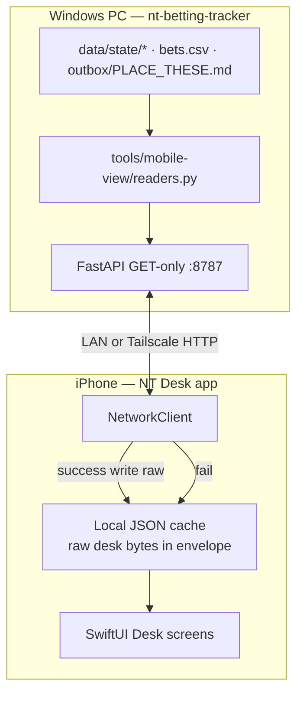
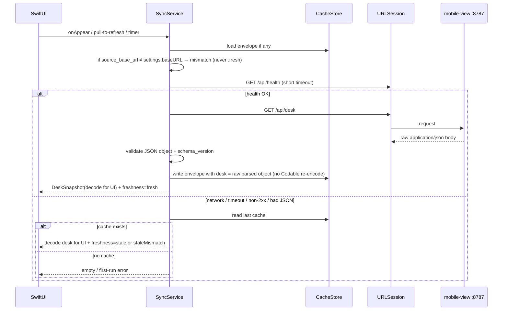
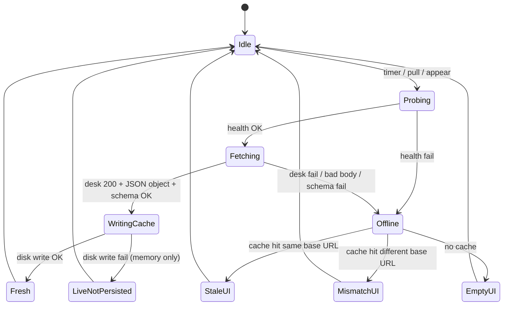
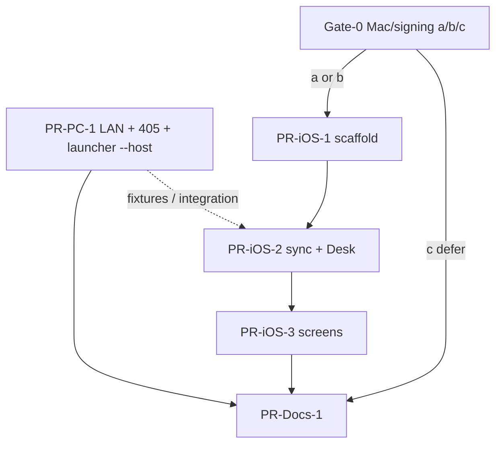

# iOS NT Desk Viewer + Local JSON Cache

| Field | Value |
|-------|--------|
| **Status** | **Implemented in-repo (PC + iOS scaffold)** — Gate-0 = **unsigned IPA sideload** via operator build script; **charts** added (equity, daily P/L, drawdown, sport) on `/api/desk` |
| **Repo (PC)** | `nt-betting-tracker` (`C:\Users\Sander\Documents\GitHub\nt-betting-tracker`) |
| **Operator day-to-day** | **Windows** (PowerShell launchers, paths under `C:\Users\Sander\…`) |
| **iOS project location (proposed)** | `tools/ios-desk/` (in-repo Xcode project) or sibling repo `nt-desk-ios` |
| **Depends on** | Phase A+ mobile-view (`tools/mobile-view/`) — already shipped |
| **Phase** | B — native personal iPhone viewer (read-only, offline-capable cache) |
| **Mutations** | **None** — app never calls write APIs; PC surface remains GET/HEAD only |
| **Distribution** | Personal device via Xcode **only after Mac/signing path chosen**; optional private TestFlight |

---

## Overview

Build a **small personal SwiftUI iPhone app** that displays the same desk snapshot already exposed by Phase A+ mobile-view:

| Endpoint | Role |
|----------|------|
| `GET /api/desk` | Schema v1 JSON (equity, liquid, open risk, phase, freeze flags, pending bets, PLACE_THESE, status, …) |
| `GET /api/health` | Reachability / readiness probe |
| `GET /` | Existing browser HTML — **not** required by the native app |

**When the PC is reachable** (home LAN after a deliberate LAN bind, or Tailscale mesh): the app refreshes `/api/desk` and **persists the raw response JSON** on device inside a versioned envelope.

**When the PC is offline / unreachable** (phone on cellular, PC asleep, wrong network): the app shows the **last cached snapshot** with a clear **stale / last-sync** banner. It never invents bankroll math or invents live state.

**Product constraint (user decision):** Cloudflare public URL is **out of scope** for this phase (“local only is enough” — no domain ownership for luminant.com). Primary network paths are **LAN** and optional **Tailscale**. Cloudflare Access remains available for the *browser* HTML path if configured later; the native app does not depend on it.

**Operator reality:** Day-to-day desk ops are on **Windows**. Native iOS work requires a **Mac + signing** path that must be chosen **before** PR-iOS-1 merges to main (see §7 go/no-go). **PR-PC-1 (LAN bind) can ship immediately** regardless.



---

## Background

### What already exists (Phase A+)

| Artifact | Path | Notes |
|----------|------|--------|
| Read-only server | `tools/mobile-view/server.py` | GET/HEAD only; 405 on other methods |
| Snapshot builder | `tools/mobile-view/readers.py` | `build_desk_snapshot()` → schema_version **1** |
| Path map | `tools/mobile-view/paths_util.py` | No `nt.*` imports; `NT_PROJECT_ROOT` optional |
| Dark HTML UI | `tools/mobile-view/html_page.py` | Browser-only; polls `/api/desk` ~20s |
| Launcher | `tools/mobile-view/start.ps1` | Default **LocalOnly** → uvicorn `--host 127.0.0.1` (**does not call `server.main()`**) |
| Docs | `docs/MOBILE_VIEW_PHASE_A_PLUS.md`, `docs/MOBILE_VIEW_PHASE_A_PLUS_DESIGN.md` | CF Tunnel + Access for browser |
| Tests | `tests/test_mobile_view_readers.py` | Snapshot + no-`nt` import smoke |

### Hard bind constraint today (dual path)

`server.py` `main()` **fail-closes** any host that is not loopback:

```python
# tools/mobile-view/server.py (current)
host = os.environ.get("MOBILE_VIEW_HOST") or "127.0.0.1"
if host not in ("127.0.0.1", "localhost", "::1"):
    # Fail closed: never bind public interfaces in Phase A+
    host = "127.0.0.1"
```

**Critical production fact:** operators run **`start.ps1`**, which always sets `MOBILE_VIEW_HOST=127.0.0.1` and starts:

```powershell
# tools/mobile-view/start.ps1 (current) — bypasses server.main()
uvicorn server:app --host 127.0.0.1 --port $Port
```

So fixing only `server.main()` is **insufficient**. LAN mode **must** pass the same host into **uvicorn CLI `--host`** (and env). See §2 “Single bind path.”

**Implication:** a phone on the same Wi-Fi **cannot** reach the desk today. For a native app without Cloudflare, **PC must allow an opt-in LAN (or Tailscale) bind via the launcher path operators actually use**.

### SSOT sources (unchanged)

| File | Fields of interest |
|------|-------------------|
| `data/state/bankroll.json` | equity, liquid, pending_at_risk, updated_at |
| `data/state/risk.json` | can_bet, size_mode, freeze/stop flags, remaining, reasons |
| `data/state/phase.json` | phase_id, label |
| `data/state/status.md` | status_excerpt |
| `data/bets.csv` | open-risk pending_bets (Pending + ConfirmedPlaced) |
| `outbox/PLACE_THESE.md` | place_these summary / excerpt |

### Engine law (AGENTS.md)

- Engines in `nt/` are law — UI **presents** snapshots only.
- **Do not** change capital / phase / staking engines.
- **Do not** call `refresh_state` or any writer from the mobile path.
- This phase adds **zero** write endpoints and **zero** engine imports.

### Motivation for native + cache

| Gap with browser-only A+ | Native + cache fills it |
|--------------------------|-------------------------|
| CF public URL needs domain | LAN/Tailscale, no domain |
| No offline view | Last-known snapshot on device |
| Bookmark / session friction (Access OTP) | Saved base URL; local network |
| Phone OS “app icon” UX | Real home-screen app |

---

## Goals & Non-Goals

### Goals

1. **Personal SwiftUI app** showing the desk snapshot (KPIs, freeze/stop banner, pending bets, PLACE_THESE, status) — **after Mac/signing gate**.
2. **Configurable base URL** (e.g. `http://192.168.1.42:8787` or `http://100.x.y.z:8787` Tailscale IP).
3. **Online path:** probe health → fetch `/api/desk` → validate schema → **persist raw response JSON** on device → render via Codable view model.
4. **Offline path:** load last cache → render with **stale / last-sync banner** (never blank invent); **base-URL mismatch never shown as fresh**.
5. **PC opt-in LAN bind** so home Wi-Fi / Tailscale can reach the server without Cloudflare — **implementation-ready now**.
6. **Keep view-only:** no place/settle/recommend from the phone.
7. **Simple distribution** once gate passes: Xcode personal device; TestFlight optional; **not** App Store unless later needed.
8. **Schema-stable contract:** consume `schema_version: 1` from `/api/desk`; version the **cache envelope** separately; **never re-encode desk through Codable for storage**.

### Non-Goals

- Cloudflare Tunnel / Access as primary path for the native app (browser path remains as-is).
- Public internet exposure of the desk without a conscious operator action.
- Write APIs, remote place/settle, push notifications, WebSockets.
- Full LuminaNT / Flet feature parity (lab, multi-day forensic drill, recommend UI).
  **Amendment:** simple Book-aligned **charts** (equity, daily P/L, drawdown, by-sport, overall ROI/WR) **are in scope** via additive `charts` on `/api/desk`.
- Recomputing bankroll / phase / Kelly on device or on the mobile-view process.
- Multi-user accounts, team MDM, App Store review packaging.
- Android (may share API later; not in this design).
- Changing `nt/` engines or ledger schemas.
- Assuming a Mac exists for day-to-day Windows operators without an explicit gate decision.

---

## Proposed Design

### 1. Architecture: PC server role vs iOS app role

| Role | Responsibility | Must not |
|------|----------------|----------|
| **PC engines** (`nt/`) | Write SSOT state via normal desk workflow | Unchanged by this phase |
| **PC mobile-view** | Read files → assemble schema v1 JSON; serve GET `/api/desk`, `/api/health`, `/` | Import writers; recompute+persist; accept POST |
| **iOS app** | Fetch JSON when reachable; **store raw desk JSON**; present; surface stale / mismatch | Mutate desk; invent numbers; “fake live” when offline or wrong base URL |



**Trust boundary:** The phone treats the PC as the sole authority for desk numbers. Cache is a **byte-faithful copy of the last successful `/api/desk` JSON object**, plus client metadata (`cached_at`, `source_base_url`). The app may recompute *display* flags but never equity math.

---

### 2. Required PC-side changes (LAN bind)

#### Problem

Phone on LAN cannot hit `127.0.0.1` on the PC. Tailscale to the PC’s loopback also fails unless something binds a reachable interface.

#### Design: opt-in bind modes (fail-closed default preserved)

| Mode | Host bind | How enabled | Use case |
|------|-----------|-------------|----------|
| **LocalOnly** (default) | `127.0.0.1` | current default | PC browser, Cloudflare tunnel origin |
| **Lan** | default `0.0.0.0`, or `-BindHost` | `-Lan` / `MOBILE_VIEW_LAN=1` | Home Wi-Fi + Tailscale NIC |
| **Host=…** | Operator-supplied IP | `-Lan -BindHost 192.168.1.42` or `-Lan -BindHost 100.x.y.z` | Pin single interface (preferred over all-interfaces when practical) |

**Fail-closed rules:**

1. Default without flags: **always** `127.0.0.1`.
2. `MOBILE_VIEW_HOST` alone **must not** open non-loopback unless `MOBILE_VIEW_LAN` / `-Lan` confirm is set.
3. When Lan is enabled, print a loud warning: view-only but **reachable on the bound network interfaces**.
4. Still **no** write routes; still GET/HEAD only.
5. No origin auth in this phase (trust LAN/Tailscale). Residual risk documented (§6).

#### Recommended operator order (security)

| Preference | Command | Why |
|------------|---------|-----|
| **1 (best)** | Tailscale on PC + phone; `-Lan` (or `-Lan -BindHost 100.x.y.z`) | Away-from-home without public URL; ACL on tailnet |
| **2** | `-Lan -BindHost <primary-LAN-IPv4>` | Limits to one NIC vs all interfaces |
| **3 (last)** | `-Lan` → host `0.0.0.0` | Simplest; multi-homed PC exposes all NICs |

#### Single bind path (normative — dual-implementation fix)

**Problem:** `start.ps1` invokes uvicorn with `--host` and **never** calls `server.main()`. Python-only `resolve_bind_host()` tests can pass while production still binds loopback.

**Single source of truth:**

1. Pure function `resolve_bind_host(requested: str, lan: bool) -> str` in `server.py` (unit-tested).
2. **`start.ps1` must compute the same host and pass it to uvicorn CLI:**

```powershell
# Normative start.ps1 bind block (PR-PC-1)
if ($Lan) {
  $env:MOBILE_VIEW_LAN = "1"
  $bindHost = if ($BindHost) { $BindHost } else { "0.0.0.0" }
} else {
  Remove-Item Env:MOBILE_VIEW_LAN -ErrorAction SilentlyContinue
  $bindHost = "127.0.0.1"
  if ($BindHost -and $BindHost -notin @("127.0.0.1","localhost","::1")) {
    Write-Err "-BindHost requires -Lan"; exit 1
  }
}
$env:MOBILE_VIEW_HOST = $bindHost

# MUST match resolve_bind_host() outcome — operators use this path, not server.main()
$serverArgs = @(
  "-m", "uvicorn", "server:app",
  "--host", $bindHost,    # e.g. 0.0.0.0 when -Lan and no -BindHost
  "--port", "$Port",
  "--log-level", "info"
)
```

3. `server.main()` also calls `resolve_bind_host()` for anyone running `python server.py` / `python -m server` without the script.
4. Comment in both places: **CLI `--host` and `MOBILE_VIEW_HOST` must agree; launcher is the production path.**

**Acceptance (PR-PC-1):**

```powershell
.\tools\mobile-view\start.ps1 -Lan
# On PC:
Get-NetTCPConnection -LocalPort 8787 -State Listen  # LocalAddress 0.0.0.0 or chosen IP
# From another host on LAN / Tailscale:
curl http://<pc-ip>:8787/api/health
curl http://<pc-ip>:8787/api/desk
```

#### `resolve_bind_host` (Python)

```python
def resolve_bind_host(
    requested: str | None = None,
    *,
    lan: bool | None = None,
) -> str:
    """
    Pure bind resolver. Unit-tested.
    Without lan: only loopback. With lan: honor requested (default 0.0.0.0 from launcher).
    """
    req = (requested if requested is not None else os.environ.get("MOBILE_VIEW_HOST") or "127.0.0.1").strip()
    if lan is None:
        lan = os.environ.get("MOBILE_VIEW_LAN", "").strip().lower() in ("1", "true", "yes")
    loopback = {"127.0.0.1", "localhost", "::1"}
    if not req:
        req = "127.0.0.1"
    if req in loopback:
        return "127.0.0.1" if req == "localhost" else req
    if not lan:
        return "127.0.0.1"  # fail closed
    return req  # e.g. 0.0.0.0, 192.168.x.x, 100.x.y.z
```

#### Mode matrix: `-Lan` × Cloudflare public

| Flags | Bind | Tunnel | Allowed? |
|-------|------|--------|----------|
| (default) / `-LocalOnly` | `127.0.0.1` | no | Yes — safe default |
| `-Lan` only | `0.0.0.0` or `-BindHost` | no | Yes — native / browser on LAN |
| `-IConfirmAccessConfigured` only | **`127.0.0.1`** | yes | Yes — CF path; origin stays loopback (current) |
| `-Lan` **and** `-IConfirmAccessConfigured` | LAN bind + tunnel | yes | **Discouraged** — wider origin than Access alone. If both set: print **double warning**, still allow only if operator insists; document “prefer not to combine.” Public tunnel does **not** require `-Lan`. |

Normative launcher behavior when public confirm **without** `-Lan`: keep origin **`127.0.0.1`** (unchanged Phase A+). When both flags: set LAN bind as requested + start tunnel + warn loudly.

#### Windows Firewall

Document one-time: allow inbound TCP **8787** for **Private** profile when using `-Lan`. Do **not** auto-open firewall in v1. Manual checklist: if phone on **guest SSID** can reach desk, treat as misconfiguration (guest isolation off / same L2) — prefer Tailscale.

#### Tailscale

1. Install Tailscale on PC + iPhone; same tailnet.  
2. `.\tools\mobile-view\start.ps1 -Lan` (or `-Lan -BindHost 100.x.y.z`).  
3. iOS Settings base URL: `http://100.x.y.z:8787` or MagicDNS `http://<machine>.tailnet-xxxx.ts.net:8787`.

#### Docs

- `docs/IOS_DESK_VIEWER.md` (new) or section in `docs/MOBILE_VIEW_PHASE_A_PLUS.md`: LAN mode, Tailscale, bind preference order, flag matrix.  
- `tools/mobile-view/README.md`: LocalOnly vs Lan table.

#### No API schema change required for v1

Clients must work with current `build_desk_snapshot` JSON. Optional later non-breaking fields deferred.

#### Required test: POST → 405 under LAN

PR-PC-1 **must** include FastAPI TestClient (or equivalent) asserting `POST /api/desk` and `POST /` → **405**, independent of bind host. Middleware is the write-guard; keep it required, not optional.

---

### 3. iOS app structure (SwiftUI)

#### Gate before any iOS PR merges to main

See §7. Scaffold may be drafted offline; **do not** treat iOS track as unblocked until Mac/signing decision is recorded in `tools/ios-desk/README.md`.

#### Project layout (recommended in-repo)

```text
tools/ios-desk/
  README.md                         # Mac/signing method + re-sign cadence (required)
  NTDesk/
    NTDesk.xcodeproj
    NTDesk/
      NTDeskApp.swift
      Models/
        DeskSnapshot.swift          # Codable view model ONLY (not storage)
        PendingBet.swift
        PlaceThese.swift
        CacheEnvelope.swift         # envelope metadata; desk as raw JSON object
        Freshness.swift             # fresh | stale | staleMismatch | empty
        PrivateHostPolicy.swift     # cleartext allowlist classifier
      Services/
        DeskAPIClient.swift
        CacheStore.swift            # atomic write; desk = raw JSON
        SyncService.swift
        SettingsStore.swift
      Views/ …
      Resources/
        Info.plist                  # Local Network + ATS (see below)
  fixtures/
    desk_sample_v1.json             # captured live GET /api/desk (+ future_field test fixture)
```

**Gitignore (monorepo additions for PR-iOS-1):**

```gitignore
# tools/ios-desk Xcode user/local
tools/ios-desk/**/xcuserdata/
tools/ios-desk/**/DerivedData/
tools/ios-desk/**/*.xcuserstate
tools/ios-desk/**/.DS_Store
```

#### Screens

| Screen | Content |
|--------|---------|
| **Desk** | KPI cards; freeze/stop banner; client freshness + server `stale` + **source mismatch** banners; `generated_at` |
| **Pending** | `pending_bets[]` using `stake_nok` + `decimal_odds` (not invented `odds`) |
| **Slip** | `place_these.title`, `summary_line`, scrollable `text_excerpt` only (`rows_preview` is always `[]` in server v1) |
| **Status** | `status_excerpt` as plain text |
| **Settings** | Base URL, refresh interval, Sync now, clear cache, optional Face ID, last persisted sync, About |

Wireframe: pending line shows e.g. `Astralis … stake 12.00 @ 1.75` from `stake_nok` / `decimal_odds`.

#### Settings model

| Key | Type | Default | Notes |
|-----|------|---------|-------|
| `baseURL` | String | `""` | Normalize before compare (see §4) |
| `refreshSeconds` | Int | `30` | Foreground; min 10, max 300 |
| `requireBiometric` | Bool | `false` | Optional |
| `lastSuccessSyncAt` | Double? | nil | **Only updated after atomic cache write succeeds** |
| `allowInsecurePrivateHTTP` | Bool | `true` for personal v1 | Client still refuses cleartext to non-private hosts |

#### Models — Codable for UI only

`schemaVersion` is **`Int?`**. Missing or invalid → do **not** write cache; keep previous envelope; schema-error banner. Tolerant path only for `schema_version > 1` (decode known keys for UI; still store **raw** JSON).

```swift
// DeskSnapshot — view model. NEVER used as sole cache serialization of desk.
struct DeskSnapshot: Codable, Equatable {
    let schemaVersion: Int?   // optional; missing → fail closed for write
    // ... same top-level fields as readers.build_desk_snapshot ...
    let pendingBets: [PendingBet]?
    let placeThese: PlaceThese?
    // CodingKeys: schema_version, equity_nok, … (snake_case)
}

// Nested — keys match tools/mobile-view/readers.py exactly
struct PendingBet: Codable, Equatable, Identifiable {
    let betId: String?
    let date: String?
    let match: String?
    let selection: String?
    let decimalOdds: Double?   // JSON: decimal_odds — NOT "odds"
    let stakeNok: Double?      // JSON: stake_nok
    let result: String?
    let sport: String?
    let updatedAt: String?
    var id: String { betId ?? "\(match ?? "")-\(selection ?? "")-\(updatedAt ?? "")" }
    enum CodingKeys: String, CodingKey {
        case betId = "bet_id", date, match, selection
        case decimalOdds = "decimal_odds", stakeNok = "stake_nok"
        case result, sport, updatedAt = "updated_at"
    }
}

struct PlaceThese: Codable, Equatable {
    let exists: Bool?
    let mtime: String?
    let title: String?
    let summaryLine: String?
    let textExcerpt: String?
    let rowsPreview: [String]?  // server v1 always []; Slip uses text_excerpt only
    enum CodingKeys: String, CodingKey {
        case exists, mtime, title
        case summaryLine = "summary_line"
        case textExcerpt = "text_excerpt"
        case rowsPreview = "rows_preview"
    }
}
```

**Fixture:** commit `tools/ios-desk/fixtures/desk_sample_v1.json` captured from live `GET /api/desk` on the operator PC (or from test harness that mirrors `build_desk_snapshot`). Include a second fixture `desk_sample_v1_extra_key.json` with `"future_field": true` for cache round-trip.

#### Info.plist — Local Network + ATS (normative)

Required keys for real-device LAN:

```xml
<!-- Privacy — Local Network (iOS 14+); without this, LAN HTTP often fails with opaque errors -->
<key>NSLocalNetworkUsageDescription</key>
<string>NT Desk loads your home PC desk snapshot on the local network or Tailscale.</string>

<!-- Bonjour / local network browse if needed; string above is the user-facing prompt -->
<!-- Optional: NSBonjourServices only if using Bonjour discovery (v1 uses manual base URL — omit unless added) -->

<key>NSAppTransportSecurity</key>
<dict>
  <!-- Allows cleartext to local network addresses recognized by the system -->
  <key>NSAllowsLocalNetworking</key>
  <true/>
  <!--
    Tailscale CGNAT 100.64.0.0/10 is often NOT treated as "local" by ATS alone.
    Do NOT set NSAllowsArbitraryLoads = true globally.
    Client enforces PrivateHostPolicy before any http:// request; for allowed
    private hosts only, use URLSession configuration that permits insecure HTTP
    OR document that operator enables the personal toggle which sets a
    carefully scoped exception via custom URLProtocol / ATS exception domains
    is impractical for dynamic IPs — therefore:
  -->
</dict>
```

**Normative cleartext policy (client code, not only plist):**

```swift
// PrivateHostPolicy.isCleartextAllowed(host: String) -> Bool
// Allow http:// only if host matches ANY of:
//   - loopback: localhost, 127.0.0.0/8, ::1
//   - RFC1918: 10.0.0.0/8, 172.16.0.0/12, 192.168.0.0/16
//   - link-local: 169.254.0.0/16
//   - ULA IPv6: fc00::/7 (optional; include if supporting)
//   - Tailscale CGNAT: 100.64.0.0/10   // REQUIRED for Tailscale path
//   - mDNS / MagicDNS: host hasSuffix ".local" OR host contains ".ts.net"
//      (MagicDNS: still prefer resolving to 100.64/10; if https fails, http only if
//       resolved address is on allowlist — if only hostname known, allow .ts.net
//       only when allowInsecurePrivateHTTP is true)
// Deny: any other public IP/hostname over http://
```

**Implementation note for Tailscale + ATS:**

1. Prefer connecting to **numeric** `http://100.x.y.z:8787` (clear allowlist path).  
2. For MagicDNS hostnames: resolve first; only proceed on http if resolved A/AAAA is in allowlist; if ATS still blocks, use `URLSessionConfiguration` with `waitsForConnectivity` and, for **personal builds only**, a documented approach: set `NSExceptionAllowsInsecureHTTPLoads` is domain-based and awkward for dynamic MagicDNS — **v1 recommended base URL = Tailscale IP or LAN IP**, MagicDNS as optional.  
3. Unit-test `PrivateHostPolicy` for: `192.168.1.1` allow, `100.64.1.2` allow, `8.8.8.8` deny, `example.com` deny, `localhost` allow.

**Manual checklist:** first launch on device → **Local Network** permission dialog → Allow.

#### Background behavior

- Foreground-only auto-refresh (`scenePhase == .active`).  
- `becomeActive` → one sync.  
- Pull-to-refresh.  
- No BGAppRefresh in v1.

---

### 4. Sync algorithm



#### URL normalization (for compare + requests)

```text
function normalizeBaseURL(s):
  t = trim(s)
  strip trailing slash(es)
  lowercase scheme + host (not path; path should be empty)
  // examples:
  // "http://192.168.1.42:8787/" → "http://192.168.1.42:8787"
  // "HTTP://192.168.1.42:8787" → "http://192.168.1.42:8787"
```

#### Base URL vs `source_base_url` (normative)

| Condition | Freshness | Banner | Show numbers? |
|-----------|-----------|--------|----------------|
| Online sync success, disk write OK, URLs match | **`.fresh`** | “Last sync just now” / relative age | Yes |
| Online sync success, disk write **fail** | **`.liveNotPersisted`** (not `.fresh` for offline purposes) | “Live (not saved on device)” | Yes (memory) |
| Offline / error, cache exists, `normalize(settings.baseURL) == normalize(env.source_base_url)` | **`.stale`** | “Offline · cache from {cached_at}” | Yes |
| Cache exists, **URLs differ** | **`.staleMismatch`** — **never `.fresh`** | “Cache from different server ({source}) · not this base URL” + offer **Clear cache** | Yes, only with mismatch banner (operator may still want a glance); do not imply current PC |
| No cache | **`.empty`** | Setup / error | No invented zeros |

On Settings base URL **edit**: immediately re-evaluate cache → if mismatch, flip UI to `.staleMismatch` without waiting for next sync. Optional: prompt “Clear cache from previous server?”

#### Algorithm (normative)

```text
function sync(trigger):
  base = normalizeBaseURL(settings.baseURL)
  if base empty: return UI.needsSetup

  // Always apply mismatch to any displayed cache first
  if let env = CacheStore.read():
    if normalize(env.source_base_url) != base:
      present(env, freshness: .staleMismatch)  // may replace with live later

  if not PrivateHostPolicy.allowsRequest(base):  // cleartext / host policy
    return error "HTTP only allowed to private/Tailscale hosts"

  try:
    // Health gate (primary)
    healthResult = GET(base + "/api/health", timeout=2s)
    healthOK = healthResult is JSON object with ok==true and role=="read-only"
    if not healthOK:
      // Transient health-only failure: still try desk once (timeout class only)
      if healthResult was hard 4xx/5xx with body: throw Unreachable
      // else fall through to desk attempt

    deskHTTP = GET(base + "/api/desk", timeout=5s)
    if status not 2xx: throw Unreachable
    rawData = body bytes
    if rawData.count > 2_000_000: throw TooLarge  // keep old cache
    // Require JSON object (not HTML error page)
    root = JSONSerialization.jsonObject(rawData)
    if root is not Dictionary: throw BadJSON  // do NOT write cache

    schema = root["schema_version"] as? Int
    if schema == nil: throw SchemaError  // missing → fail closed; do not write
    if schema < 1: throw SchemaError
    // schema > 1: still store raw; decode known fields for UI; banner "server newer"

    if root["view_only"] as? Bool == false:
      // Critical banner — still display payload; do not invent safety by hiding data
      flagCriticalViewOnlyFalse = true

    snap = try? DeskSnapshot.decode(from: rawData)  // UI only; failure → partial UI from dict if needed

    envelope = {
      "envelope_version": 1,
      "cached_at": now_utc_iso,           // only written if disk succeeds
      "source_base_url": base,
      "app_build": appBuild,
      "desk": root                        // RAW JSON object — NOT Codable re-encode
    }
    okWrite = CacheStore.writeAtomic(envelope)  // serialize envelope; desk subtree from JSONSerialization
    if okWrite:
      settings.lastSuccessSyncAt = now
      return UI.show(snap, freshness: .fresh, serverStale: root["stale"] as? Bool)
    else:
      return UI.show(snap, freshness: .liveNotPersisted, serverStale: ...)
      // do NOT advance lastSuccessSyncAt / do not claim cached_at advanced

  catch:
    if let env = CacheStore.read():
      freshness = (normalize(env.source_base_url) == base) ? .stale : .staleMismatch
      return UI.show(decode(env.desk), freshness, serverStale: env.desk.stale)
    else:
      return UI.showEmpty(error)
```

**Never:**

- Re-encode `DeskSnapshot` into the `desk` field of the cache (strips unknown keys).  
- Clear UI to zeros on network failure when cache exists.  
- Overwrite a good cache with failed/partial/non-JSON response.  
- Label freshness **`.fresh`** when `source_base_url` ≠ settings base URL.  
- Advance `lastSuccessSyncAt` / `cached_at` if atomic disk write failed.

#### Timeouts & retries

| Call | Timeout | Retries |
|------|---------|---------|
| `/api/health` | 2s | 0; on timeout-only, still try desk once |
| `/api/desk` | 5s | 1 retry only on transport reset |
| Full sync | — | Coalesce; next timer tick |

#### Content-type / decode

- Prefer `Content-Type` containing `json`, but **authoritative** check is successful `JSONSerialization` → `Dictionary`.  
- HTML 200 from proxy → BadJSON → **keep old cache**.  
- Decode failure for UI struct after valid dict → still store raw; show partial KPIs via dictionary getters if needed.

#### Concurrency

- Single-flight sync.  
- MainActor UI; disk I/O off main with atomic replace.

---

### 5. Local storage format

#### Path

```text
Application Support/
  com.<bundle>.ntdesk/
    cache/
      desk_snapshot.json
```

`isExcludedFromBackup = true` on the cache file.

#### Envelope schema (client-owned)

```json
{
  "envelope_version": 1,
  "cached_at": "2026-07-24T18:05:12Z",
  "source_base_url": "http://192.168.1.42:8787",
  "app_build": "1",
  "desk": { }
}
```

| Field | Purpose |
|-------|---------|
| `envelope_version` | Wrapper migration only |
| `cached_at` | ISO-8601 UTC **when atomic write succeeded** |
| `source_base_url` | Normalized base URL used for the successful fetch; **mismatch ⇒ not fresh** |
| `app_build` | Diagnostics |
| `desk` | **Exact JSON object** from `/api/desk` body — **raw preservation mandatory** |

#### CacheStore write (normative — raw desk)

```text
// CORRECT
let deskObject = try JSONSerialization.jsonObject(with: responseData) as! [String: Any]
var envelope: [String: Any] = [
  "envelope_version": 1,
  "cached_at": isoNow,
  "source_base_url": normalizedBase,
  "app_build": build,
  "desk": deskObject   // inserted as object graph, not re-encoded via DeskSnapshot
]
let out = try JSONSerialization.data(withJSONObject: envelope)
write tmp → replaceItemAt final

// FORBIDDEN for storage
let snap = try JSONDecoder().decode(DeskSnapshot.self, from: responseData)
let deskData = try JSONEncoder().encode(snap)  // DROPS unknown keys — do not use for cache
```

**Acceptance test:** fixture with `"future_field": true` → write → read → `desk["future_field"] == true`.  
**Cap:** body > 2 MiB → reject write; keep previous file.

#### Versioning

| Case | Behavior |
|------|----------|
| Missing file | First-run empty |
| `envelope_version` == 1 | Load |
| Unknown envelope version | Try extract `desk`; else corrupt path |
| `schema_version` missing / &lt; 1 | Do not write new cache; banner |
| `schema_version` &gt; 1 | Store raw; partial UI; “server newer” |
| Corrupt JSON | Rename `.corrupt`; empty + error |

---

### 6. Security

| Risk | Severity | Mitigation |
|------|----------|------------|
| LAN bind exposes desk JSON | Medium | Opt-in `-Lan`; prefer Tailscale or `-BindHost` single IP; loud warning |
| Guest / IoT same L2 as home LAN | Medium | Prefer Tailscale; checklist: guest SSID should not reach desk |
| Multi-homed `0.0.0.0` | Medium | Recommend `-BindHost` primary LAN or Tailscale IP first |
| Phone cache sensitive | Medium | Device lock; optional Face ID; exclude from backup |
| Write API creep | Critical | GET-only client; server 405; required test |
| Cleartext MITM on hostile Wi-Fi | Medium–High | `PrivateHostPolicy` deny public http; prefer Tailscale |
| Global ATS disable | High | Forbidden (`NSAllowsArbitraryLoads` false) |
| Combined `-Lan` + public tunnel | Medium | Discouraged; double warning |
| No origin shared secret | Accepted (K14) | Residual: optional bearer later; document in IOS doc |

#### Residual risk (document in `docs/IOS_DESK_VIEWER.md`)

- No origin bearer/token in v1.  
- Guest Wi-Fi on same subnet sees view-only desk if `-Lan` and firewall allows.  
- Optional follow-up (not v1): `Authorization: Bearer` shared secret header.

#### Optional Face ID

Toggle; does not encrypt cache at rest in v1.

---

### 7. Distribution & Mac/signing gate (hard)

Operator environment is **Windows-primary**. Native iOS is **not** unblocked by PC LAN alone.

#### Go / no-go (required before PR-iOS-1 merge to main)

| Option | Meaning | Next step |
|--------|---------|-----------|
| **(a) Mac access confirmed** | Operator has Mac (own/borrow) with Xcode 15+ **this week** | Record in `tools/ios-desk/README.md`; proceed PR-iOS-1 |
| **(b) Paid Apple Developer + install path** | $99/yr; device install and/or TestFlight; re-sign cadence **1 year** (or TF) | Record team ID + method in README; proceed |
| **(c) Defer native** | No Mac/signing now | **Ship PR-PC-1 only**; phone uses browser/curl on LAN; optional thin PWA note; **cancel or freeze PR-iOS-*** |

**Until (a) or (b) is written into README acceptance, Status of this design for iOS remains blocked.** PC track is implementation-ready.

#### Free Apple ID caveat

Free signing: **~7-day** re-sign on device. Must be in README acceptance checklist (open Xcode, re-run on device weekly) — not only a risk footnote.

#### Methods

| Method | When |
|--------|------|
| Xcode → personal device | Primary if Mac exists |
| TestFlight (personal/internal) | Needs paid program |
| App Store | Non-goal |
| AltStore / Sideloadly / cloud Mac | Escape hatches; still need signing material |
| **Contingency if (c)** | PR-PC-1 + Safari/curl to `http://<lan-ip>:8787/`; document offline = open last browser tab is weak — native cache is the offline product |

#### Bundle

- Example Bundle ID: `local.sander.ntdesk`  
- Deployment: iOS 17+  
- **iOS PRs require macOS agent or local Mac** — Windows CI cannot compile Swift for device.

---

### 8. Testing plan

#### PC (Python)

| Test | Required |
|------|----------|
| `resolve_bind_host` defaults / fail-closed without LAN | Yes |
| LAN + `0.0.0.0` / BindHost allowed | Yes |
| Existing readers / no `import nt` | Yes (keep) |
| **POST → 405** (TestClient) | **Yes** (not optional) |
| Manual: curl from second host after `-Lan` | Yes |
| Manual: `-Lan` + public discouraged warning | Yes |

#### iOS (when gate open)

| Test | Required |
|------|----------|
| Decode fixture `desk_sample_v1.json` | Yes |
| **Raw cache round-trip preserves `future_field`** | **Yes** |
| CacheStore atomic write; `lastSuccessSyncAt` only after success | Yes |
| Sync offline → cache; bad JSON → keep old | Yes |
| **Base URL mismatch → `.staleMismatch`, never `.fresh`** | **Yes** |
| `PrivateHostPolicy` unit tests (RFC1918, 100.64/10, deny public) | Yes |
| schema_version missing → no write | Yes |

#### Manual acceptance

1. LocalOnly → phone cannot connect.  
2. `-Lan` → phone connects; KPIs match.  
3. Kill server → stale banner + numbers.  
4. Change base URL → **mismatch banner**, not fresh.  
5. Clear cache → empty until online.  
6. First launch → **Local Network** prompt.  
7. Tailscale IP cleartext works with policy.  
8. Only GET in server logs / proxy.  
9. Guest SSID should fail (if isolated); note residual if not.

---

### 9. Observability

| Signal | Where |
|--------|-------|
| Last **persisted** sync | Settings + banner (`cached_at`) |
| Live-not-persisted | Distinct banner |
| Source mismatch | Distinct banner |
| Server `warnings[]` / `stale` | Desk UI |
| PC logs | `tools/mobile-view/.pids/` |

---

### 10. Rollout

1. **PR-PC-1** ships LAN bind (Windows) — no Mac needed.  
2. **Mac/signing gate decision** recorded.  
3. If defer: stop; use browser on LAN.  
4. If proceed: PR-iOS-1 → 2 → 3 → Docs.  
5. Rollback: LocalOnly; uninstall app; no engine migration.

---

## API / Interface

### Unchanged server contract

#### `GET /api/health`

```json
{ "ok": true, "role": "read-only", "view_only": true }
```

#### `GET /api/desk` (schema_version 1)

Authoritative: `tools/mobile-view/readers.py` `build_desk_snapshot`.

| Nested | Keys (exact) |
|--------|----------------|
| `pending_bets[]` | `bet_id`, `date`, `match`, `selection`, `decimal_odds`, `stake_nok`, `result`, `sport`, `updated_at` |
| `place_these` | `exists`, `mtime`, `title`, `summary_line`, `text_excerpt`, `rows_preview` (**always `[]` in v1**) |

**Client:** `schema_version` missing → fail closed (no cache write). `view_only == false` → critical banner; still show payload.

### PC control plane

| Interface | Change |
|-----------|--------|
| `start.ps1 -Lan` | New — **must pass `--host` to uvicorn** |
| `start.ps1 -BindHost <ip>` | New — requires `-Lan` |
| Env `MOBILE_VIEW_LAN=1` | New |
| Env `MOBILE_VIEW_HOST` | With LAN: non-loopback honored; without: clamp |
| Flag matrix with Access confirm | See §2 |
| HTTP routes | **No change** |

---

## Data Model

- **Server/ledger:** no changes.  
- **Client envelope:** §5; `desk` = raw JSON object.  
- **Settings:** §3.

---

## Alternatives Considered

### 1. PWA / Safari Add to Home Screen

- **Pros:** No Mac.  
- **Cons:** Weak offline; flaky install.  
- **Verdict:** **Contingency product** if gate option (c); not primary. Document thin offline note under PR-PC-1 docs if deferred.

### 2. iOS Shortcuts

- Rejected for daily UX.

### 3. Full cloud replica

- Rejected (SSOT / dual-write risk).

### 4. Cloudflare as native primary

- Out of scope (no domain).

### 5. Browser HTML only

- Insufficient for offline product goal; interim if native deferred.

### 6. React Native / Flutter

- Rejected for personal v1.

### 7. Bind `0.0.0.0` by default

- Rejected — opt-in `-Lan` only.

### 8. Codable-only cache

- **Rejected** — re-encode drops keys (Issue 1). Raw JSON storage is normative.

---

## Security & Privacy Considerations

View-only checklist:

- [ ] GET/HEAD only; POST→405 required test  
- [ ] No `import nt` in mobile-view  
- [ ] iOS GET only  
- [ ] Cache excluded from backup  
- [ ] LAN requires `-Lan`; launcher passes `--host`  
- [ ] Cleartext only via `PrivateHostPolicy` (RFC1918 + 100.64/10 + loopback + …)  
- [ ] Base URL mismatch never `.fresh`  
- [ ] `NSLocalNetworkUsageDescription` present  
- [ ] No `NSAllowsArbitraryLoads = true`  

---

## Observability

See §9.

---

## Rollout Plan

| Step | Gate | Deliverable |
|------|------|-------------|
| 1 | None | PR-PC-1 LAN bind + 405 test + docs |
| 2 | **Mac/signing decision** | README gate (a/b/c) |
| 3 | (a) or (b) | PR-iOS-1..3 |
| 4 | (c) | Stop native; browser/curl on LAN |

---

## Open Questions

1. **Mac/signing choice (a/b/c)?** — **Blocks iOS track.** Must answer before PR-iOS-1 merge.  
2. In-repo `tools/ios-desk/` vs sibling repo? — Prefer in-repo; gitignore Xcode user state.  
3. Default `-Lan` bind `0.0.0.0` vs force BindHost? — Default `0.0.0.0` for simplicity; **docs recommend** BindHost/Tailscale first.  
4. Face ID in v1 or v1.1? — Optional after MVP.  
5. MagicDNS vs numeric Tailscale IP? — **v1 recommend numeric 100.x** for ATS clarity.  
6. Origin bearer later? — Deferred residual risk.  
7. Hide `project_root` in UI? — Yes by default.

---

## References

| Path | Role |
|------|------|
| `tools/mobile-view/server.py` | FastAPI GET surface; bind clamp today |
| `tools/mobile-view/start.ps1` | **Production entry** — uvicorn `--host` (must change for LAN) |
| `tools/mobile-view/readers.py` | schema v1 + nested field names |
| `tools/mobile-view/html_page.py` | KPI layout reference |
| `tests/test_mobile_view_readers.py` | Snapshot / import ban |
| `AGENTS.md` | Engine law |
| `docs/MOBILE_VIEW_PHASE_A_PLUS*.md` | Phase A+ |

---

## Key Decisions

| # | Decision | Rationale |
|---|----------|-----------|
| K1 | Native SwiftUI personal app (when gate open) | Offline JSON cache + app icon; PWA is contingency only |
| K2 | PC SSOT; phone caches last fetch only | AGENTS.md; no invent offline |
| K3 | No CF primary for native | User: local only; no domain |
| K4 | Opt-in `-Lan`; default 127.0.0.1 | Phase A+ fail-closed |
| K5 | Network: home LAN + optional Tailscale | Replaces CF for personal native |
| K6 | **Cache stores raw `/api/desk` JSON object inside envelope; Codable is UI-only** | Preserve unknown keys; schema evolution; offline correctness |
| K7 | Consume schema_version 1 as-is; **missing schema_version fail closed** | No invent; no bad cache write |
| K8 | No capital/phase/staking engine changes | Explicit non-goal |
| K9 | GET-only forever; POST 405 required test | View-only safety |
| K10 | **Distribution blocked until Mac/signing (a/b/c) chosen; free ID 7-day re-sign documented in README** | Windows-primary operator; avoid stalled native track |
| K11 | Prefer `tools/ios-desk/` + Xcode gitignore | Contract proximity |
| K12 | **Cleartext only for PrivateHostPolicy allowlist: loopback, RFC1918, link-local, Tailscale 100.64/10, optional .local/.ts.net; NSLocalNetworkUsageDescription + NSAllowsLocalNetworking; no global arbitrary loads** | Real LAN + Tailscale CGNAT |
| K13 | Dual stale UX + **URL mismatch ⇒ never `.fresh`** | Trust + clear banners |
| K14 | No origin shared secret v1; residual guest-LAN risk documented | Simplicity; prefer Tailscale |
| K15 | **`start.ps1` must pass uvicorn `--host` matching resolve (production path)** | start.ps1 bypasses server.main() |
| K16 | **`lastSuccessSyncAt` / `cached_at` only after atomic write success** | Offline recovery integrity |
| K17 | **Discouraged: `-Lan` + CF public together** | Avoid widening origin while tunnel runs |

---

## PR Plan

### Gate-0 — Mac/signing decision (human; not a code PR)

Record in chat + eventually `tools/ios-desk/README.md`: **(a) / (b) / (c)**.  
- If **(c):** only PR-PC-1 + docs contingency; **no PR-iOS-* merge**.  
- If **(a)/(b):** unlock iOS PRs; state re-sign cadence (7-day free vs paid).

### PR-PC-1 — LAN bind (nt-betting-tracker) — **unblocked now**

| File | Change |
|------|--------|
| `tools/mobile-view/server.py` | `resolve_bind_host()` pure function; `main()` uses it |
| `tools/mobile-view/start.ps1` | `-Lan`, `-BindHost`; set `MOBILE_VIEW_LAN`; **`--host $bindHost` on uvicorn CLI** (e.g. `0.0.0.0`); flag matrix vs Access; double-warn if both |
| `tools/mobile-view/README.md` | LocalOnly / Lan / recommendation order |
| `docs/IOS_DESK_VIEWER.md` or A+ doc section | LAN, Tailscale, residual risks, contingency browser path |
| `tests/…` | resolve_bind_host units; **POST→405 required**; keep no-nt import tests |

**Acceptance:** second-host curl works after `-Lan`; default still loopback; POST 405.

### PR-iOS-1 — Scaffold (requires Gate-0 a/b)

| Deliverable | Notes |
|-------------|-------|
| Xcode project under `tools/ios-desk/` | iOS 17+ |
| README | **Signing method + re-sign cadence** |
| Codable UI models + nested PendingBet/PlaceThese | UI only |
| CacheStore **raw JSON desk** | future_field test |
| PrivateHostPolicy + Info.plist Local Network/ATS | |
| Settings base URL | normalize + mismatch readiness |
| Fixture from live `/api/desk` | committed |
| Root `.gitignore` Xcode user paths | |
| **CI note:** needs macOS | Windows runners skip |

### PR-iOS-2 — Sync + Desk UI

SyncService normative algorithm; freshness enum including `.staleMismatch` and `.liveNotPersisted`; banners; refresh.

### PR-iOS-3 — Pending / Slip / Status / polish

`decimal_odds`/`stake_nok` UI; Slip = `text_excerpt` only; optional Face ID; clear cache.

### PR-Docs-1

Cross-links; daily ops: `start.ps1 -Lan`, base URL, Tailscale, firewall Private profile.

### Dependency graph



### Explicit non-changes (all PRs)

- No `nt/` capital/phase/staking/settle writer changes.  
- No new HTTP methods.  
- No cloud dual-write ledger.  
- CF browser path remains optional and independent; public mode stays loopback origin unless operator forces both flags (discouraged).

---

## Revision Summary (2026-07-24)

Addressed design review `grok-design-review-f7237692.md`:

1. **Raw desk JSON cache** — Codable forbidden for storage; `JSONSerialization` object graph; future_field acceptance test.  
2. **Local Network + Tailscale ATS** — `NSLocalNetworkUsageDescription`, `NSAllowsLocalNetworking`, `PrivateHostPolicy` allowlist including **100.64/10**, unit tests, first-launch checklist.  
3. **Mac/signing hard gate** — Status split PC-ready vs iOS-blocked; options a/b/c; free 7-day re-sign in README acceptance; contingency if defer.  
4. **Launcher bind path** — `start.ps1` **must** pass uvicorn `--host` (e.g. `0.0.0.0` on `-Lan`); pure `resolve_bind_host` shared; production path documented.  
5. **Base URL mismatch** — never `.fresh`; `.staleMismatch` banner + clear cache; normalize URL.  
6. **Nested models** — `PendingBet` / `PlaceThese` exact keys; `rows_preview` empty in v1.  
7. **Health/JSON gate** — optional desk try on health timeout; require JSON object; no cache write on bad body; `view_only false` critical banner still show data.  
8. **LAN security order** — Tailscale → BindHost → 0.0.0.0; residual guest LAN.  
9. **Flag matrix** — `-Lan` × CF public discouraged.  
10. **PR gaps** — fixture capture, gitignore, required 405, macOS for iOS PRs, Gate-0.  
11. **Disk write** — `lastSuccessSyncAt` / `cached_at` only after atomic success; `.liveNotPersisted`.  
12. **schema_version** optional Int?; missing fail closed.  
13. **K6/K10/K12/K15–K17** amended.
