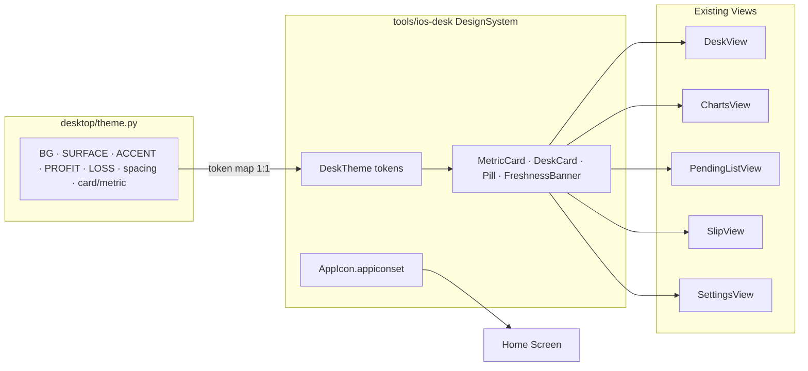
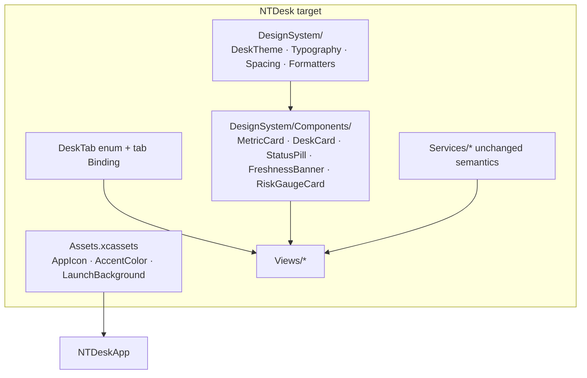
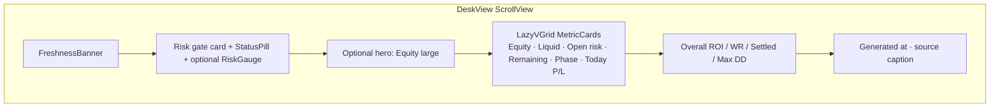
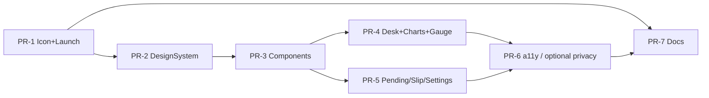

# NT Desk iOS — Visual Identity, Design System & HIG Polish

| Field | Value |
|-------|--------|
| **Author** | Grok Build (design) |
| **Date** | 2026-07-24 |
| **Status** | Draft (revised after review) |
| **Repo** | `nt-betting-tracker` |
| **Scope path** | `tools/ios-desk/NTDesk/` |
| **Depends on** | Shipped scaffold (Gate-0 unsigned IPA); PC `GET /api/desk` schema v1; desktop “desk night” theme in `desktop/theme.py` |
| **Related docs** | `docs/IOS_DESK_APP_DESIGN.md`, `docs/IOS_DESK_VIEWER.md`, `tools/ios-desk/README.md` |
| **Distribution** | Unsigned IPA sideload — **not** App Store packaging, but HIG quality still applies |
| **Deployment** | `IPHONEOS_DEPLOYMENT_TARGET = 17.0` (verified in pbxproj) |

---

## Overview

NT Desk iOS is a **view-only personal viewer** that already works: it fetches `/api/desk` from the PC mobile-view server, caches raw JSON, and shows KPIs, charts, pending bets, and PLACE_THESE. Functionally correct — visually generic.

This design upgrades the shipped scaffold so the phone feels like the **same desk** as the Flet desktop app (“desk night”: warm amber on deep ink), ships a proper **App Icon**, and incorporates **Apple Human Interface Guidelines** practices: Dynamic Type, VoiceOver, Reduce Motion, privacy strings, launch experience, materials, SF Symbols, and polished empty/error states.

**Approach:** progressive enhancement — add a shared SwiftUI `DesignSystem`, restyle existing views, wire an Asset Catalog, and layer accessibility without rewriting navigation, sync, or cache rules. PC remains SSOT; mutations stay forbidden.



---

## Background & Motivation

### Current state (shipped)

| Area | Today | Pain |
|------|-------|------|
| **App Icon** | `ASSETCATALOG_COMPILER_APPICON_NAME = AppIcon` in `project.pbxproj`, but **no** `Assets.xcassets` in the target group; `PBXResourcesBuildPhase` files list is **empty** | Generic/blank home-screen glyph; looks unfinished when sideloaded |
| **Colors** | Ad-hoc `Color(red: 0.06, green: 0.07, blue: 0.08)` / `0.10, 0.11, 0.14` in `DeskView` / `ChartsView` | Drift from desktop; hard to keep consistent; charts use system green/red/orange |
| **Design system** | None — KPI tiles and section cards are private helpers inside each view | Duplication; no accent rail, monospaced numbers, or pill/chip language from desktop |
| **Typography** | System defaults; fixed sizes via `.title3` / `.caption2` without Dynamic Type strategy | Poor Large Content Size support; no desk-night hierarchy (section labels, Consolas-like nums) |
| **Navigation** | 5-tab `TabView` in `RootView.swift` | Fine for phone, but Settings is primary chrome; tab bar has no theme tint; no first-run path |
| **Launch** | Empty `UILaunchScreen` dict in `Info.plist` | White/black flash; no brand continuity |
| **Accessibility** | No custom accessibility labels/traits; numeric KPIs not announced as groups | VoiceOver reads raw text without context (“Equity… 1234.56 NOK” as disconnected nodes) |
| **Privacy / HIG** | `NSLocalNetworkUsageDescription` + `NSAllowsLocalNetworking` present; no Privacy Manifest, no Bonjour usage string | Incomplete for quality best practices even off App Store (Privacy Manifest is optional hygiene for sideload) |
| **Empty / error** | Basic `ContentUnavailableView`; Settings form is plain | Not desk-themed; first-run doesn’t guide LAN/Tailscale setup |

**Early-win note:** Equity chart already uses `Color.accentColor` (`ChartsView.swift`). Wiring `AccentColor.colorset` to `#E8A317` in PR-1 alone turns the equity series amber before any Charts restyle PR.

### Desktop visual language (source of truth)

Canonical tokens live in [`desktop/theme.py`](file:///Users/simsalabim/nt-betting-tracker/desktop/theme.py) — **“desk night”**:

| Token | Hex | Role |
|-------|-----|------|
| `BG` | `#0B0D12` | Page ink |
| `SURFACE` | `#12161F` | Rail / header |
| `SURFACE_ELEV` | `#171C27` | Cards |
| `SURFACE_2` | `#1C2330` | Nested / chips |
| `SURFACE_3` | `#262E3D` | Pressed / bars |
| `BORDER` / `BORDER_SOFT` | `#2C3548` / `#232A38` | Card edges |
| `TEXT` / `TEXT_MUTED` / `TEXT_DIM` | `#F3F5F9` / `#8B95A8` / `#5C6678` | Hierarchy |
| `ACCENT` | `#E8A317` | Amber gold (desk brand) |
| `ACCENT_SOFT` | `#E8A31728` | Amber at alpha `0x28/255` (≈0.157) |
| `PROFIT` / `LOSS` / `PENDING` | `#3DDC97` / `#FF6B7A` / `#F5C542` | P/L semantics |
| `INFO` | `#7C9CFF` | Secondary info |
| Spacing | 4px base (`S1`…`S8`) | 4, 8, 12, 16, 20, 24, 32, 40 |
| Radius | 6 / 10 / 14 | SM / default / LG |

Desktop components that iOS should **echo** (not pixel-clone):

- **Metric tiles** with 3px left accent rail (`metric()` / `card(accent=…)`)
- **Section labels** — uppercase, muted, monospaced weight
- **Numeric values** — bold monospaced (`num()` → Consolas on desktop)
- **Pills / chips** for can-bet, freeze, result status
- **Risk gauge** pattern from `desktop/components/widgets.py` (`risk_gauge`) — **used/cap** progress + remaining display + threshold colors
- **Charts** in Book/analytics use profit/loss colors and dense dark surfaces

### Why now

The operator already has a working LAN/Tailscale loop. The remaining gap is **product feel**: home-screen identity + same desk night language as Windows Flet, plus HIG polish so the personal app doesn’t feel like a scaffold.

---

## Goals & Non-Goals

### Goals

1. **App Icon** in an Asset Catalog with all required iOS 17+ sizes; distinctive “desk night” mark.
2. **Shared SwiftUI DesignSystem** mapping desktop theme tokens 1:1 (with `ACCENT_SOFT` documented as alpha-equivalent); eliminate ad-hoc RGB.
3. **Restyle all five tabs** (Desk, Charts, Pending, Slip, Settings) to match desk night: cards, accent rails, monospaced KPIs, chart colors.
4. **Apple HIG practices** for a personal utility app: Dynamic Type, VoiceOver, Reduce Motion, contrast, refined privacy **usage** strings, ink launch screen, empty/error states, SF Symbols consistency.
5. **First-run / empty state** that explains base URL + PC LAN start without requiring mutations or cloud accounts.
6. **Incremental PRs** — each mergeable without blocking cache/sync correctness.
7. **Unsigned IPA path unchanged** — `build_unsigned_ipa.sh` still produces installable artifact.

### Non-Goals

- App Store / TestFlight packaging, App Review checklist, privacy nutrition labels, marketing screenshots, or encryption questionnaires as process gates (HIG quality still applied).
- Write paths, place/settle, biometric lock (optional later; not required by this design).
- Full Flet feature parity (Lab, forensic drill, multi-day workflow, Grok hand-off).
- Light mode (desktop is dark-only; iOS stays `.preferredColorScheme(.dark)`).
- Replacing `TabView` with iPad-first `NavigationSplitView` as primary (phone is primary device).
- Changing `/api/desk` schema, cache envelope format, or `PrivateHostPolicy` allowlist rules.
- **Server `desk.stale` / `warnings[]` UI banners** — existing functional gap vs parent `docs/IOS_DESK_APP_DESIGN.md`; **deferred** (not part of this visual identity series). Client `SyncService.freshness` banners remain in scope.
- Desktop risk-gauge **full** parity for `stop_day_loss_limit_nok` / min-stake config copy — those fields are **not** on `/api/desk` / `DeskSnapshot`; simplified cap/remaining gauge only (see §3.4).
- Android, multi-user, push notifications, widgets (may follow later).

---

## Proposed Design

### 1. Architecture (progressive enhancement)



**New folders (under `tools/ios-desk/NTDesk/NTDesk/`):**

```text
Assets.xcassets/
  AppIcon.appiconset/          # committed opaque 1024 PNG
  AccentColor.colorset/
  LaunchBackground.colorset/   # #0B0D12 — wired in PR-1
DesignSystem/
  DeskTheme.swift              # colors + materials; SoT header comment
  DeskTypography.swift         # Dynamic Type styles
  DeskSpacing.swift            # 4pt grid + radii
  DeskFormatters.swift         # NOK / % / int — normative contracts
  Color+Hex.swift              # init(hex:opacity:)
  Components/
    DeskCard.swift
    MetricCard.swift
    StatusPill.swift
    SectionHeader.swift
    FreshnessBanner.swift      # move out of DeskView
    RiskGaugeCard.swift        # simplified gauge — PR-4
    EmptyDeskView.swift
```

**Services / Models:** no behavioral change. `SyncService`, `CacheStore`, `DeskAPIClient`, `PrivateHostPolicy` remain SSOT for network and cache. **Every visual PR must not edit these files** (checklist item on each PR).

**Optional test target (PR-2):** `NTDeskTests` with hex-constant assertions — preferred if cheap to add; else SoT comment + README (PR-7).

---

### 2. Design token map: desktop → SwiftUI

#### 2.1 Colors

```swift
// DesignSystem/DeskTheme.swift
// Source of truth: desktop/theme.py — keep hex values in sync.
// Asserted in NTDeskTests.DeskThemeTokenTests when test target exists.

enum DeskTheme {
    // Surfaces
    static let bg          = Color(hex: 0x0B0D12)   // BG
    static let surface     = Color(hex: 0x12161F)   // SURFACE
    static let surfaceElev = Color(hex: 0x171C27)   // SURFACE_ELEV
    static let surface2    = Color(hex: 0x1C2330)   // SURFACE_2
    static let surface3    = Color(hex: 0x262E3D)   // SURFACE_3
    static let rail        = Color(hex: 0x1A2030)   // RAIL

    // Borders
    static let border      = Color(hex: 0x2C3548)
    static let borderSoft  = Color(hex: 0x232A38)
    static let borderFocus = Color(hex: 0x4A5568)

    // Text
    static let text        = Color(hex: 0xF3F5F9)
    static let textMuted   = Color(hex: 0x8B95A8)
    static let textDim     = Color(hex: 0x5C6678)

    // Semantic
    static let accent      = Color(hex: 0xE8A317)   // brand amber
    /// Desktop ACCENT_SOFT = "#E8A31728" → alpha 0x28/255 ≈ 0.15686
    static let accentSoft  = Color(hex: 0xE8A317, opacity: Double(0x28) / 255.0)
    static let accentDim   = Color(hex: 0xB87E10)
    static let profit      = Color(hex: 0x3DDC97)
    static let loss        = Color(hex: 0xFF6B7A)
    static let pending     = Color(hex: 0xF5C542)
    static let info        = Color(hex: 0x7C9CFF)

    static func pl(_ value: Double?) -> Color {
        guard let v = value else { return textMuted }
        if v > 0.005 { return profit }
        if v < -0.005 { return loss }
        return textMuted
    }

    static func result(_ result: String?) -> Color {
        switch (result ?? "").trimmingCharacters(in: .whitespaces) {
        case "Win": return profit
        case "Loss": return loss
        case "Pending": return pending
        default: return textMuted
        }
    }
}
```

**`Color(hex:)` contract (PR-2):**

```swift
extension Color {
    /// sRGB from 0xRRGGBB (24-bit). Alpha via `opacity` (default 1).
    /// Not 0xAARRGGBB — use opacity for alpha (matches ACCENT_SOFT encoding).
    init(hex: UInt32, opacity: Double = 1) {
        let r = Double((hex >> 16) & 0xFF) / 255
        let g = Double((hex >> 8) & 0xFF) / 255
        let b = Double(hex & 0xFF) / 255
        self.init(.sRGB, red: r, green: g, blue: b, opacity: opacity)
    }
}
```

Wire **AccentColor** asset to `#E8A317` so system `Color.accentColor`, chart accents, and tinted controls match without per-view overrides.

Replace current hard-coded backgrounds:

| File | Current | After |
|------|---------|-------|
| `DeskView.swift` | `Color(red: 0.06, 0.07, 0.08)` | `DeskTheme.bg` |
| KPI tiles | `Color(red: 0.10, 0.11, 0.14)` | `DeskTheme.surfaceElev` + soft border |
| `ChartsView` greens/reds | `Color.green` / `Color.red` | `DeskTheme.profit` / `DeskTheme.loss` |
| Drawdown line | `Color.orange` | **`DeskTheme.loss` only** (semantic drawdown) |

**Color role lock (normative):**

| Role | Token | Used for |
|------|-------|----------|
| Brand | `accent` / `accentSoft` | Equity chart, tab tint, default metric rails, section accents |
| Profit | `profit` | Positive P/L, CAN BET pill, win result |
| Loss | `loss` | Negative P/L, drawdown series, STOP / RISK FULL / FREEZE pills |
| Caution / mid | `pending` | Pending bet result, stale banners, risk gauge mid-threshold bar (0.55–0.85) |
| Info | `info` | Secondary non-P/L highlights only |

#### 2.2 Spacing & radius (4pt grid)

```swift
enum DeskSpacing {
    static let s1: CGFloat = 4
    static let s2: CGFloat = 8
    static let s3: CGFloat = 12
    static let s4: CGFloat = 16
    static let s5: CGFloat = 20
    static let s6: CGFloat = 24
    static let s7: CGFloat = 32
    static let s8: CGFloat = 40

    static let radius: CGFloat = 10      // desktop RADIUS
    static let radiusSM: CGFloat = 6     // RADIUS_SM
    static let radiusLG: CGFloat = 14    // RADIUS_LG
    static let contentPad: CGFloat = 16  // phone; desktop CONTENT_PAD = 22
}
```

| Desktop | Swift | Value |
|---------|-------|-------|
| `S1`…`S8` | `DeskSpacing.s1`…`s8` | 4…40 |
| `CONTENT_PAD` | `contentPad` | 16 on phone |
| `RADIUS` / `RADIUS_SM` / `RADIUS_LG` | `radius` / `radiusSM` / `radiusLG` | 10 / 6 / 14 |
| Chart heights | CHART_S/M/L ≈ 150/210/280 | Phone: 160 / 180 / 200 max; avoid 280 on narrow |

#### 2.3 Typography (Dynamic Type first)

Desktop uses fixed px + Consolas. iOS must use **text styles** that scale:

| Role | Desktop | SwiftUI style | Notes |
|------|---------|---------------|-------|
| Page title | 24 W800 | `.largeTitle` or `.title` + bold | Navigation title can stay large |
| Section title | 15 W700 | `.headline` | |
| Section label | 11 uppercased muted mono | `.caption` + `.monospaced()` + `.tracking` + uppercase | `TEXT_MUTED` / `TEXT_DIM` |
| KPI value | 22 W700 mono | `.title2` monospaced bold | **Scales with Dynamic Type**; `.lineLimit(1)` |
| Hero equity (optional) | 36 mono | `.largeTitle` monospaced | Desk hero only |
| Body / captions | 12 muted | `.subheadline` / `.caption` / `.footnote` | Prefer semantic styles |
| Slip monospaced body | Consolas footnote | `.system(.footnote, design: .monospaced)` | Keep `textSelection` |

**Rule:** Prefer `Font.TextStyle` over fixed `Font.system(size:)`. Where monospaced KPI size is needed, use:

```swift
.font(.system(.title2, design: .monospaced).weight(.bold))
.minimumScaleFactor(0.7)
.lineLimit(1)   // phase long text → MetricCard.subtitle, not second value line
```

Verify with Accessibility Inspector at **AX3** and **AX5**.

#### 2.4 Formatters (normative — mirrors `theme.py`)

All KPI surfaces (Desk metrics, Charts summary strip, RiskGauge labels) **must** use these helpers. No inline `String(format:)` for NOK/%/counts on those surfaces.

| API | Input | Rules | Output examples |
|-----|-------|-------|-----------------|
| `DeskFormatters.nok(_ value: Double?, signed: Bool = false)` | `Double?` | `nil` → `"—"`; else 2 decimal places + `" NOK"`; if `signed`, force `+`/`−` sign (`%+.2f`) | `"12.50 NOK"`, `"+12.50 NOK"`, `"—"` |
| `DeskFormatters.pct(_ value: Double?, signed: Bool = false)` | **ratio** `Double?` (0.125 = 12.5%) | `nil` → `"—"`; multiply by **100**; 1 decimal place; if `signed`, force sign | `"12.5%"`, `"+12.5%"`, `"—"` |
| `DeskFormatters.int(_ value: Double?)` / `int(_ value: Int?)` | optional number | `nil` → `"—"`; truncate toward zero via `Int(v)` for Double | `"42"`, `"—"` |

Matches desktop:

```python
# theme.py
def fmt_nok(x, signed=False):  # None → "—"; f"{x:+.2f} NOK" / f"{x:.2f} NOK"
def fmt_pct(x, signed=False):  # ratio × 100; f"{x*100:+.1f}%" / f"{x*100:.1f}%"
```

**Charts summary strip:** ROI and WR both use `pct(_:)` (1 decimal). Today Charts uses `%.0f%%` for WR — **standardize to 1dp** for consistency with Desk overall stats. P/L on summary may use `nok(_:signed: true)` or a compact integer form only if labeled “rounded”; prefer `nok` for consistency.

#### 2.5 Materials

Use sparingly for HIG polish without fighting the ink background:

| Surface | Treatment |
|---------|-----------|
| Page background | Solid `DeskTheme.bg` (not system grouped — preserves desk night) |
| Cards | Solid `surfaceElev` + 1pt `borderSoft` |
| Tab bar / nav bar | Default SwiftUI chrome with `.toolbarBackground(DeskTheme.surface, for: .navigationBar)` and tab bar tint = accent |
| Freshness / risk banners | `surface2` fill + semantic border; avoid pure yellow system colors |
| Optional | `.ultraThinMaterial` only for floating toolbars if added later — **not** for KPI cards (contrast) |

---

### 3. Shared components

#### 3.1 `MetricCard` (maps desktop `metric()`)

```swift
struct MetricCard: View {
    let label: String
    let value: String
    var subtitle: String = ""
    var valueColor: Color = DeskTheme.text
    var railColor: Color? = nil

    var body: some View {
        HStack(spacing: 0) {
            RoundedRectangle(cornerRadius: 2)
                .fill(railColor ?? (valueColor == DeskTheme.text ? DeskTheme.accent : valueColor))
                .frame(width: 3)
            VStack(alignment: .leading, spacing: DeskSpacing.s1) {
                Text(label.uppercased())
                    .font(.system(.caption2, design: .monospaced).weight(.bold))
                    .foregroundStyle(DeskTheme.textDim)
                    .accessibilityAddTraits(.isHeader)
                Text(value)
                    .font(.system(.title2, design: .monospaced).weight(.bold))
                    .foregroundStyle(valueColor)
                    .minimumScaleFactor(0.7)
                    .lineLimit(1)  // long phase → put extras in subtitle
                if !subtitle.isEmpty {
                    Text(subtitle)
                        .font(.caption)
                        .foregroundStyle(DeskTheme.textMuted)
                        .lineLimit(2)
                }
            }
            .padding(.leading, DeskSpacing.s3)
            .padding(.vertical, DeskSpacing.s2)
            Spacer(minLength: 0)
        }
        .padding(.trailing, DeskSpacing.s3)
        .padding(.vertical, DeskSpacing.s2)
        .background(
            RoundedRectangle(cornerRadius: DeskSpacing.radius)
                .fill(DeskTheme.surfaceElev)
                .overlay(
                    RoundedRectangle(cornerRadius: DeskSpacing.radius)
                        .stroke(DeskTheme.borderSoft, lineWidth: 1)
                )
        )
        .accessibilityElement(children: .combine)
        .accessibilityLabel("\(label), \(value)\(subtitle.isEmpty ? "" : ", \(subtitle)")")
    }
}
```

**Phase KPI:** value = `phaseId` (or `"—"`); subtitle = `phaseLabel` — keeps `.lineLimit(1)` on the value.

#### 3.2 `DeskCard`, `StatusPill`, `SectionHeader`

- **DeskCard** — elevated container; optional left accent; padding `S4`.
- **StatusPill** — maps desktop `pill` / risk labels with **priority** below.
- **SectionHeader** — uppercase muted mono label (desktop `section_label`).

##### StatusPill priority (normative)

When multiple risk flags are true, show **one** primary pill (highest priority wins). Desktop is binary CAN BET / RISK FULL; iOS uses richer labels:

| Priority | Condition | Pill text | Color (`ok` sense) |
|----------|-----------|-----------|---------------------|
| 1 (highest) | `stopped == true` | `STOP` | `loss` |
| 2 | `freeze == true` | `FREEZE` | `loss` |
| 3 | `canBet == false` (or nil treated as unknown → no RISK FULL alone) | `RISK FULL` | `loss` |
| 4 (default) | else | `CAN BET` | `profit` |

- **`sizeMode`** (if present) is **subtitle** on the risk card, not pill text.
- **`riskReasons`**: show as a muted bullet list only when non-empty (fixture often `[]` — hide empty).
- Helper:

```swift
enum RiskGateStatus {
    case stop, freeze, riskFull, canBet

    static func resolve(stopped: Bool?, freeze: Bool?, canBet: Bool?) -> RiskGateStatus {
        if stopped == true { return .stop }
        if freeze == true { return .freeze }
        if canBet == false { return .riskFull }
        return .canBet
    }
}
```

#### 3.3 `FreshnessBanner` (extract from `DeskView.swift`)

Covers **client** `SyncService.freshness` only. Server `snapshot.stale` / `warnings` are **out of scope** for this series (see Non-Goals).

| Freshness | Visual | SF Symbol | Accessibility |
|-----------|--------|-----------|---------------|
| `.fresh` | Hidden | — | — |
| `.stale` | Pending border/text | `clock.arrow.circlepath` | “Stale data, last sync …” |
| `.staleMismatch` | Loss border | `exclamationmark.triangle` | “Cache from different base URL, not live” |
| `.liveNotPersisted` | Pending | `externaldrive.badge.exclamationmark` | “Live but not saved on device” |
| `.empty` | Muted / secondary | `wifi.slash` | Error or “No cache yet” |

#### 3.4 Desk screen layout (restyle, not rewrite)



Enhancements vs current `DeskView.swift` (**PR-4**, not PR-3):

1. **Risk gate** card with `StatusPill` (priority table §3.2) + optional `riskReasons` + `sizeMode` subtitle.
2. **P/L-colored** Today P/L and ROI via `DeskTheme.pl(_:)` + `DeskFormatters`.
3. **RiskGaugeCard (in scope for PR-4)** — simplified vs desktop (see below).
4. Shared formatters on all KPIs.
5. Grid collapses to 1 column when `dynamicTypeSize.isAccessibilitySize`.

##### RiskGaugeCard — normative algorithm

Mirrors `desktop/components/widgets.py` `risk_gauge` **progress math**, not full copy (no min-stake / stop-day-loss strings without schema fields).

**Inputs** (from `DeskSnapshot`):

- `dailyRiskCapNok` → `cap`
- `remainingRiskNok` → `remaining`
- `canBet` → `can` (for bar color + pill already shown)
- Optional display: `todayRealizedPlNok` for a signed P/L line under the bar

**Visibility:** Show gauge only when `cap != nil && cap > 0` and `remaining != nil`. If `cap` is nil or `≤ 0`, **omit** the gauge (do not show empty/broken bar). Fixture `desk_sample_v1.json` has `daily_risk_cap_nok: 42`, `remaining_risk_nok: 8`, `can_bet: false` — enough for implement + manual check.

**Fraction (used/cap — not remaining/cap):**

```swift
let used = max(0, cap - remaining)
let frac = cap > 0 ? min(1, used / cap) : 0
// ProgressView(value: frac)  // fills with USED portion
```

**Bar color thresholds** (match desktop):

| Condition | Bar color |
|-----------|-----------|
| `frac > 0.85` **or** `canBet == false` | `DeskTheme.loss` |
| `frac > 0.55` | `DeskTheme.pending` |
| else | `DeskTheme.accent` |

Track background: `DeskTheme.surface3`.

**Copy (in scope):**

- Large number: `DeskFormatters.nok(remaining)` — remaining today
- Caption: e.g. `Used {nok(used)} of {nok(cap)}` (same as desktop used/cap line without stop-limit clause)
- Optional: `Today P/L {nok(today, signed: true)}` with `DeskTheme.pl`

**Explicitly out of scope without schema change:**

- `stop_day_loss_limit_nok` subtitle
- min-stake “no room for new bets” note from desktop config

#### 3.5 Charts visual language

File: `ChartsView.swift` — keep Swift Charts; restyle only.

| Series | Color | Notes |
|--------|-------|-------|
| Equity line + area | `accent` + `accentSoft` area | Brand; area uses `accentSoft` (desktop alpha) |
| Daily P/L bars | `profit` / `loss` by sign | Replace system green/red |
| Drawdown | **`loss` only** | Semantic drawdown; no orange / accentDim |
| By-sport bars | profit/loss by sign | Same as daily |

Chart containers: `DeskCard` with `SectionHeader`. Summary strip uses monospaced stats via `DeskFormatters`. Respect **Reduce Motion**: current charts are static — keep them static.

Empty states: `EmptyDeskView` with symbol `chart.xyaxis.line` and copy pointing to settled history / sync.

#### 3.6 Pending & Slip

**PendingListView**

- List row as mini-card content: match (headline), selection (muted), date · odds · stake monospaced.
- Optional left rail color by result (`Pending` → `pending` color).
- Accessibility: “\(match), \(selection), odds \(odds), stake \(stake) NOK”.

**SlipView**

- Desk background + `DeskCard` for PLACE_THESE and Status excerpts.
- Monospaced body retained; section headers themed.
- Empty: “No PLACE_THESE.md” with `doc.plaintext` — clarify view-only (place on PC).

---

### 4. Navigation structure

#### Decision: keep `TabView` (phone-primary)

##### Normative tab model (PR-5)

Do **not** hard-code tab index `4` for Settings. Introduce:

```swift
enum DeskTab: Int, CaseIterable, Hashable {
    case desk = 0
    case charts
    case pending
    case slip
    case settings
}

// RootView
@State private var tab: DeskTab = .desk

TabView(selection: $tab) {
    DeskView(selectedTab: $tab)  // or environment
        .tabItem { Label("Desk", systemImage: "gauge.with.dots.needle.33percent") }
        .tag(DeskTab.desk)
    // ...
    SettingsView()
        .tabItem { Label("Settings", systemImage: "gearshape") }
        .tag(DeskTab.settings)
}
```

**First-run navigation pattern (chosen):** pass `Binding<DeskTab>` into views that host `EmptyDeskView` (or inject a tiny `@Observable` / `ObservableObject` `AppNavigation` with `var tab: DeskTab`). EmptyDeskView primary button:

```swift
Button("Open Settings") { selectedTab = .settings }
```

**Prefer tab switch over sheet** — base URL field stays discoverable in the Settings tab chrome the operator already knows.

**Not chosen:** `NotificationCenter`, hard-coded `tab = 4`, or Settings-only sheet (sheet hides the rest of Settings status/cache).

| Tab | SF Symbol (current) | Recommended (HIG + desk) |
|-----|---------------------|---------------------------|
| Desk | `gauge.with.dots.needle.33percent` | Keep — matches risk/desk metaphor |
| Charts | `chart.xyaxis.line` | Keep |
| Pending | `list.bullet` | Prefer `list.bullet.rectangle` |
| Slip | `doc.plaintext` | Keep |
| Settings | `gear` | Prefer `gearshape` |

**Why not NavigationSplitView / sidebar as primary?**

- Operator device is **iPhone**; split view is iPad-oriented.
- Five top-level destinations are within HIG guidance for tab bars (≤5).
- Desktop uses a left **icon rail** (`NAV_WIDTH = 84`); tab bar is the phone equivalent of that rail.

**HIG polish on tabs** (PR-5):

```swift
TabView(selection: $tab) { ... }
    .tint(DeskTheme.accent)
    .toolbarBackground(DeskTheme.surface, for: .tabBar)
```

**Settings placement:** Keep Settings as a tab for one-thumb access to base URL (critical path). Alternative (gear in Desk toolbar only) **rejected** for v1.

**iPad (secondary):** Optional later; not in this PR series unless free.

---

### 5. App Icon

#### 5.1 Visual brief

| Attribute | Direction |
|-----------|-----------|
| **Name on home screen** | `NT Desk` (`CFBundleDisplayName` already set) |
| **Metaphor** | Personal betting desk / night terminal — not a sports mascot, not a casino chip cliché |
| **Palette** | Ink `#0B0D12` field, amber `#E8A317` mark, optional mint `#3DDC97` micro-accent |
| **Form** | Simple geometric mark that survives 29pt notification size: e.g. rounded square “panel” with a bold **N** or **gauge/needle** silhouette + thin amber left rail (echo metric cards) |
| **Style** | Flat / slight soft gradient only; no fine text; no screenshot of UI |
| **Avoid** | Photos, busy charts, green “money” clichés, Apple-like SF Symbol rips as sole mark |

**Concept A (default if operator does not override):** Deep ink rounded square; vertical amber **3pt rail** on the left third; abstract monoline **desk gauge** or stylized **NT** monogram in amber at right-center.

**Concept B:** Circular amber “status lamp” on ink with small mint arc (can-bet) — more abstract.

Generate master at **1024×1024**, **opaque PNG (no alpha)** even for sideload (avoids system masking quirks). **PR-1 requires the master PNG committed in-repo** — not “generate later.”

#### 5.2 Asset catalog structure (iOS 17+)

```text
Assets.xcassets/
  Contents.json
  AppIcon.appiconset/
    Contents.json
    AppIcon.png               # opaque 1024×1024, committed
  AccentColor.colorset/
  LaunchBackground.colorset/  # #0B0D12
```

**Recommended approach for iOS 17+ / Xcode 15+:** **Single Size** App Icon (one 1024×1024). Xcode generates home screen, spotlight, settings, and notification sizes. Matches `IPHONEOS_DEPLOYMENT_TARGET = 17.0`.

`Contents.json` (single-size example):

```json
{
  "images": [
    {
      "filename": "AppIcon.png",
      "idiom": "universal",
      "platform": "ios",
      "size": "1024x1024"
    }
  ],
  "info": { "author": "xcode", "version": 1 }
}
```

#### 5.3 Generation pipeline & pbxproj wiring

1. **Brief** default Concept A (operator may swap art later).
2. Generate 1024 master; export PNG sRGB, **no transparency**.
3. Place as `Assets.xcassets/AppIcon.appiconset/AppIcon.png` (**commit the binary**).
4. Add `Assets.xcassets` to the Xcode target carefully:
   - **PBXFileReference** + **PBXGroup** entry under `NTDesk`
   - **PBXBuildFile** for the asset catalog
   - **`PBXResourcesBuildPhase`** — **required**; Sources phase alone does **not** embed the icon
   - Prefer adding via Xcode UI; if editing `project.pbxproj` by hand, update **all three** (ref, group, resources phase)
5. Confirm `ASSETCATALOG_COMPILER_APPICON_NAME = AppIcon` (already set).
6. Wire launch: `Info.plist` → `UILaunchScreen` → `UIColorName` = `LaunchBackground` (**PR-1 owns full ink launch**, not PR-6).
7. Build IPA: `./tools/ios-desk/build_unsigned_ipa.sh`.

**PR-1 acceptance (all required):**

1. `Assets.xcassets` in **Resources** build phase (not only file refs).
2. Opaque 1024 `AppIcon.png` **committed**.
3. `build_unsigned_ipa.sh` succeeds.
4. Built app contains compiled app icon (e.g. `AppIcon*.png` under `Payload/NTDesk.app` or asset catalog `.car`).
5. Simulator/device home screen shows non-default glyph.
6. Launch flash is ink (`LaunchBackground`), not system white/black default.

Optional helper script (non-blocking): `tools/ios-desk/scripts/generate_app_icon.sh` using `sips` if multi-size set is ever needed.

---

### 6. Launch screen & first-run

#### 6.1 Launch screen (owned by PR-1)

Current: empty `UILaunchScreen` → system default.

**Design (complete in PR-1 with assets):**

- `LaunchBackground.colorset` = `#0B0D12`
- Info.plist `UILaunchScreen`:
  - `UIColorName` → `LaunchBackground`
  - Optional later: `UIImageName` centered logo — not required for v1
- Avoid storyboard complexity for a single-view utility.

Result: ink flash → SwiftUI root with same bg (no white pop).

PR-6 does **not** re-own launch; PR-6 is a11y + optional privacy hygiene + local-network string refine if not already done.

#### 6.2 First-run

**Derivation (v1 rule):** treat as first-run when `freshness == .empty` **and** no cache envelope on disk (same as empty UI today). **No** `@AppStorage("didCompleteFirstRun")` unless we later need dismissible tips.

| Step | UI |
|------|-----|
| 1 | Desk (and Charts/Pending) show `EmptyDeskView` — title “Connect to your desk PC”, symbol `desktopcomputer`, body explains LAN/Tailscale |
| 2 | Primary button **Open Settings** → `selectedTab = .settings` via `Binding<DeskTab>` |
| 3 | Settings: base URL helper text with examples; **optional** `@FocusState` on URL field when first-run (nice-to-have, not required) |
| 4 | After first successful sync (cache present), empty first-run chrome no longer appears |

---

### 7. Settings, errors, empty states

#### Settings (`SettingsView.swift`)

| Section | Content | HIG notes |
|---------|---------|-----------|
| **Connection** | Base URL field, Save & sync, helper text | `.textContentType(.URL)`, no autocap, URL keyboard; validation errors inline; optional `@FocusState` when first-run |
| **Status** | Last success, freshness, last error | Monospaced times; color-code freshness |
| **Cache** | Sync now, Clear cache (destructive confirm) | **`confirmationDialog`** before clear (today clears immediately) |
| **About** | View-only notice, version (`CFBundleShortVersionString` / build), “Unsigned sideload”, privacy blurb | No store links |

Theme Form: `.scrollContentBackground(.hidden)` + `DeskTheme.bg` background when practical; prioritize readability over fighting UIKit Form.

#### Error copy (actionable)

| Condition | Message |
|-----------|---------|
| Cleartext denied | “Host not allowed for cleartext HTTP. Use LAN/Tailscale IP or HTTPS.” |
| Health/HTTP fail | “Can’t reach PC. Is mobile-view running with -Lan? Check Wi‑Fi/Tailscale.” |
| Schema | “Desk JSON missing schema_version — PC app too old or wrong URL.” |
| Cache mismatch | Existing staleMismatch banner — keep strong wording |

---

### 8. Accessibility (HIG)

| Requirement | Implementation |
|-------------|----------------|
| **VoiceOver** | Combine KPI elements; label charts with summary (“Equity curve, \(n) points”); pending rows combined |
| **Dynamic Type** | Semantic fonts; test AX sizes; grids stack to 1 column when `dynamicTypeSize.isAccessibilitySize` |
| **Contrast** | Token colors for contrast on ink; never gray-on-gray for primary KPIs |
| **Reduce Motion** | No decorative animation in v1; charts stay static |
| **Reduce Transparency** | Solid surfaces (already planned) |
| **Bold Text** | System fonts respect accessibility bold |
| **Smart Invert** | Dark fixed scheme; tokens not pure black/white extremes |
| **Touch targets** | Tab bar defaults OK; custom buttons ≥ 44pt |
| **RTL** | Leading/trailing; NOK strings fine |

VoiceOver rotor: section headers via `.accessibilityAddTraits(.isHeader)` on section labels.

---

### 9. Privacy, Info.plist & best-practice keys

#### Already present

| Key | Status |
|-----|--------|
| `NSLocalNetworkUsageDescription` | Present — refine wording (PR-6 bar) |
| `NSAppTransportSecurity` → `NSAllowsLocalNetworking` | Present |
| `CFBundleDisplayName` | `NT Desk` |
| `UILaunchScreen` | Empty today — **complete in PR-1** |
| Portrait + landscape | Present |

#### Required for this series vs optional hygiene

| Artifact | Status for sideload | Notes |
|----------|---------------------|-------|
| Refined `NSLocalNetworkUsageDescription` | **Required bar** (PR-6) | User-facing permission clarity |
| Ink `UILaunchScreen` | **Required** (PR-1) | Brand continuity |
| VoiceOver / Dynamic Type pass | **Required bar** (PR-6) | HIG quality |
| `PrivacyInfo.xcprivacy` | **Optional hygiene** | Useful if Xcode warns; **not** required for sideload install. Do if easy; **do not block** a11y merge. |
| `ITSAppUsesNonExemptEncryption` | **Optional** | Only needed for TestFlight/export; skip until TestFlight |
| Required Reason APIs (UserDefaults etc.) | **Optional** | Add when toolchain warns |
| `NSBonjourServices` | **Omit** until used | |
| Camera / Mic / Photos / Tracking strings | **Do not add** | Unused |

**Out of scope (App Store process only):** App Review guidelines checklist, privacy nutrition labels UI, marketing screenshot sets, encryption questionnaires as process.

**Privacy Manifest** (if added — optional skeleton):

```xml
<?xml version="1.0" encoding="UTF-8"?>
<!DOCTYPE plist PUBLIC "-//Apple//DTD PLIST 1.0//EN" "...">
<plist version="1.0">
<dict>
  <key>NSPrivacyTracking</key>
  <false/>
  <key>NSPrivacyTrackingDomains</key>
  <array/>
  <key>NSPrivacyCollectedDataTypes</key>
  <array/>
  <key>NSPrivacyAccessedAPITypes</key>
  <array>
    <!-- Add UserDefaults reason CA92.1 only if Xcode warns -->
  </array>
</dict>
</plist>
```

**Local Network string (refined):**

> “NT Desk connects to your PC on the local network or Tailscale to load a read-only desk snapshot. No data is sent to third parties.”

#### Data handling

| Data | Location | Notes |
|------|----------|-------|
| Base URL | `UserDefaults` | Operator-entered private IP |
| Desk cache | App container (CacheStore) | Raw JSON envelope; no cloud |
| Network | Ephemeral `URLSession` | Already configured in `DeskAPIClient` |

No account system, no IDFA, no third-party SDKs.

---

### 10. Observability (lightweight personal app)

Not a production multi-user service — keep observability local:

| Signal | Approach |
|--------|----------|
| Sync success/fail | Existing `lastError`, `freshness`, `lastSuccessSyncAt` in Settings |
| Optional debug | `#if DEBUG` print of schema_version / HTTP status — no analytics SDK |
| Crash | System only (sideload); no third-party crash reporter required |

**Manual regression (every PR that touches UI):** sync online → stop mobile-view / kill network → stale (or empty) banner still appears and is themed; numbers do not invent equity offline.

---

### 11. Risks

| Risk | Severity | Mitigation |
|------|----------|------------|
| Token drift vs desktop | Medium | SoT header in `DeskTheme.swift`; prefer XCTest hex asserts in PR-2; README keep-in-sync in PR-7 |
| Risk gauge inverted (remaining vs used) | High | Normative `used/cap` formula §3.4; check against fixture cap=42, remaining=8 |
| Formatter inconsistency reappears | Medium | Normative `DeskFormatters` contracts; ban inline formats on KPI surfaces |
| Dynamic Type breaks 2-col grid | Medium | Collapse to 1 column at accessibility sizes (PR-4) |
| Icon alpha / wrong pbxproj wiring | Medium | Opaque 1024 + Resources phase checklist PR-1 |
| Form theming fights UIKit | Low | Accept hybrid Form; prioritize readability |
| Over-scoping rewrite | High | Component-first PRs; **no** Services/Models edits |
| Privacy Manifest noise for sideload | Low | Optional only; do not block a11y |

---

## API / Interface Changes

**None** for PC `/api/desk` or cache envelope.

Swift-only surface:

| Addition | Kind |
|----------|------|
| `DeskTheme`, spacing, typography, formatters, `Color(hex:)` | New shared API for views |
| Extracted `FreshnessBanner` | Move + public to all tabs |
| `enum DeskTab` + `Binding<DeskTab>` (or `AppNavigation`) | First-run Settings navigation |
| `RiskGateStatus.resolve` / `RiskGaugeCard` math | Display-only helpers |

---

## Data Model Changes

**None.** `DeskSnapshot`, `CacheEnvelope`, freshness enum unchanged.

Optional display-only helpers (extensions, not schema):

```swift
extension DeskSnapshot {
    var riskIsBlocked: Bool { freeze == true || stopped == true || canBet == false }
}
```

---

## Alternatives Considered

### A. Hard-code colors per view (status quo)

- **Pros:** Zero abstraction.
- **Cons:** Already drifted from desktop; every polish PR re-touches RGB literals.
- **Rejected** in favor of `DeskTheme`.

### B. Port full Flet layout (rail + multi-panel desk) via custom chrome

- **Pros:** Maximum visual parity with Windows.
- **Cons:** Fights iOS HIG; wastes vertical space on phone; high rewrite cost.
- **Rejected** — map **tokens and components**, not desktop layout.

### C. NavigationSplitView + Settings only in sidebar

- **Pros:** iPad-friendly; fewer tabs.
- **Cons:** Inferior for iPhone primary; Settings less discoverable.
- **Deferred** — TabView retained; split optional later.

### D. App Icon only (no design system)

- **Pros:** Fast home-screen win.
- **Cons:** Leaves “generic dark app” problem; user asked for desktop parity + HIG.
- **Rejected** as sole deliverable — icon is PR-1 of a series.

### E. SwiftUI `Asset` colorsets for every token vs code constants

- **Pros:** Appearance variants in catalog.
- **Cons:** Dark-only app; code constants map cleanly to `theme.py` and are greppable.
- **Decision:** Code tokens for palette; **AccentColor** + **LaunchBackground** as colorsets for system integration.

### F. AccentColor asset + only profit/loss semantic colors (no full DesignSystem folder)

- **Pros:** Smaller than multi-file DesignSystem; equity chart + tab tint improve quickly; less PR surface.
- **Cons:** Surfaces, borders, text hierarchy, section labels, accent rails, and pending/stale semantics still ad-hoc; reintroduces the drift problem for everything except three colors; MetricCard/Pill still need shared structure.
- **Rejected** — full token map + components justified even for a 5-tab personal app because desktop parity is the product goal, not a thin accent tint.

---

## Security & Privacy Considerations

| Topic | Design |
|-------|--------|
| Threat model | Unchanged: LAN/Tailscale readable desk; view-only phone; no new network surface |
| Auth | None (trust network) — document in Settings About |
| Cleartext | `PrivateHostPolicy` unchanged |
| Data minimization | Cache only desk JSON; no telemetry |
| Clipboard | Slip/status `textSelection` only — user initiated |
| Biometrics | Out of scope this design |

---

## Observability

See §10. No new metrics pipeline. Operator-facing diagnostics remain on Settings.

---

## Rollout Plan

| Stage | Action |
|-------|--------|
| 1 | AppIcon + AccentColor + **ink launch** (PR-1); IPA smoke |
| 2 | DesignSystem tokens + formatters (+ optional XCTest) |
| 3 | Components + banner extract; minimal Desk MetricCard swap |
| 4 | Desk + Charts full restyle + RiskGauge |
| 5 | Pending / Slip / Settings + first-run tab binding |
| 6 | a11y pass + local network string; optional PrivacyInfo |
| 7 | README / ops notes |

**Feature flags:** None required (personal sideload). Progressive merge by PR.

**Rollback:** Revert PR in git; rebuild IPA. No server coupling.

**Acceptance criteria (overall):**

1. Home screen shows custom NT Desk icon (committed opaque PNG).
2. Launch is ink-colored.
3. All tabs use desk night palette (no system green/red/orange for P/L or drawdown).
4. KPI cards have accent rails + monospaced values via `DeskFormatters`.
5. Risk gauge uses **used/cap**; StatusPill priority correct on multi-flag states.
6. VoiceOver announces combined KPI and pending rows.
7. Dynamic Type AX3: no truncated critical KPIs without scale/stack.
8. First empty state guides to Settings via `DeskTab` binding.
9. `build_unsigned_ipa.sh` succeeds; sync/cache behavior unchanged (manual: online → offline stale still works).
10. No edits to Services/Models in visual PRs.

---

## Open Questions

1. **Icon final art** — default **Concept A**; operator may substitute art without design change (PR-1 still needs *some* opaque 1024 committed).
2. ~~**Risk gauge on Desk**~~ — **Resolved:** simplified RiskGauge in **PR-4** (cap/remaining only).
3. **Privacy Manifest Required Reason APIs** — only if Xcode warns; optional hygiene.
4. **Landscape chart height** — optional polish; not blocking.
5. **Test target** — prefer XCTest for tokens in PR-2; if pbxproj cost is high, SoT comment + PR-7 README opt-out is acceptable.

*(Min iOS version is 17.0 — closed; no longer an open question.)*

---

## Key Decisions

| Decision | Rationale |
|----------|-----------|
| **Progressive enhancement, not rewrite** | Scaffold sync/cache is correct; risk is visual drift and missing polish — minimize regression surface. |
| **1:1 token map from `desktop/theme.py`** | Single brand language across PC Flet and iPhone; greppable hex constants with SoT comment; `accentSoft` uses alpha `0x28/255` for honesty. |
| **Shared `DesignSystem` package folder in-app** | Eliminates ad-hoc RGB; enables consistent MetricCard/Pill/Banner across five tabs (Alternative F rejected). |
| **Keep 5-tab `TabView` + `enum DeskTab`** | Phone-primary; Settings critical path; type-safe first-run navigation without hard-coded indices. |
| **Single-size 1024 App Icon (opaque, committed)** | iOS 17 deployment target; sideload-friendly; avoids empty Resources phase. |
| **PR-1 owns full ink launch** | Icon + launch brand continuity in one smokeable PR; PR-6 not split mid-launch. |
| **AccentColor in PR-1 is an intentional early win** | Equity chart already uses `Color.accentColor`; tab `.tint` later amplifies the same asset. |
| **Dark-only desk night** | Matches desktop `ThemeMode.DARK`; avoid light-mode dual maintenance. |
| **HIG without App Store packaging** | Quality bar for personal daily driver; PrivacyInfo / encryption keys optional hygiene only. |
| **No API/schema/Services changes** | Visual project; PC SSOT and cache rules stay frozen. |
| **Simplified RiskGauge in PR-4** | Fixture has cap/remaining; formula is used/cap matching desktop; stop-limit/min-stake deferred without schema. |
| **Drawdown series = `loss` only** | Single implementable mapping; `pending` reserved for mid-risk / pending result / stale. |
| **StatusPill priority STOP > FREEZE > RISK FULL > CAN BET** | Deterministic multi-flag UI; sizeMode as subtitle. |
| **Normative `DeskFormatters` (ratio pct × 100)** | Stops per-view format drift; matches `fmt_nok` / `fmt_pct`. |
| **Solid surfaces over heavy materials** | Contrast for KPIs and Reduce Transparency; desk night is ink-solid by design. |
| **Extract FreshnessBanner (client freshness only)** | Used on multiple tabs; server stale/warnings deferred explicitly. |
| **First-run derived from empty cache + tab Binding** | No extra preference flags; Settings discoverable. |

---

## References

- `desktop/theme.py` — desk night design system v2  
- `desktop/components/widgets.py` — `risk_gauge`, `phase_panel`, cards  
- `desktop/views/desk.py`, `desktop/views/book.py` — visual reference  
- `tools/ios-desk/NTDesk/NTDesk/Views/*` — current SwiftUI scaffold  
- `tools/ios-desk/NTDesk/NTDesk/Info.plist` — privacy / launch keys  
- `tools/ios-desk/fixtures/desk_sample_v1.json` — RiskGauge sample fields  
- `tools/ios-desk/README.md` — Gate-0 unsigned IPA  
- `docs/IOS_DESK_APP_DESIGN.md` — architecture, cache, LAN  
- `docs/IOS_DESK_VIEWER.md` — operator short guide  
- Apple HIG: Foundations (color, typography, materials), App Icons, Accessibility, Tab Bars  
- Apple Privacy Manifest documentation (Required Reason APIs)

---

## PR Plan

Incremental, independently reviewable PRs. **No PR changes PC API.** **No PR edits `Services/*` or `Models/*`** unless a bugfix is discovered (out of band).

**Shared acceptance (every PR):** `build_unsigned_ipa.sh` or Xcode build succeeds when sources/assets change; manual offline stale path still works after online sync.

### PR-1 — App Icon + Asset Catalog + AccentColor + ink launch

| Field | Content |
|-------|---------|
| **Title** | `ios-desk: add AppIcon, AccentColor, and ink launch screen` |
| **Files / components** | `NTDesk/Assets.xcassets/**` (AppIcon opaque 1024 **committed**, AccentColor, LaunchBackground), `project.pbxproj` (**PBXFileReference + group + PBXResourcesBuildPhase**), `Info.plist` (`UILaunchScreen` → `UIColorName` = `LaunchBackground`) |
| **Depends on** | None |
| **Description** | Create asset catalog with single-size 1024 App Icon (Concept A default), AccentColor `#E8A317`, LaunchBackground `#0B0D12`. Wire **Resources** phase completely. Full ink launch in this PR (not deferred). Smoke IPA; verify home-screen glyph + ink launch flash. Equity chart may already pick up amber via `Color.accentColor`. No view logic changes. |

### PR-2 — DesignSystem foundation (tokens, spacing, typography, formatters)

| Field | Content |
|-------|---------|
| **Title** | `ios-desk: add DeskTheme design system mapped from desktop/theme.py` |
| **Files / components** | `DesignSystem/DeskTheme.swift`, `DeskTypography.swift`, `DeskSpacing.swift` (s1–s8 + radii + contentPad), `DeskFormatters.swift` (normative nok/pct/int), `Color+Hex.swift` (`init(hex:opacity:)` 0xRRGGBB sRGB); optional `NTDeskTests` hex asserts; `project.pbxproj` sources; optional `RootView` bg = `DeskTheme.bg` only |
| **Depends on** | PR-1 recommended (AccentColor available) but can land with code-only accent |
| **Description** | Token constants matching desktop hex values; `accentSoft` = alpha `0x28/255`; SoT comment pointing at `desktop/theme.py`. Prefer XCTest for BG/ACCENT/PROFIT/LOSS hex ints; if test target too costly, SoT comment only and document opt-out in PR-7. No wholesale view migration. |

### PR-3 — Shared UI components + FreshnessBanner extract

| Field | Content |
|-------|---------|
| **Title** | `ios-desk: MetricCard, DeskCard, StatusPill, shared FreshnessBanner` |
| **Files / components** | `DesignSystem/Components/*` (except full RiskGauge behavior can stub), move `FreshnessBanner` out of `DeskView.swift`, update all banner call sites |
| **Depends on** | PR-2 |
| **Description** | Build reusable components with accessibility labels + StatusPill priority API. **DeskView delta constrained to:** (1) extract FreshnessBanner file, (2) swap private `kpi()` → `MetricCard` with **existing** strings/colors (may still use temporary colors until PR-4). **Do not** in PR-3: risk gate rewrite, StatusPill on desk, RiskGauge, hero, P/L coloring, grid a11y collapse, chart changes. |

### PR-4 — Desk + Charts visual restyle + RiskGauge

| Field | Content |
|-------|---------|
| **Title** | `ios-desk: desk night restyle for Desk and Charts tabs` |
| **Files / components** | `DeskView.swift`, `ChartsView.swift`, `RiskGaugeCard.swift` |
| **Depends on** | PR-3 |
| **Description** | Full token application: risk gate card + StatusPill priority, simplified RiskGauge (**used/cap**, thresholds, omit if cap nil/0), P/L-colored metrics via formatters, themed chart series (equity accent, bars profit/loss, **drawdown = loss**), section headers, empty states, accessibility grid collapse. Charts remain Swift Charts; data binding unchanged. |

### PR-5 — Pending, Slip, Settings polish + first-run empty state

| Field | Content |
|-------|---------|
| **Title** | `ios-desk: themed Pending/Slip/Settings and first-run empty guidance` |
| **Files / components** | `PendingListView.swift`, `SlipView.swift`, `SettingsView.swift`, `RootView.swift` (`enum DeskTab` + `Binding`), `EmptyDeskView.swift` |
| **Depends on** | PR-3 (parallelizable with PR-4) |
| **Description** | List row hierarchy, monospaced slip cards, Settings `confirmationDialog` for clear cache, About privacy blurb + version, first-run empty → `selectedTab = .settings`. Tab bar `.tint(DeskTheme.accent)` / toolbar background. Optional `@FocusState` on URL when empty freshness. |

### PR-6 — HIG accessibility pass (+ optional privacy hygiene)

| Field | Content |
|-------|---------|
| **Title** | `ios-desk: accessibility pass and privacy string polish` |
| **Files / components** | a11y traits/labels sweep, refined `NSLocalNetworkUsageDescription`; **optional** `PrivacyInfo.xcprivacy`; **optional** `ITSAppUsesNonExemptEncryption` only if approaching TestFlight; README a11y notes |
| **Depends on** | PR-4, PR-5 |
| **Description** | VoiceOver + Dynamic Type verification as merge bar. PrivacyInfo is **optional hygiene** — do not block if a11y is done. Launch screen already shipped in PR-1. Final unsigned IPA smoke: icon + all tabs + offline cache banners. |

### PR-7 (optional) — Docs & operator notes

| Field | Content |
|-------|---------|
| **Title** | `docs: NT Desk visual identity and icon ops notes` |
| **Files / components** | `tools/ios-desk/README.md`, optionally `docs/IOS_DESK_VIEWER.md` |
| **Depends on** | PR-1, PR-6 |
| **Description** | Document theme SoT (`desktop/theme.py` ↔ `DeskTheme.swift`), icon regen, a11y checklist, token-test opt-out if no XCTest target. No app code required. |



---

*End of design document.*
